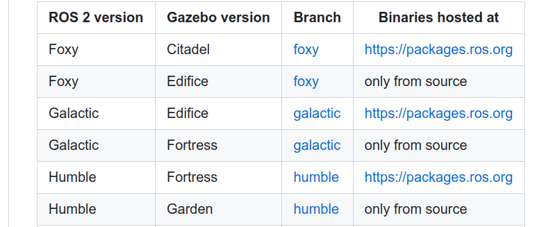

---
tags:
    - gazebo
    - garden
    - gz
---

# Gazebo garden
[gazebosim doc](https://gazebosim.org/docs/garden/install_ubuntu)


## ROS2 Bridge
### install
#### build from source
[github ros_gz](https://github.com/gazebosim/ros_gz/tree/humble)

**Install steps from github instruction**



```bash title="very important"
export GZ_VERSION=garden
```

```bash title="clone humble branch"
# Setup the workspace
mkdir -p ~/ws/src
cd ~/ws/src

# Download needed software
git clone https://github.com/gazebosim/ros_gz.git -b humble
```

```bash title="prepared and build"
cd ~/ws
rosdep install -r --from-paths src -i -y --rosdistro humble

source /opt/ros/humble/setup.zsh

cd ~/ws
colcon build
```

!!! warning "actuator_msgs"
    if the build process or running bridge failed with this message
    `error while loading shared libraries: libactuator_msgs__rosidl_typesupport_cpp.so`
    check github [install](https://github.com/gazebosim/ros_gz/tree/humble)
     
---

### Demo
Run Bridge with simple topic contain Int32 msg

!!! Tip source workspace
    ```
    cd ~/ws
    source install/setup.zsh
    ```

- Send msgs from ros to gz
- Send msgs from gz to ros


```bash title="run bridge"
ros2 run ros_gz_bridge parameter_bridge \
/keyboard/keypress@std_msgs/msg/Int32@gz.msgs.Int32
```

#### Ros as publisher
```bash title="ros pub"
ros2 topic pub /keyboard/keypress std_msgs/msg/Int32 "{data: 100}"
```

```bash title="gz echo (subscriber)"
gz topic -e -t /keyboard/keypress
```

#### ROS as subscriber

```
ros2 topic echo /keyboard/keypress
```

```bash title="gz as publisher"
gz topic \
-t /keyboard/keypress \
-m gz.msgs.Int32 \
-p 'data: 200'
```

!!! warning check why pub publish only once
     