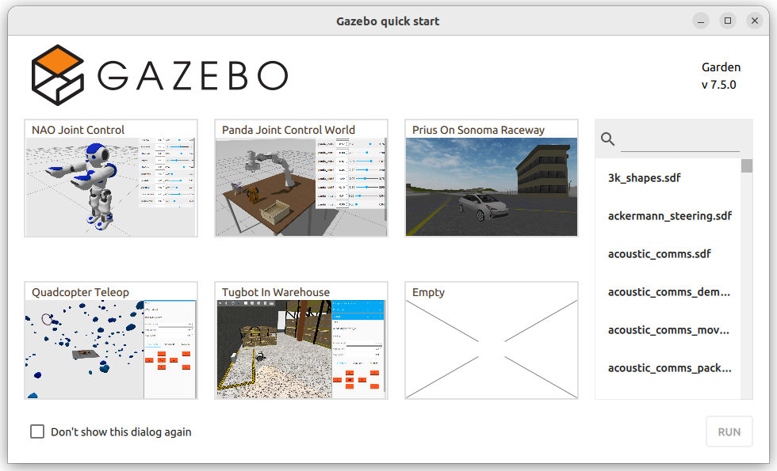
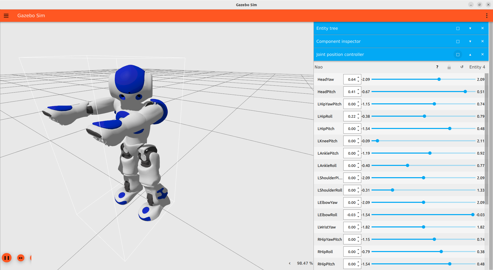

---
tags:
    - gz
    - gazebogz-sim-joint-position-controller-system
    - bridge
    - ros2
---

# gz-sim-joint-position-controller-system

## Issue
Joint position controller topic not shown when running `gz topic --list`

## Demo 
Run NAO Joint controller



---

Using Joint position controller GUI



```bash
gz topic --list
#
No joint controller topics
```

!!! note 
    Run `gz sim -v 3`

    for each joint gazebo create topic for example
    ```
    /model/Nao/joint/HeadYaw/0/cmd_pos
    ```

---

### gz pub 
Using gz topic pub

```bash title="turn head left"
gz topic \
-t /model/Nao/joint/HeadYaw/0/cmd_pos \
-m gz.msgs.Double \
-p 'data: -1'
```


```bash title="turn head right"
gz topic \
-t /model/Nao/joint/HeadYaw/0/cmd_pos \
-m gz.msgs.Double \
-p 'data: 1'
```


---

### ROS2 gz bridge

```bash
ros2 run ros_gz_bridge parameter_bridge \
/model/Nao/joint/HeadYaw/0/cmd_pos@std_msgs/msg/Float64@ignition.msgs.Double 

# Got WARN
[WARN] [1694368598.616787862] [ros_gz_bridge]: Failed to create a bridge for topic [/model/Nao/joint/HeadYaw/0/cmd_pos] with ROS2 type [std_msgs/msg/Float64] to topic [/model/Nao/joint/HeadYaw/0/cmd_pos] with Gazebo Transport type [ignition.msgs.Double]
```

[check gz-sim issue](https://github.com/gazebosim/gz-sim/issues/447)

#### yaml
Using bridge `yaml` file to map ros topic name to gz topic name

```yaml
- ros_topic_name: "joint_head"
  gz_topic_name: "/model/Nao/joint/HeadYaw/0/cmd_pos"
  ros_type_name: "std_msgs/msg/Float64"
  gz_type_name: "gz.msgs.Double"
```

!!! note "ros topic name"
    Can be anything
     

```bash
ros2 run ros_gz_bridge parameter_bridge \
--ros-args -p config_file:=/home/user/projects/ardupilot_gazebo/config/bridge.yaml
```
     
```bash title="ros pub"
# Turn head left
ros2 topic pub \
/joint_head std_msgs/msg/Float64 '{data: -1}' \
--once
# Result
publisher: beginning loop
publishing #1: std_msgs.msg.Float64(data=-1.0)

# Turn head right
ros2 topic pub \
/joint_head std_msgs/msg/Float64 '{data: 1}' \
--once
```