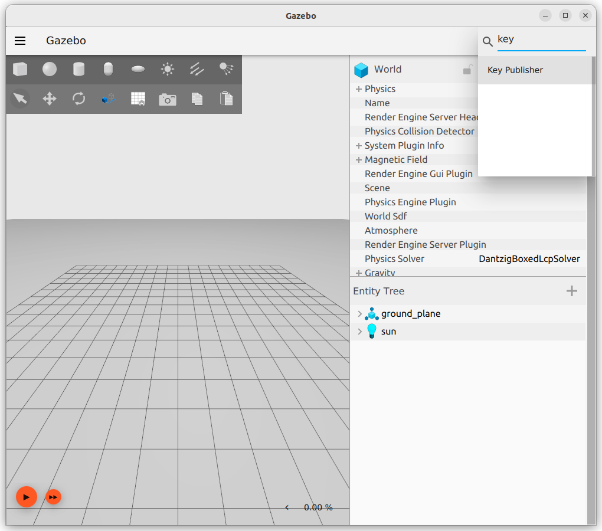

## ros ign bridge

ros_ign contains packages that provide integration between ROS2 and Ignition:

- ros_ign: Metapackage that provides all other software packages;
- ros_ign_image: Use image_transport to transfer the image from Ignition to the one-way transmission bridge of ROS;
- ros_ign_bridge: Two-way transmission bridge between Ignition and ROS;
- ros_ign_gazebo: It is convenient to use the startup files and executable files of Ignition Gazebo and ROS;
- ros_ign_gazebo_demos: Demos using ROS-Ignition integration;
- ros_ign_point_cloud: A plug-in used to simulate publishing point clouds to ROS from Ignition Gazebo

### install
```
sudo apt install ros-humble-ros-gz
```

---

### Demo
Pub keypress from gazebo to ROS2 using bridge
- Load bridge with mapping
- Open Terminal with `ROS` echo command
- For testing open anther Terminal with `ign` echo command
- Run gazebo with `key press` plugin
- Press anywhere on gazebo , both subscriber window show the keypress code

```bash title="run bridge"
# <topic name>@<ros2 type>@<gz type>
ros2 run ros_gz_bridge parameter_bridge \
/keyboard/keypress@std_msgs/msg/Int32@ignition.msgs.Int32
```

```bash title="ros subscriber"
ros2 topic echo /keyboard/keypress
```

```bash title="ign echo (subscriber)"
ign topic -e --topic /keyboard/keypress
```

```bash
ign gazebo empty.sdf
```


#### using yaml config

```yaml title="ign2ros_bridge.yaml"
- topic_name: /keyboard/keypress
  ros_type_name: std_msgs/msg/Int32
  ign_type_name: ignition.msgs.Int32
  direction: BIDIRECTIONAL
```

```bash name="Terminal1: Run bridge
ros2 run ros_gz_bridge \
bridge_node \
--ros-args \
-p config_file:=$PWD/src/gz_demos/config/ign2ros_bridge.yaml
```

```bash title="Terminal2 ROS echo"
ros2 topic echo /keyboard/keypress
```

```bash title="Terminal3 ign pub"
ign topic  -t /keyboard/keypress --msgtype ignition.msgs.Int32 -p "data: 102"

```