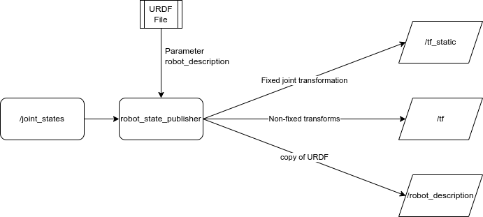
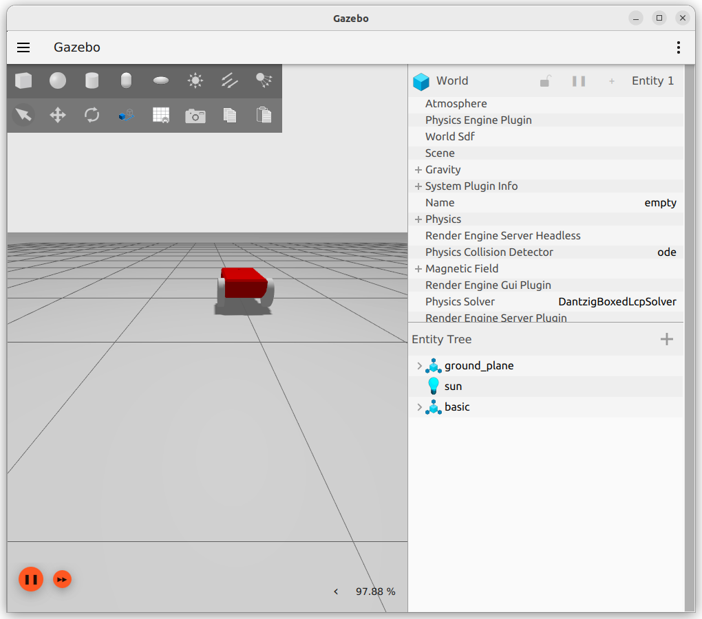

---

## Robot_State_Publisher

robot_state_publisher uses the URDF specified by the parameter `robot_description` and the joint positions from the topic `joint_states` to calculate the forward kinematics of the robot and publish the results via tf.

---

## Joint_State_Publisher
The JointStatePub system publishes state information for a model. The published message type is ignition::msgs::Model, and the publication topic is `/world/<world_name>/model/<model_name>/joint_state`.

```xml
<plugin
    filename="ignition-gazebo-joint-state-publisher-system"
    name="ignition::gazebo::systems::JointStatePublisher">
</plugin>
```

---

# Demo
- Create 2 wheel robot urdf(xacro)
- Run ignition spawn the robot
- Bridge ign and ROS2 msgs
- Run rviz2




## project
```
├── CMakeLists.txt
├── config
│   └── rviz.rviz
├── launch
│   └── mobile.launch.py
├── models
│   └── basic_mobile_robot
│       ├── meshes
│       │   └── robot_base.stl
│       └── mobile_bot.xacro
├── package.xml
└── worlds
    └── empty.sdf
```

### launch


```python title="mobile.launch.py" linenums="1" hl_lines="52-64"
import os
import xacro
from ament_index_python.packages import get_package_share_directory
from launch import LaunchDescription
from launch_ros.actions import Node
from launch.actions import IncludeLaunchDescription
from launch.launch_description_sources import PythonLaunchDescriptionSource

PACKAGE_NAME = "ign_tutorial"

def generate_launch_description():
    pkg_ros_gz_sim = get_package_share_directory('ros_gz_sim')
    pkg_demo = get_package_share_directory(PACKAGE_NAME)

    # Parse robot description from xacro
    robot_description_file = os.path.join(pkg_demo, 'models', "basic_mobile_robot", 'mobile_bot.xacro')
    robot_description_config = xacro.process_file(
        robot_description_file
    )
    robot_description = robot_description_config.toxml()
    params = {'use_sim_time': True, 'robot_description': robot_description}

    # Robot state publisher
    robot_state_publisher = Node(
        package='robot_state_publisher',
        executable='robot_state_publisher',
        name='robot_state_publisher',
        output='both',
        parameters=[params],
    )

    # Gazebo Sim
    gazebo = IncludeLaunchDescription(
        PythonLaunchDescriptionSource(
            os.path.join(pkg_ros_gz_sim, 'launch', 'gz_sim.launch.py')
        ),
        launch_arguments={'gz_args': '-r empty.sdf'}.items(),
    )

     # Spawn
    spawn = Node(
        package='ros_gz_sim',
        executable='create',
        arguments=[
            '-name', 'basic',
            '-topic', 'robot_description',
        ],
        output='screen',
    )

    # Bridge
    bridge = Node(
        package='ros_gz_bridge',
        executable='parameter_bridge',
        arguments=[
            '/clock@rosgraph_msgs/msg/Clock[gz.msgs.Clock',
            # Joint states (IGN -> ROS2)
            '/world/empty/model/basic/joint_state@sensor_msgs/msg/JointState[gz.msgs.Model',
        ],
        remappings=[
            ('/world/empty/model/basic/joint_state', 'joint_states'),
        ],
        output='screen'
    )

    rviz_node = Node(
            package='rviz2',
            namespace='',
            executable='rviz2',
            name='rviz2',
            arguments=['-d' + os.path.join(pkg_demo, 'config', 'rviz.rviz')]
        )

    return LaunchDescription(
        [
            gazebo,
            spawn,
            bridge,
            robot_state_publisher,
            rviz_node
        ]
    )

```

---

```bash
ign topic --list
/clock
/gazebo/resource_paths
/gui/camera/pose
/stats
/world/empty/clock
/world/empty/dynamic_pose/info
/world/empty/model/basic/joint_state
/world/empty/pose/info
/world/empty/scene/deletion
/world/empty/scene/info
/world/empty/state
/world/empty/stats

# info
ign topic --info -t /world/empty/model/basic/joint_state
Publishers [Address, Message Type]:
  tcp://172.18.0.1:46571, ignition.msgs.Model

```

---

### urdf

```xml title="basic_mobile_robot.urdf.xacro" linenums="1" hl_lines="186-189"
<?xml version="1.0" ?>
<robot name="basic_mobile_bot" xmlns:xacro="http://ros.org/wiki/xacro">

  <!-- ****************** ROBOT CONSTANTS *******************************  -->
  <!-- Define the size of the robot's main chassis in meters -->
  <xacro:property name="base_width" value="0.39"/>
  <xacro:property name="base_length" value="0.70"/>
  <xacro:property name="base_height" value="0.20"/>
	
  <!-- Define the shape of the robot's two back wheels in meters -->
  <xacro:property name="wheel_radius" value="0.14"/>
  <xacro:property name="wheel_width" value="0.06"/>

  <!-- x-axis points forward, y-axis points to left, z-axis points upwards -->
  <!-- Define the gap between the wheel and chassis along y-axis in meters -->
  <xacro:property name="wheel_ygap" value="0.035"/>

  <!-- Position the wheels along the z-axis -->
  <xacro:property name="wheel_zoff" value="0.05"/>

  <!-- Position the wheels along the x-axis -->
  <xacro:property name="wheel_xoff" value="0.221"/>

  <!-- Position the caster wheel along the x-axis -->
  <xacro:property name="caster_xoff" value="0.217"/>

  <!-- Define intertial property macros  -->
  <xacro:macro name="box_inertia" params="m w h d">
    <inertial>
      <origin xyz="0 0 0" rpy="${pi/2} 0 ${pi/2}"/>
      <mass value="${m}"/>
      <inertia ixx="${(m/12) * (h*h + d*d)}" ixy="0.0" ixz="0.0" iyy="${(m/12) * (w*w + d*d)}" iyz="0.0" izz="${(m/12) * (w*w + h*h)}"/>
    </inertial>
  </xacro:macro>

  <xacro:macro name="cylinder_inertia" params="m r h">
    <inertial>
      <origin xyz="0 0 0" rpy="${pi/2} 0 0" />
      <mass value="${m}"/>
      <inertia ixx="${(m/12) * (3*r*r + h*h)}" ixy = "0" ixz = "0" iyy="${(m/12) * (3*r*r + h*h)}" iyz = "0" izz="${(m/2) * (r*r)}"/>
    </inertial>
  </xacro:macro>

  <xacro:macro name="sphere_inertia" params="m r">
    <inertial>
      <mass value="${m}"/>
      <inertia ixx="${(2/5) * m * (r*r)}" ixy="0.0" ixz="0.0" iyy="${(2/5) * m * (r*r)}" iyz="0.0" izz="${(2/5) * m * (r*r)}"/>
    </inertial>
  </xacro:macro>

  <!-- ****************** ROBOT BASE FOOTPRINT ***************************  -->
  <!-- Define the center of the main robot chassis projected on the ground -->	
  <link name="world"/>

  <!-- The base footprint of the robot is located underneath the chassis -->
  <joint name="base_joint" type="fixed">
    <parent link="world"/>
    <child link="base_link" />
    <origin xyz="0.0 0.0 ${(wheel_radius+wheel_zoff)}" rpy="0 0 0"/>
  </joint>

  <!-- ********************** ROBOT BASE *********************************  -->
  <link name="base_link">
    <visual>
      <origin xyz="0 0 -0.05" rpy="1.5707963267949 0 3.141592654"/>
      <geometry>
        <mesh filename="file:///home/user/wasp_ws/src/tutorials/ign_tutorial/models/basic_mobile_robot/meshes/robot_base.stl" />
      </geometry>
      <material name="Red">
        <color rgba="${255/255} ${0/255} ${0/255} 1.0"/>
      </material>
    </visual>

    <collision>
      <geometry>
        <box size="${base_length} ${base_width} ${base_height}"/>
      </geometry>
    </collision>

    <xacro:box_inertia m="40.0" w="${base_width}" d="${base_length}" h="${base_height}"/>
    
  </link>

  <gazebo reference="base_link">
    <material>Gazebo/Red</material>
  </gazebo>

  <!-- *********************** DRIVE WHEELS ******************************  -->

  <xacro:macro name="wheel" params="prefix x_reflect y_reflect">
    <link name="${prefix}_link">
      <visual>
        <origin xyz="0 0 0" rpy="1.5707963267949 0 0"/>
        <geometry>
            <cylinder radius="${wheel_radius}" length="${wheel_width}"/>
        </geometry>
        <material name="White">
          <color rgba="${255/255} ${255/255} ${255/255} 1.0"/>
        </material>
      </visual>
      
      <collision>
        <origin xyz="0 0 0" rpy="${pi/2} 0 0"/>
        <geometry>
          <cylinder radius="${wheel_radius}" length="${wheel_width}"/>
        </geometry>
      </collision>
      
      <xacro:cylinder_inertia m="110.5" r="${wheel_radius}" h="${wheel_width}"/>
      
    </link>

    <!-- Connect the wheels to the base_link at the appropriate location, and 
         define a continuous joint to allow the wheels to freely rotate about
         an axis -->
    <joint name="${prefix}_joint" type="revolute">
      <parent link="base_link"/>
      <child link="${prefix}_link"/>
      <origin xyz="${x_reflect*wheel_xoff} ${y_reflect*(base_width/2+wheel_ygap)} ${-wheel_zoff}" rpy="0 0 0"/>
      <limit upper="3.1415" lower="-3.1415" effort="30" velocity="5.0"/>
      <axis xyz="0 1 0"/>
    </joint>
  </xacro:macro>

  <!-- Instantiate two wheels using the macro we just made through the 
       xacro:wheel tags. We also define the parameters to have one wheel
       on both sides at the back of our robot (i.e. x_reflect=-1). -->
  <xacro:wheel prefix="drivewhl_l" x_reflect="-1" y_reflect="1" />
  <xacro:wheel prefix="drivewhl_r" x_reflect="-1" y_reflect="-1" />

  <!-- *********************** CASTER WHEEL ******************************  -->
  <!-- We add a caster wheel. It will be modeled as sphere.
       We define the wheel’s geometry, material and the joint to connect it to 
       base_link at the appropriate location. -->
  <link name="front_caster">
    <visual>
      <geometry>
        <sphere radius="${(wheel_radius+wheel_zoff-(base_height/2))}"/>
      </geometry>
      <material name="White">
        <color rgba="${255/255} ${255/255} ${255/255} 1.0"/>
      </material>
    </visual>
    <collision>
      <origin xyz="0 0 0" rpy="0 0 0"/>
      <geometry>
        <sphere radius="${(wheel_radius+wheel_zoff-(base_height/2))}"/>
      </geometry>
    </collision>
    <xacro:sphere_inertia m="10.05" r="${(wheel_radius+wheel_zoff-(base_height/2))}"/>
  </link>

  <gazebo reference="front_caster">
    <mu1>0.01</mu1>
    <mu2>0.01</mu2>
    <material>Gazebo/White</material>
  </gazebo>

  <joint name="caster_joint" type="fixed">
    <parent link="base_link"/>
    <child link="front_caster"/>
    <origin xyz="${caster_xoff} 0.0 ${-(base_height/2)}" rpy="0 0 0"/>
  </joint>
  
  <!-- *********************** IMU SETUP *********************************  -->
  <!-- Each sensor must be attached to a link.                              --> 
  
  <joint name="imu_joint" type="fixed">
    <parent link="base_link"/>
    <child link="imu_link"/>
    <origin xyz="-0.10 0 0.05" rpy="0 0 0"/>
  </joint>

  <link name="imu_link"/>

  <!-- *********************** GPS SETUP **********************************  -->
  <joint name="gps_joint" type="fixed">
    <parent link="base_link"/>
    <child link="gps_link"/>
    <origin xyz="0.10 0 0.05" rpy="0 0 0"/>
  </joint>

  <link name="gps_link"/>

  <gazebo>
    <plugin
      filename="libignition-gazebo-joint-state-publisher-system.so"
      name="ignition::gazebo::systems::JointStatePublisher">
    </plugin>
  </gazebo>
</robot>
```

### world

```xml
<sdf version="1.6">
  <world name="my-empty">
    <physics name="1ms" type="ignored">
      <max_step_size>0.001</max_step_size>
      <real_time_factor>1.0</real_time_factor>
    </physics>
    <plugin filename="ignition-gazebo-physics-system" name="ignition::gazebo::systems::Physics">
    </plugin>
    <plugin filename="ignition-gazebo-scene-broadcaster-system" name="ignition::gazebo::systems::SceneBroadcaster">
    </plugin>

    <light type="directional" name="sun">
      <cast_shadows>true</cast_shadows>
      <pose>0 0 10 0 0 0</pose>
      <diffuse>0.8 0.8 0.8 1</diffuse>
      <specular>0.2 0.2 0.2 1</specular>
      <attenuation>
        <range>1000</range>
        <constant>0.9</constant>
        <linear>0.01</linear>
        <quadratic>0.001</quadratic>
      </attenuation>
      <direction>-0.5 0.1 -0.9</direction>
    </light>

    <model name="ground_plane">
      <static>true</static>
      <link name="link">
        <collision name="collision">
          <geometry>
            <plane>
              <normal>0 0 1</normal>
              <size>100 100</size>
            </plane>
          </geometry>
        </collision>
        <visual name="visual">
          <geometry>
            <plane>
              <normal>0 0 1</normal>
              <size>100 100</size>
            </plane>
          </geometry>
          <material>
            <ambient>0.8 0.8 0.8 1</ambient>
            <diffuse>0.8 0.8 0.8 1</diffuse>
            <specular>0.8 0.8 0.8 1</specular>
          </material>
        </visual>
      </link>
    </model>

  </world>
</sdf>
  
```

---


# Reference
- [double_pendulum_model](https://github.com/gazebosim/ros_gz/blob/ros2/ros_gz_sim_demos/models/double_pendulum_model.sdf)
- [launch demo](https://github.com/gazebosim/ros_gz/blob/ros2/ros_gz_sim_demos/launch/tf_bridge.launch.py)
- [ros_gz_sim_demos](https://github.com/gazebosim/ros_gz/tree/ros2/ros_gz_sim_demos)
- [JointStatePublisher Class Reference](https://gazebosim.org/api/gazebo/4.3/classignition_1_1gazebo_1_1systems_1_1JointStatePublisher.html)
- [joint state publisher and robot state publisher](https://answers.ros.org/question/275079/joint-state-publisher-and-robot-state-publisher/)
- [RVIZ2 Tutorials Episode1: Learn TF](https://www.theconstructsim.com/rviz2-tutorials-episode1-learn-tf/)
