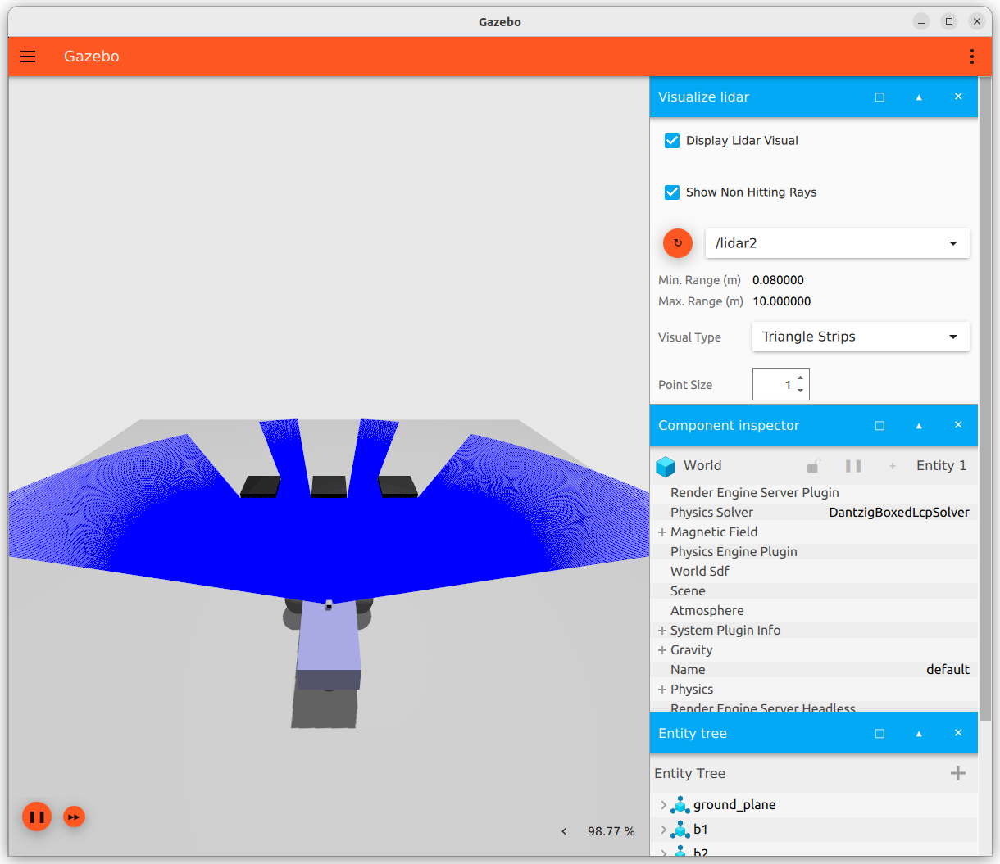

# LAB
Spawn sdf/xacro model into simulation
using launch files

- Manual spawn
- Minimal spawn
    - file
    - topic
    - param
- Spawn model with rviz
    - joint_state
- Spawn with xacro

## Project

```
sam_bot_description
    ├── CMakeLists.txt
    ├── config
    │   └── rviz.rviz
    ├── launch
    │   ├── minimal.launch.py
    │   ├── from_topic.launch.py
    │   ├── from_param.launch.py
    │   ├── spawn_with_rviz_and_bridge.launch.py
    │   ├── xacro.launch.py (todo)
    ├── models
    │   └── sam
    │       ├── model.config
    │       ├── model.sdf
    │       └── model.sdf.xacro
    ├── package.xml
    └── worlds
        └── demo.sdf
```

---

## Manual spawn

## Minimal
Spawn sdf model using `-file` argument



### world
```xml title="worlds/demo.sdf"
<?xml version="1.0" ?>
<sdf version="1.6">
  <world name="demo">
    <physics name="1ms" type="ignored">
      <max_step_size>0.001</max_step_size>
      <real_time_factor>1.0</real_time_factor>
    </physics>
    <plugin filename="libignition-gazebo-physics-system.so" name="ignition::gazebo::systems::Physics">
    </plugin>
    <plugin filename="libignition-gazebo-sensors-system.so" name="ignition::gazebo::systems::Sensors">
      <render_engine>ogre2</render_engine>
    </plugin>
    <plugin filename="libignition-gazebo-scene-broadcaster-system.so" name="ignition::gazebo::systems::SceneBroadcaster">
    </plugin>
    <plugin filename="ignition-gazebo-user-commands-system" name="ignition::gazebo::systems::UserCommands">
    </plugin>
    <gui fullscreen="0">
      <!-- 3D scene -->
      <plugin filename="MinimalScene" name="3D View">
        <ignition-gui>
          <title>3D View</title>
          <property type="bool" key="showTitleBar">false</property>
          <property type="string" key="state">docked</property>
        </ignition-gui>

        <engine>ogre2</engine>
        <scene>scene</scene>
        <ambient_light>0.4 0.4 0.4</ambient_light>
        <background_color>0.8 0.8 0.8</background_color>
        <camera_pose>-6 0 6 0 0.5 0</camera_pose>
      </plugin>

      <!-- Plugins that add functionality to the scene -->
      <plugin filename="EntityContextMenuPlugin" name="Entity context menu">
        <ignition-gui>
          <property key="state" type="string">floating</property>
          <property key="width" type="double">5</property>
          <property key="height" type="double">5</property>
          <property key="showTitleBar" type="bool">false</property>
        </ignition-gui>
      </plugin>
      <plugin filename="GzSceneManager" name="Scene Manager">
        <ignition-gui>
          <property key="resizable" type="bool">false</property>
          <property key="width" type="double">5</property>
          <property key="height" type="double">5</property>
          <property key="state" type="string">floating</property>
          <property key="showTitleBar" type="bool">false</property>
        </ignition-gui>
      </plugin>
      <plugin filename="InteractiveViewControl" name="Interactive view control">
        <ignition-gui>
          <property key="resizable" type="bool">false</property>
          <property key="width" type="double">5</property>
          <property key="height" type="double">5</property>
          <property key="state" type="string">floating</property>
          <property key="showTitleBar" type="bool">false</property>
        </ignition-gui>
      </plugin>
      <plugin filename="CameraTracking" name="Camera Tracking">
        <ignition-gui>
          <property key="resizable" type="bool">false</property>
          <property key="width" type="double">5</property>
          <property key="height" type="double">5</property>
          <property key="state" type="string">floating</property>
          <property key="showTitleBar" type="bool">false</property>
        </ignition-gui>
      </plugin>
      <!-- World control -->
      <plugin filename="WorldControl" name="World control">
        <ignition-gui>
          <title>World control</title>
          <property type="bool" key="showTitleBar">false</property>
          <property type="bool" key="resizable">false</property>
          <property type="double" key="height">72</property>
          <property type="double" key="width">121</property>
          <property type="double" key="z">1</property>

          <property type="string" key="state">floating</property>
          <anchors target="3D View">
            <line own="left" target="left"/>
            <line own="bottom" target="bottom"/>
          </anchors>
        </ignition-gui>

        <play_pause>true</play_pause>
        <step>true</step>
        <start_paused>true</start_paused>
        <use_event>true</use_event>

      </plugin>

      <!-- World statistics -->
      <plugin filename="WorldStats" name="World stats">
        <ignition-gui>
          <title>World stats</title>
          <property type="bool" key="showTitleBar">false</property>
          <property type="bool" key="resizable">false</property>
          <property type="double" key="height">110</property>
          <property type="double" key="width">290</property>
          <property type="double" key="z">1</property>

          <property type="string" key="state">floating</property>
          <anchors target="3D View">
            <line own="right" target="right"/>
            <line own="bottom" target="bottom"/>
          </anchors>
        </ignition-gui>

        <sim_time>true</sim_time>
        <real_time>true</real_time>
        <real_time_factor>true</real_time_factor>
        <iterations>true</iterations>
      </plugin>

      <plugin filename="VisualizeLidar" name="Visualize Lidar">
      </plugin>

      <!-- Inspector -->
      <plugin filename="ComponentInspector" name="Component inspector">
        <ignition-gui>
          <property type="string" key="state">docked</property>
        </ignition-gui>
      </plugin>

      <!-- Entity tree -->
      <plugin filename="EntityTree" name="Entity tree">
        <ignition-gui>
          <property type="string" key="state">docked</property>
        </ignition-gui>
      </plugin>
    </gui>

    <light type="directional" name="sun">
      <cast_shadows>true</cast_shadows>
      <pose>0 0 10 0 0 0</pose>
      <diffuse>0.8 0.8 0.8 1</diffuse>
      <specular>0.2 0.2 0.2 1</specular>
      <attenuation>
        <range>1000</range>
        <constant>0.9</constant>
        <linear>0.01</linear>
        <quadratic>0.001</quadratic>
      </attenuation>
      <direction>-0.5 0.1 -0.9</direction>
    </light>

    <model name="ground_plane">
      <static>true</static>
      <link name="link">
        <collision name="collision">
          <geometry>
            <box>
              <size>20 20 0.1</size>
            </box>
          </geometry>
        </collision>
        <visual name="visual">
          <geometry>
            <box>
              <size>20 20 0.1</size>
            </box>
          </geometry>
          <material>
            <ambient>0.8 0.8 0.8 1</ambient>
            <diffuse>0.8 0.8 0.8 1</diffuse>
            <specular>0.8 0.8 0.8 1</specular>
          </material>
        </visual>
      </link>
    </model>

    <include>
      <uri>https://fuel.gazebosim.org/1.0/chapulina/models/Test box</uri>
      <name>b1</name>
      <pose>2 2 0.5 0 0 0</pose>
    </include>

    <include>
      <uri>https://fuel.gazebosim.org/1.0/chapulina/models/Test box</uri>
      <name>b2</name>
      <pose>2 0 0.5 0 0 0</pose>
    </include>

    <include>
      <uri>https://fuel.gazebosim.org/1.0/chapulina/models/Test box</uri>
      <name>b3</name>
      <pose>2 -2 0.5 0 0 0</pose>
    </include>
</world>
</sdf>

```


### launch
```python title="launch/minimal.launch.py"
import os
from launch import LaunchDescription
from ament_index_python.packages import get_package_share_directory
from launch.actions import IncludeLaunchDescription
from launch.launch_description_sources import PythonLaunchDescriptionSource
from launch_ros.actions import Node

def generate_launch_description():
    package_name = "sam_bot_description"
    sdf_model_path = "sam/model.sdf"
    world_file_path = "demo.sdf"

    # Pose where we want to spawn the robot
    spawn_x_val = "-2.0"
    spawn_y_val = "0.0"
    spawn_z_val = "0.5"
    spawn_yaw_val = "0.0"

    pkg_ros_gz_sim = get_package_share_directory("ros_gz_sim")
    pkg_share = get_package_share_directory(package_name)
    world_path = os.path.join(pkg_share, "worlds", world_file_path)
    sdf_models_path = os.path.join(pkg_share, "models", sdf_model_path)

    gazebo = IncludeLaunchDescription(
        PythonLaunchDescriptionSource(
            os.path.join(pkg_ros_gz_sim, "launch", "gz_sim.launch.py")
        ),
        launch_arguments={"gz_args": f"-r {world_path}"}.items(),
    )
    # Launch the robot
    spawn_entity_cmd = Node(
        package="ros_gz_sim",
        executable="create",
        arguments=[
            "-world",
            "default",
            "-file",
            sdf_models_path,
            "-x",
            spawn_x_val,
            "-y",
            spawn_y_val,
            "-z",
            spawn_z_val,
            "-Y",
            spawn_yaw_val,
        ],
        output="screen",
    )

    ld = LaunchDescription()
    ld.add_action(gazebo)
    ld.add_action(spawn_entity_cmd)
    return ld

```


