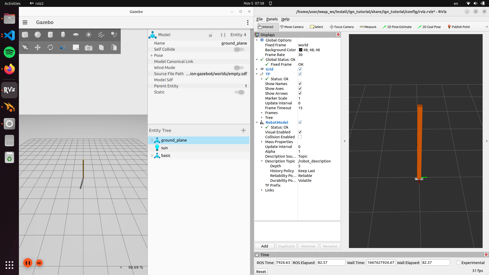

# LAB

- Spawn xacro model into ign gazebo world
- View in rviz
- 




# project

```
├── CMakeLists.txt
├── config
│   └── rviz.rviz
├── launch
│   └── xacro_demo.launch.py
├── models
│   └── basic.xacro
└── package.xml
```

# CMakeLists 

- Copy launch, models and config file to workspace `install` folder


```c title="CMakeLists.txt"
cmake_minimum_required(VERSION 3.8)
project(ign_tutorial)

find_package(ament_cmake REQUIRED)

install(DIRECTORY
 launch
 models
 config
 DESTINATION share/${PROJECT_NAME}
)

ament_package()
```

---

# launch file

- Use `gz_sim.launch.py` launch from `ros_gz_sim` package to launch ignition with  `empty.world`
- Use `xacro` node from xacro package to parse the `urdf.xacro` file
- Use `create` node from `ros_gz_sim` package to spawn the urdf

```python title="xacro_demo.launch.py"
import os
import xacro
from ament_index_python.packages import get_package_share_directory
from launch import LaunchDescription
from launch_ros.actions import Node
from launch.actions import IncludeLaunchDescription
from launch.launch_description_sources import PythonLaunchDescriptionSource

PACKAGE_NAME = "ign_tutorial"

def generate_launch_description():
    pkg_ros_gz_sim = get_package_share_directory('ros_gz_sim')
    pkg_demo = get_package_share_directory(PACKAGE_NAME)

    # Parse robot description from xacro
    robot_description_file = os.path.join(pkg_demo, 'models', 'basic.xacro')
    robot_description_config = xacro.process_file(
        robot_description_file
    )
    robot_description = robot_description_config.toxml()
    params = {'use_sim_time': True, 'robot_description': robot_description}

    # Robot state publisher
    robot_state_publisher = Node(
        package='robot_state_publisher',
        executable='robot_state_publisher',
        name='robot_state_publisher',
        output='both',
        parameters=[params],
    )

    # Gazebo Sim
    gazebo = IncludeLaunchDescription(
        PythonLaunchDescriptionSource(
            os.path.join(pkg_ros_gz_sim, 'launch', 'gz_sim.launch.py')
        ),
        launch_arguments={'gz_args': '-r empty.sdf'}.items(),
    )

     # Spawn
    spawn = Node(
        package='ros_gz_sim',
        executable='create',
        arguments=[
            '-name', 'basic',
            '-topic', 'robot_description',
        ],
        output='screen',
    )

    rviz_node = Node(
            package='rviz2',
            namespace='',
            executable='rviz2',
            name='rviz2',
            arguments=['-d' + os.path.join(get_package_share_directory(PACKAGE_NAME), 'config', 'rviz.rviz')]
        )

    return LaunchDescription(
        [
            gazebo,
            spawn,
            robot_state_publisher,
            rviz_node
        ]
    )

```

---

# urdf

- Declare `world` link and `fixed` join for `tf`


```xml title="basic.xacro"
<?xml version="1.0"?>
<robot name="basic_xacro"
    xmlns:xacro="http://www.ros.org/wiki/xacro">

    <xacro:property name="height1" value="2" />
    <xacro:property name="mass" value="1" />
    <xacro:property name="width" value="0.1" />

    <material name="orange">
        <color rgba="${255/255} ${108/255} ${10/255} 1.0"/>
      </material>

    <link name="world"/>

    <joint name="fixed" type="fixed">
        <parent link="world"/>
        <child link="link1"/>
    </joint>

    <!-- Base Link -->
    <link name="link1">
        <collision>
            <origin xyz="0 0 ${height1/2}" rpy="0 0 0"/>
            <geometry>
                <box size="${width} ${width} ${height1}"/>
            </geometry>
        </collision>

        <visual>
            <origin xyz="0 0 ${height1/2}" rpy="0 0 0"/>
            <geometry>
                <box size="${width} ${width} ${height1}"/>
            </geometry>
            <material name="orange"/>
        </visual>

        <inertial>
            <origin xyz="0 0 ${height1/2}" rpy="0 0 0"/>
            <mass value="${mass}"/>
            <inertia ixx="${mass / 12.0 * (width*width + height1*height1)}" ixy="0.0" ixz="0.0" iyy="${mass / 12.0 * (height1*height1 + width*width)}" iyz="0.0" izz="${mass / 12.0 * (width*width + width*width)}"/>
        </inertial>
    </link>
</robot>
```

---

# Dependencies

- rviz2
- ros_gz_sim
- xacro
- robot_state_publisher

## package.xml

- Add the following dependencies

```xml
<exec_depend>xacro</exec_depend>
<exec_depend>robot_state_publisher</exec_depend>
<exec_depend>ros_gz_sim</exec_depend>
<exec_depend>rviz2</exec_depend>
```

### rosdep
```bash
# from package root
rosdep install --from-paths . --ignore-src --rosdistro=humble

```

### apt
```bash
sudo apt install ros-humble-ros-gz-sim
sudo apt install ros-humble-xacro
sudo apt install ros-humble-robot-state-publisher
sudo apt install ros-humble-rviz2
```