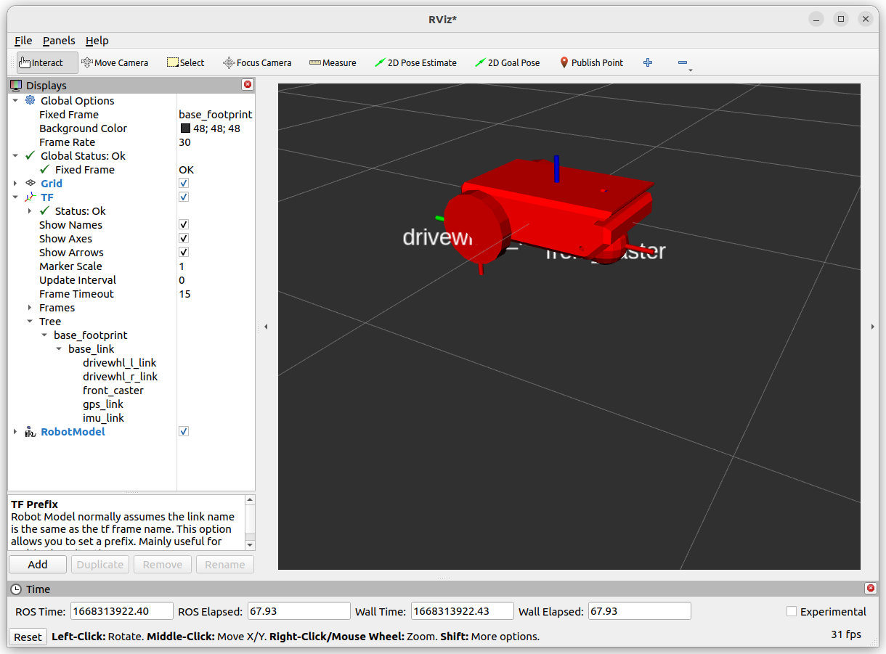
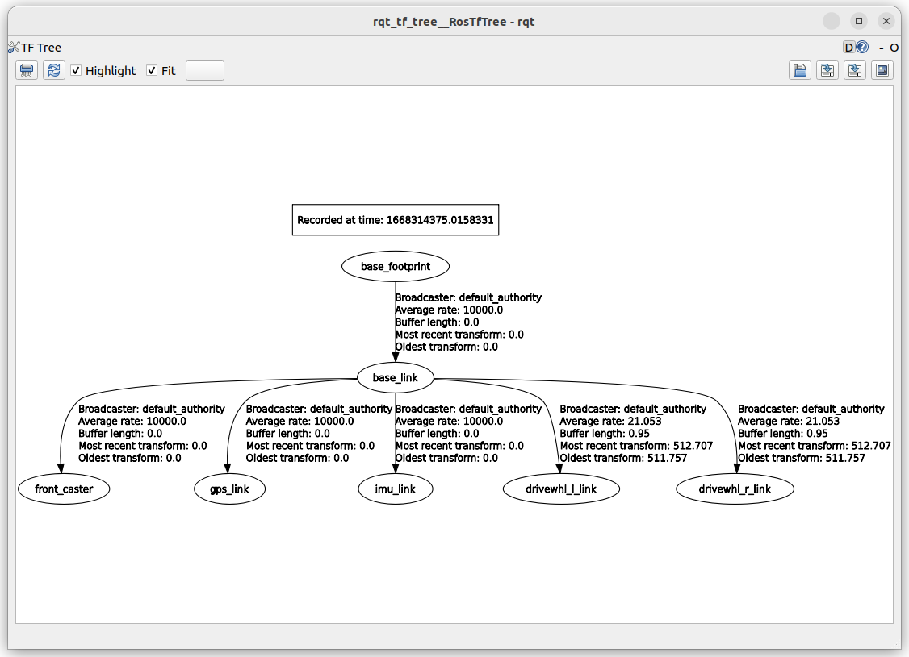

# LAB
- load model SDF into ignition and rviz
- publish `JointState` from ignition to ros2 using bridge


```
├── CMakeLists.txt
├── config
│   └── rviz.rviz
├── launch
│   └── ign.launch.launch.py
│   └── ign_bridge.launch.py
├── models
│   └── vehicle_2
│       │   └── meshes
│       │       └── robot_base.stl
│       └── model.config
│       └── model.sdf
├── worlds
│   └── vehicle.sdf
└── package.xml
```




# launch

## ign

```python
--8<-- "docs/blog/ROS2/ignition/tutorial/files/joint_state/ign.launch.py"
```
## bridge

```python
--8<-- "docs/blog/ROS2/ignition/tutorial/files/joint_state/ign_bridge.launch.py"
```

# tf tree

```bash
ros2 run rqt_tf_tree rqt_tf_tree
```



# sdf
## model

[model](files/joint_state/model.sdf)

## world
[world](files/joint_state/vehicle.sdf)

```xml
<include>
    <pose>0 0 1 0 0 0</pose>
    <uri>model://vehicle_2</uri>
</include>
```