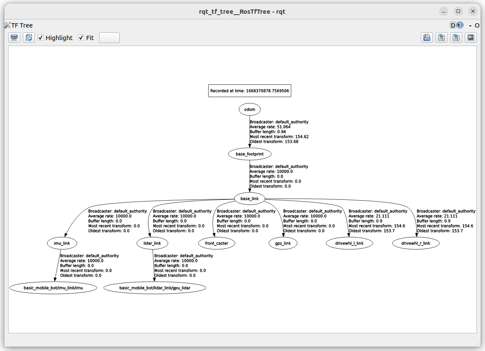
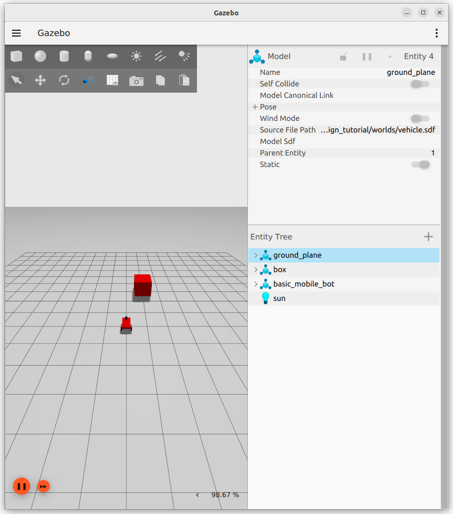
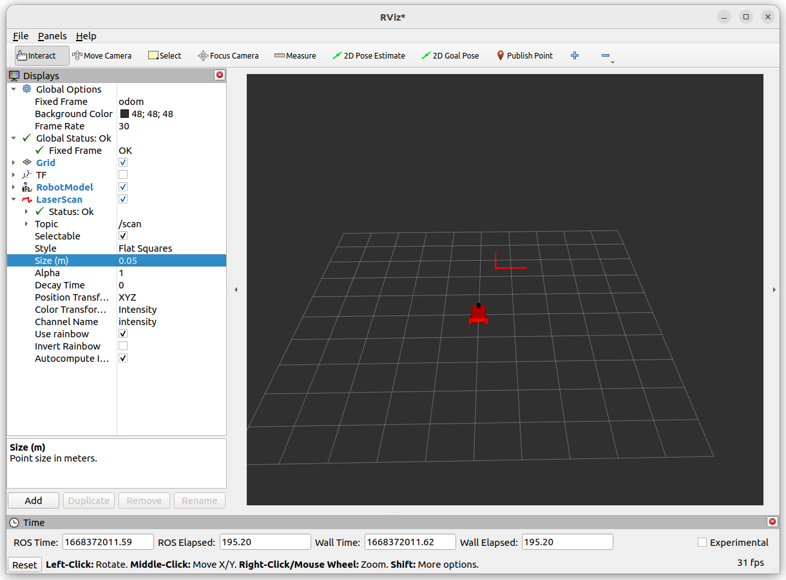

# LAB
- Add lidar sensor
- Bridge to ROS2
- Show in RVIZ

## sdf
- World
  - Add `sensor` plugin under `word` tag
- model
  - Add lidar link
  - Add sensor

```xml
<plugin filename="ignition-gazebo-sensors-system" name="ignition::gazebo::systems::Sensors">
    <render_engine>ogre2</render_engine>
</plugin>
```

```xml title="lidar sensor"
<sensor name='gpu_lidar' type='gpu_lidar'>
    <topic>lidar</topic>
    <update_rate>10</update_rate>
    <lidar>
        <scan>
            <horizontal>
                <samples>640</samples>
                <resolution>1</resolution>
                <min_angle>-1.396263</min_angle>
                <max_angle>1.396263</max_angle>
            </horizontal>
            <vertical>
                <samples>16</samples>
                <resolution>1</resolution>
                <min_angle>-0.261799</min_angle>
                <max_angle>0.261799</max_angle>
            </vertical>
        </scan>
        <range>
            <min>0.08</min>
            <max>10.0</max>
            <resolution>0.01</resolution>
        </range>
    </lidar>
    <alwaysOn>1</alwaysOn>
    <visualize>true</visualize>
</sensor>
```

[model source code](files/lidar/model.sdf)

---

## tf



## bridge

```python
lidar_bridge = Node(
    package='ros_gz_bridge',                executable='parameter_bridge',
        namespace = namespace,
        name = 'lidar_bridge',
        output='screen',
        parameters=[{
            'use_sim_time': use_sim_time
        }],
        arguments = [
                '/lidar@sensor_msgs/msg/LaserScan' + '[ignition.msgs.LaserScan',
                '/lidar/points' + '@sensor_msgs/msg/PointCloud2' + '[ignition.msgs.PointCloudPacked'
        ],
        remappings = [
            ('/lidar/points', '/scan/points'),
            ('/lidar', '/scan')
        ])

lidar_tf = Node(
    package='tf2_ros',
    executable='static_transform_publisher',
    name="imu2imu_link",
    arguments = ["0", "0", "0", "0", "0", "0", "lidar_link", "basic_mobile_bot/lidar_link/gpu_lidar"]
)
```

---

# Usage







