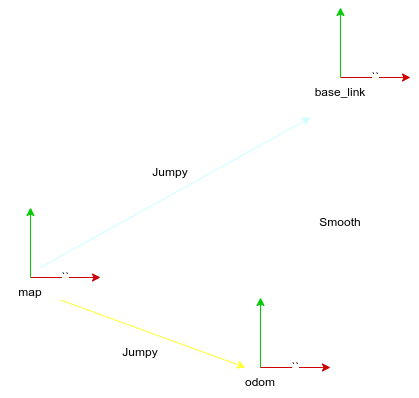
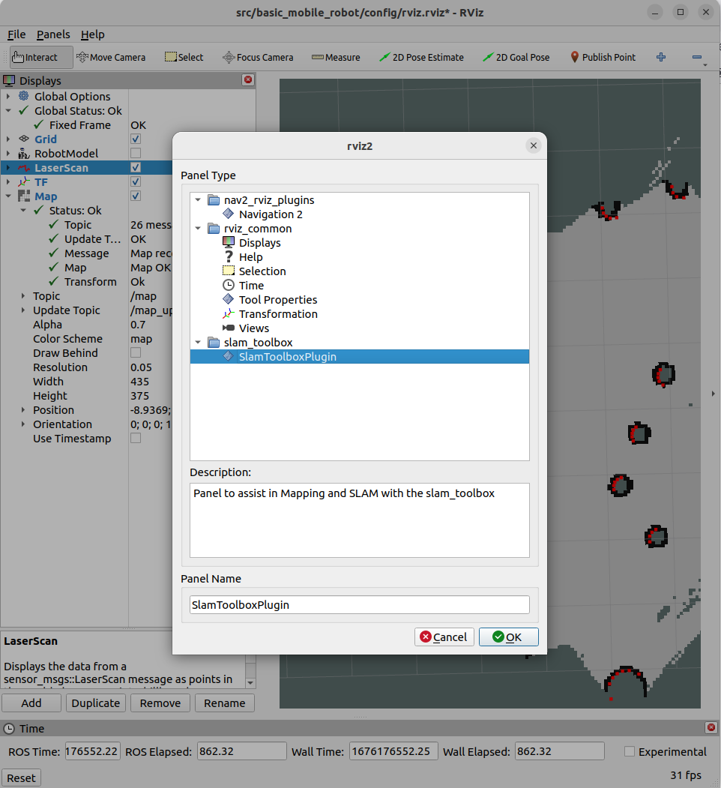

## Coordinate frames
- base_link
- odom: world origin
- map
- base_footprint: like base_link but keep in 2D

!!! note Odometry
    Measure robot velocity  
    Velocity integrated to estimate position (dead reckoning)
     



### TF's
odom: Odometry Origin
map: World origin

### Topics
/odom: nav_msgs/msg/Odometry
/map: nav_msgs/msg/OccupancyGrid


---

## install 

```bash
sudo apt install ros-humble-slam-toolbox
sudo apt install ros-humble-navigation2
sudo apt install ros-humble-nav2-bringup
```

---

## slam-toolbox

Online: Working in a live data (not recorded)
Asynchronous: Always process the most recent scan , avoid lagging (skip scan if lagging)

```
ros2 launch slam_toolbox online_async_launch.py params_file:=./src/basic_mobile_robot/config/slam_async.yaml use_sim_time:=true
```




- Save map: Old format, create pgm and yaml files
- Serialize map: New format , create posegraph and data file


!!! tip "slam_toolbox high cpu"
    change param `do_loop_closing` to false 

     

---

# Reference

- [ Easy SLAM with ROS using slam_toolbox](https://www.youtube.com/watch?v=ZaiA3hWaRzE&list=PLunhqkrRNRhYAffV8JDiFOatQXuU-NnxT&index=17)
- [articubot_one source code](https://github.com/joshnewans/articubot_one/)