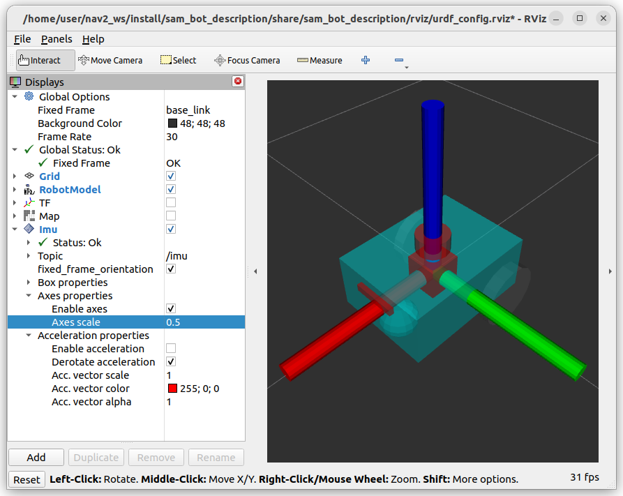

## Sensors
- imu
- lidar
- camera
- depth_camera

## Plugins
- JointStatePublisher


---

## joint_state
- Add joint_state plugin to model

```xml title="JointStatePublisher"
 <gazebo>
    <plugin
    filename="gz-sim-joint-state-publisher-system"
    name="gz::sim::systems::JointStatePublisher">
    </plugin>
  </gazebo>
```

---

## imu

```xml title="world"
<plugin
    filename="ignition-gazebo-imu-system"
    name="ignition::gazebo::systems::Imu">
</plugin>
```

```xml title="urdf"
<gazebo reference="imu_link">
    <sensor name="imu" type="imu">
        <always_on>1</always_on>
        <update_rate>100</update_rate>
        <visualize>true</visualize>
        <topic>imu</topic>
        <enable_metrics>true</enable_metrics>
    </sensor>
</gazebo>
```

```python title="bridge"
bridge = Node(
    package='ros_gz_bridge',
    executable='parameter_bridge',
    arguments=['/imu@sensor_msgs/msg/Imu@gz.msgs.IMU'],
    output='screen'
    )
```

### rviz

```
[rviz2-8] [INFO] [1670058613.098965097] [rviz2]: Message Filter dropping message: frame 'sam_bot/base_link/imu' at time 201.360 for reason 'discarding message because the queue is full'
```

#### add static tf

```bash title="run form cli"
ros2 run tf2_ros static_transform_publisher 0 0 0 0 0 0 imu_link sam_bot/base_link/imu
```

```python title="launch static tf "
imu_tf = Node(
    package='tf2_ros',
    executable='static_transform_publisher',
    name="imu2imu_link",
    arguments = ["0", "0", "0", "0", "0", "0", "imu_link", "sam_bot/base_link/imu"]
```

!!! warning "TODO"
    Why need to add static tf between sensor and link
     




---

## LIDAR

- Plugin (world.sdf)
- Sensor
- Bridge
- tf

```xml title="world"
<plugin filename="ignition-gazebo-sensors-system" name="ignition::gazebo::systems::Sensors">
    <render_engine>ogre2</render_engine>
</plugin>
```

```xml title="urdf"
<gazebo reference="lidar_link">
    <sensor name='gpu_lidar' type='gpu_lidar'>
      <topic>lidar</topic>
      <update_rate>10</update_rate>
      <lidar>
        <scan>
          <horizontal>
            <samples>640</samples>
            <resolution>1</resolution>
            <min_angle>-1.396263</min_angle>
            <max_angle>1.396263</max_angle>
          </horizontal>
          <vertical>
            <samples>16</samples>
            <resolution>1</resolution>
            <min_angle>-0.261799</min_angle>
            <max_angle>0.261799</max_angle>
          </vertical>
        </scan>
        <range>
          <min>0.08</min>
          <max>10.0</max>
          <resolution>0.01</resolution>
        </range>
      </lidar>
      <alwaysOn>1</alwaysOn>
      <visualize>true</visualize>
    </sensor>
  </gazebo>
```

```python title="bridge"
lidar_bridge = Node(
    package='ros_gz_bridge',                executable='parameter_bridge',
        namespace = namespace,
        name = 'lidar_bridge',
        output='screen',
        parameters=[{
            'use_sim_time': use_sim_time
        }],
        arguments = [
                '/lidar@sensor_msgs/msg/LaserScan' + '[ignition.msgs.LaserScan',
                '/lidar/points' + '@sensor_msgs/msg/PointCloud2' + '[ignition.msgs.PointCloudPacked'
        ],
        remappings = [
            ('/lidar/points', '/scan/points'),
            ('/lidar', '/scan')
        ])
```

### rviz
#### tf
```
ros2 run tf2_ros static_transform_publisher 0 0 0 0 0 0 lidar_link sam_bot_description/lidar_link/lidar
```