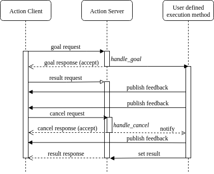

---
tags:
    - ros2
    - rclpy
    - action
    - cancel goal
---
# ROS2 Action with cancel request

base on example form ros2 examples:

- [server](https://github.com/ros2/examples/blob/master/rclpy/actions/minimal_action_server/examples_rclpy_minimal_action_server/server_single_goal.py)
- [client](https://github.com/ros2/examples/blob/master/rclpy/actions/minimal_action_client/examples_rclpy_minimal_action_client/client_cancel.py)

---



## Server
- Register to `cancel_callback` and return `CancelResponse.ACCEPT` if accept the request

- Ask if `goal_handle.is_cancel_requested` in the execute callback


```python title="server" linenums="1" hl_lines="26 30-31 45-48"
import rclpy
from rclpy.action import ActionServer, GoalResponse, CancelResponse
from rclpy.action.server import ServerGoalHandle
from rclpy.node import Node
import threading
from rclpy.clock import Clock, Duration
from rclpy.callback_groups import ReentrantCallbackGroup
from rclpy.executors import MultiThreadedExecutor
from custom_interfaces.action import Counter  # pylint: disable=E0401
from custom_interfaces.action._counter import Counter_Goal
from custom_interfaces.action._counter import Counter_Result

TOPIC = "my_action_demo"


class MyNode(Node):
    def __init__(self):
        node_name = "action_server"
        super().__init__(node_name)
        self._action_server = ActionServer(
            self,
            Counter,
            TOPIC,
            self.execute_callback,
            callback_group=ReentrantCallbackGroup(),
            cancel_callback=self.__cancel_handler,
        )
        self.get_logger().info("Hello ROS2")

    def __cancel_handler(self, goal_handle: ServerGoalHandle) -> CancelResponse:
        return CancelResponse.ACCEPT

    def execute_callback(self, goal_handle: ServerGoalHandle) -> Counter_Result:
        goal: Counter_Goal
        feedback_msg = Counter.Feedback()
        goal = goal_handle.request
        self.get_logger().info(
            f"execute method thread: {threading.current_thread().name}"
        )
        for i in range(goal.count):
            if not goal_handle.is_active:
                self.get_logger().info('Goal aborted')
                return Counter.Result()
            
            if goal_handle.is_cancel_requested:
                goal_handle.canceled()
                self.get_logger().info("Goal canceled")
                return Counter.Result()

            self.get_logger().info(f"publish feedback: {i}")
            feedback_msg.current = i
            goal_handle.publish_feedback(feedback_msg)
            self.get_clock().sleep_for(rel_time=Duration(seconds=1))

        self.get_logger().info("Action ended")
        goal_handle.succeed()

        result = Counter.Result()
        result.total = i
        return result


def main():
    rclpy.init()
    executor = MultiThreadedExecutor()
    node = MyNode()
    node.get_logger().info(f"main method thread: {threading.current_thread().name}")
    try:
        rclpy.spin(node, executor)
    except KeyboardInterrupt:
        print("User exit")
    finally:
        node.destroy_node()
        rclpy.try_shutdown()


if __name__ == "__main__":
    main()
```

## Client

```python title="client" linenums="1" hl_lines="36 40"
import rclpy
from rclpy.action.client import ActionClient, ClientGoalHandle
from rclpy.node import Node
from rclpy.task import Future

from custom_interfaces.action import Counter

ACTION_NAME = "my_action_demo"


class SimpleClient(Node):
    def __init__(self):
        node_name = "action_client_demo"
        super().__init__(node_name)
        self.action_client = ActionClient(self, Counter, ACTION_NAME)
        self.action_client.wait_for_server(1.0)
        goal = Counter.Goal()
        goal.count = 10
        future = self.action_client.send_goal_async(goal)
        future.add_done_callback(self.goal_handler)
        self.get_logger().info("Hello ROS2")
        self.__timer = None
        self.__goal_handler = None
        self.first = True

    def goal_handler(self, future):
        self.__goal_handler: ClientGoalHandle
        self.__goal_handler = future.result()
        if self.__goal_handler.accepted and self.first:
            self.__timer = self.create_timer(2.0, self.__handler_timer)

    def __handler_timer(self):
        self.get_logger().info("timer handler")
        self.__timer.cancel()
        future: Future
        future = self.__goal_handler.cancel_goal_async()
        future.add_done_callback(self.__cancel_request_handler)
        self.get_logger().info("cancel sended")

    def __cancel_request_handler(self, future: Future):
        print(future.result())


def main(args=None):
    rclpy.init(args=args)
    node = SimpleClient()
    try:
        rclpy.spin(node)
    except KeyboardInterrupt:
        print("User exit")
    finally:
        node.destroy_node()
        rclpy.try_shutdown()


if __name__ == "__main__":
    main()

```

---

## Reference
- [Action design](https://design.ros2.org/articles/actions.html)

