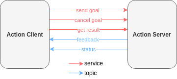

---
tags:
    - ros2
    - python
    - action
---
# Action server
Create `action server` that use `Counter.action` custom message declare at [custom_interfaces](create_custom_action_msg.md) 

Action server create 3 service
and 2 topics




!!! tip "Action topics and services"
    use `--include-hidden-topics` arg

    ```bash
    ros2 topic list --include-hidden-topics 
    #
    /action_demo/_action/feedback
    /action_demo/_action/status
    /parameter_events
    /rosout
    ```

    use `include-hidden-services` on service list
    
    ```bash
    ros2 service  list --include-hidden-services 
    /action_demo/_action/cancel_goal
    /action_demo/_action/get_result
    /action_demo/_action/send_goal
    ```  
---

## Action sequence


## Code time
!!! tip "VSCode action intellisense"
    Add path to search to `python.analysis.extraPaths` list
    in settings.json

    ```json
    {
    "python.analysis.extraPaths": [
        "/home/user/ros2_ws/install/action_tutorial_interfaces/local/lib/python3.10/dist-packages"
        ]
    }
    ```
     
### demo

```python title="action_tutorial/my_server.py"
import rclpy
from rclpy.action import ActionServer
from rclpy.action.server import ServerGoalHandle
from rclpy.node import Node

from custom_interfaces.action import Counter  # pylint: disable=E0401

TOPIC = "my_action_demo"


class MyNode(Node):
    def __init__(self):
        node_name = "action_server"
        super().__init__(node_name)
        self._action_server = ActionServer(self, Counter, TOPIC, self.execute_callback)
        self.get_logger().info("Hello ROS2")

    def execute_callback(self, goal_handle: ServerGoalHandle):
        feedback_msg = Counter.Feedback()
        for i in range(goal_handle.request.count):
            self.get_logger().info(f"current: {i}")
            feedback_msg.current = i
            goal_handle.publish_feedback(feedback_msg)

        self.get_logger().info("Action ended")
        goal_handle.succeed()

        result = Counter.Result()
        result.total = i
        return result


def main(args=None):
    rclpy.init(args=args)
    node = MyNode()
    try:
        rclpy.spin(node)
    except KeyboardInterrupt:
        print("User exit")
    finally:
        node.destroy_node()
        rclpy.try_shutdown()


if __name__ == "__main__":
    main()
```

### package.xml
```xml
<!-- Add dependency to custom_interfaces package -->
<depend>custom_interfaces</depend>
```

## Test

Use ROS cli to run action
```bash
ros2 interface show custom_interfaces/action/Counter 
int32 count
---
int32 total
---
int32 current

```

```bash title="check for actions"
ros2 action list
#
/my_action_demo
```

```bash
ros2 action send_goal -f <action_topic> <action messegae> <request part>

ros2 action send_goal -f /my_action_demo custom_interfaces/action/Counter "{count: 5}"
```

!!! tip "feedback"
    `-f` show feedback from server 
     

```bash title="send_goal" linenums="1" hl_lines="3 4 8 23 26"
ros2 action send_goal -f /my_action_demo custom_interfaces/action/Counter "{count: 5}"
#
Waiting for an action server to become available...
Sending goal:
     count: 5

Goal accepted with ID: c1129edf0f894012921b849b7948703a

Feedback:
    current: 0

Feedback:
    current: 1

Feedback:
    current: 2

Feedback:
    current: 3

Feedback:
    current: 4

Result:
    total: 4

Goal finished with status: SUCCEEDED

```

---

## Goal States


- **ACCEPTED (1)**: The goal has been accepted and wait for execute.
- **EXECUTING (2)**: The goal is currently running by action server
- **CANCELING (3)**: The client request the server to cancel current goal (cancel accepted)
- **SUCCEEDED (4)**: The goal was successfully by the action server
- **CANCELED (5)**: The goal canceled by the client or external event
- **ABORTED (6)**: The goal terminated by the action server

### action server state service
- **send_goal**: New goal request send to the server, if `accepted` start the server state machine
- **cancel_goal**: Request server to stop processing current goal.