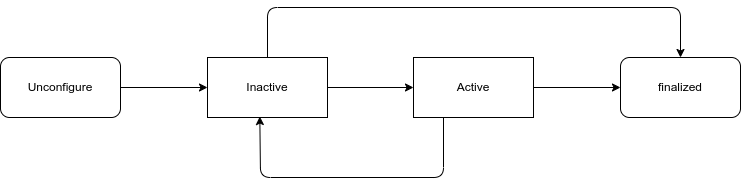

---
tags:
    - ros2
    - python
    - lifecycle
---

# ROS 2 Lifecycle Nodes / Managed nodes



## Life cycle


```bash title="run node"
ros2 run demo_pkg lifecycle_node
```

```bash title="node state
ros2 lifecycle list /lifecycle_node 
#
- configure [1]
	Start: unconfigured
	Goal: configuring
- shutdown [5]
	Start: unconfigured
	Goal: shuttingdown
```

The current node state is `unconfigure` and it can be transition to `configure` state or `shutdown`

!!! note "transition states"
    `configure` and `shutdown` are transition state and for example on configure success the node and in `inacrive` state
     

```bash
ros2 lifecycle set /lifecycle_node configure
#
Transitioning successful
```

```bash
ros2 lifecycle set /lifecycle_node activate
#
Transitioning successful
```

```bash
ros2 lifecycle set /lifecycle_node deactivate
#
Transitioning successful
```

---

## Reference
- [How to Use ROS 2 Lifecycle Nodes](https://foxglove.dev/blog/how-to-use-ros2-lifecycle-nodes)
- [ros2 demos: lifecycle](https://github.com/ros2/demos/tree/humble/lifecycle_py)
- [life cycle control demo](https://robotics.stackexchange.com/questions/102991/ros-2-how-to-start-and-stop-a-node-from-a-python-script)