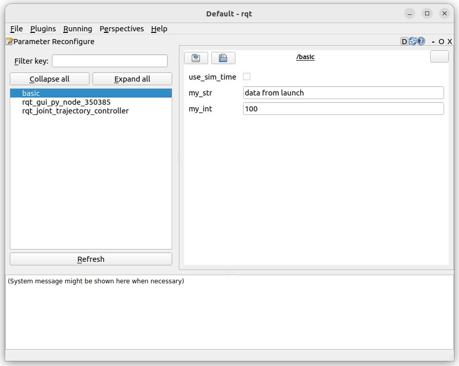

---
tags:
    - ros2
    - parameter
    - param
    - python
---

## ROS2 Params basic example
Simple node with params, run the node from cli and launch file, control the parameters from cli or yaml file  

### node

```python
import rclpy
from rclpy.node import Node

class BasicParams(Node):
    def __init__(self):
        super().__init__('basic_param')
        self.get_logger().info("start basic param")
        self.declare_parameter('my_str', value="string data")
        self.declare_parameter('my_int', value=10)
        
        self.my_str = self.get_parameter("my_str").value
        self.my_int = self.get_parameter("my_int").value

        self.get_logger().info(f"my_str: {self.my_str}")
        self.get_logger().info(f"my_int: {self.my_int}")


def main(args=None):
    rclpy.init(args=args)
    node = BasicParams()
    rclpy.spin(node)
    node.destroy_node()
    rclpy.shutdown()

if __name__ == "__main__":
    main()
```

## usage
### cli
#### use default
```bash title="simple run"
ros2 run pkg_python_tutorial param_basic 
[INFO] [1674810902.438001696] [basic_param]: start basic param
[INFO] [1674810902.438464027] [basic_param]: my_str: string data
[INFO] [1674810902.438649552] [basic_param]: my_int: 10

```

#### init from cli
```bash title="init from params from cli"
ros2 run pkg_python_tutorial param_basic --ros-args -p my_int:=20 -p my_str:="hello world"
[INFO] [1674811321.921565297] [basic_param]: start basic param
[INFO] [1674811321.921986535] [basic_param]: my_str: hello world
[INFO] [1674811321.922149889] [basic_param]: my_int: 20

```

#### load from yaml file
```yaml title="basic.yaml"
basic_param:
  ros__parameters:
    my_int: 100
    my_str: hello yaml
```

!!! tip 
    Add copy instruction to `data_files` section

    ```python
    data_files=[
        (os.path.join('share', package_name, "config"), glob('config/*.yaml'))
    ]
    ```
     

```bash title="init from yaml file"
ros2 run pkg_python_tutorial param_basic --ros-args  --params-file  config/basic.yaml
    

```

---

### launch

#### set param in launch file

```python title="node_with_param.launch.py" linenums="1" hl_lines="12"
from launch import LaunchDescription
from launch_ros.actions import Node

def generate_launch_description():
    ld = LaunchDescription()

    sim_node =  Node(
            package='pkg_python_tutorial',
            namespace='',
            executable='param_basic',
            name='basic',
            parameters=[
                {
                    "my_str": "data from launch",
                    "my_int": 100
                }
            ]
        )
    ld.add_action(sim_node)
    return ld
```

#### load param from yaml in launch file

```python title="node_with_param_file.launch.py" linenums="1" hl_lines="19 20"
import os
from launch import LaunchDescription
from ament_index_python.packages import get_package_share_directory
from launch_ros.actions import Node

def generate_launch_description():
    ld = LaunchDescription()

    config = os.path.join(
        get_package_share_directory('pkg_python_tutorial'),
        'config',
        'params.yaml'
        )

    sim_node =  Node(
            package='pkg_python_tutorial',
            namespace='',
            executable='param_basic',
            name='basic',
            parameters=[config]
        )
    ld.add_action(sim_node)
    return ld
```

```yaml title="params.yaml" linenums="1" hl_lines="1"
basic:
  ros__parameters:
    my_str: "launch and load from yaml"
    my_int: 100
```

!!! tip "node /yaml name"
    The node name in yaml file need to be the same name we set in the launch file `Node.name` property
     

### rqt

```bash
ros2 run rqt_reconfigure rqt_reconfigure
# or
# run rqt_gui and load th dynamic_reconfiguration plugin
```
