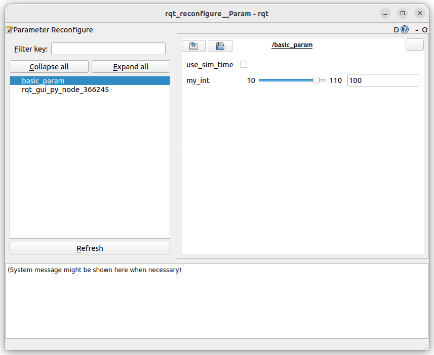

## ParameterDescriptor
### Code
- Add parameter descriptor
    - Add range validator
- Add `add_on_set_parameter_callback`


```python title="param_control.py" linenums="1" hl_lines="17 18 23"
import rclpy
from rclpy.node import Node
from rcl_interfaces.msg import SetParametersResult
from rcl_interfaces.msg import ParameterDescriptor, IntegerRange, ParameterType
from rclpy.parameter import Parameter
from typing import List

class BasicParams(Node):
    def __init__(self):
        super().__init__('basic_param')
        self.get_logger().info("param control")

        my_int_descriptor = ParameterDescriptor(
            description="my int param",
            type=ParameterType.PARAMETER_INTEGER
        )
        range = IntegerRange(from_value=10, to_value=110)
        my_int_descriptor.integer_range.append(range)
        self.declare_parameter('my_int', value=100, descriptor=my_int_descriptor)
        
        self.my_int = self.get_parameter("my_int").value
        
        self.add_on_set_parameters_callback(self.__parameters_handler)

    def __parameters_handler(self, params: List[Parameter]):
        success = True
        for param in params:
            self.get_logger().info(param.name)
            self.get_logger().info(str(param.value))
        return SetParametersResult(successful=success)

def main(args=None):
    rclpy.init(args=args)
    node = BasicParams()
    rclpy.spin(node)
    node.destroy_node()
    rclpy.shutdown()

if __name__ == "__main__":
    main()
```

### usage

```bash
ros2 param set /basic_param my_int 100
#
Set parameter successful

ros2 param set /basic_param my_int 120
#
Setting parameter failed: Parameter my_int out of range. Min: 10, Max: 110, value: 120

ros2 param set /basic_param my_int 1
#
Setting parameter failed: Parameter my_int out of range. Min: 10, Max: 110, value: 1

```

#### rqt_reconfigure

```
ros2 run rqt_reconfigure rqt_reconfigure
```



---

## add_on_set_parameters_callback

The function that is called whenever parameters are set for the node

### Demo
Using `add_on_set_parameters_callback` to run validation

```python title="" linenums="1" hl_lines="1"
import rclpy
from rclpy.node import Node
from rcl_interfaces.msg import SetParametersResult
from rcl_interfaces.msg import ParameterDescriptor, IntegerRange, ParameterType
from rclpy.parameter import Parameter
from typing import List

class BasicParams(Node):
    def __init__(self):
        super().__init__('basic_param')
        self.get_logger().info("param control")

        my_int_descriptor = ParameterDescriptor(
            description="my int param",
            type=ParameterType.PARAMETER_INTEGER
        )
    
        self.declare_parameter('my_int', value=100, descriptor=my_int_descriptor)
        
        self.my_int = self.get_parameter("my_int").value
        

        self.add_on_set_parameters_callback(self.__parameters_handler)

    def __parameters_handler(self, params: List[Parameter]):
        success = True
        for param in params:
            if param.name == "my_int":
                if param.value > 50:
                    success = False
        return SetParametersResult(successful=success)

def main(args=None):
    rclpy.init(args=args)
    node = BasicParams()
    rclpy.spin(node)
    node.destroy_node()
    rclpy.shutdown()

if __name__ == "__main__":
    main()
``` 

### usage

```bash
# Set successful
ros2 param set /basic_param my_int 1
Set parameter successful

# Set Failed
ros2 param set /basic_param my_int 100
Setting parameter failed

# Read again
ros2 param get /basic_param my_int
Integer value is: 1

```

#### rqt_reconfigure

```
ros2 run rqt_reconfigure rqt_reconfigure
```

