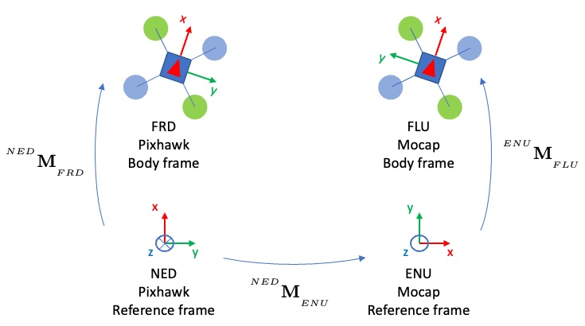
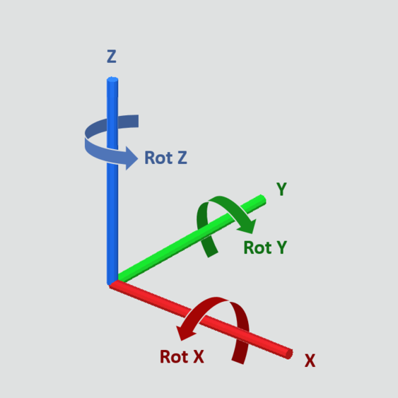
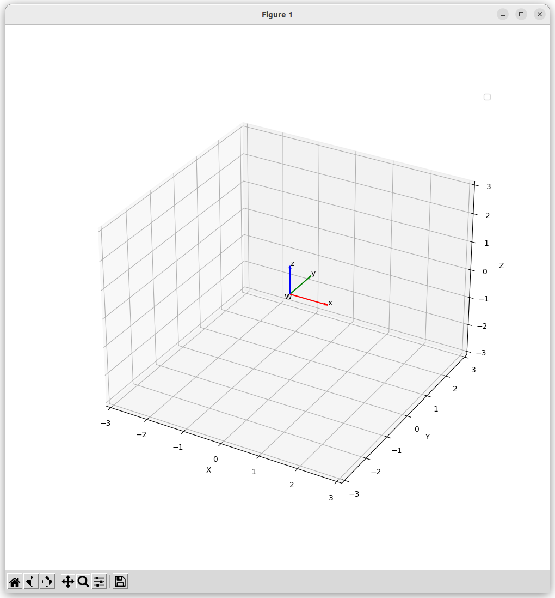

---
tags:
    - ros
    - coordinate
    - rep
    - enu
    - gazebo
---

# Gazebo World frame


## Gazebo model frame


## NED ENU 


X, Y, Z <-> Y, X,-Z

Switch matrix

$$
 P_{ned} = P_{enu}= \begin{bmatrix}
 0&  1& 0 \\
 1&  0&  0\\
 0&  0& -1 \\
\end{bmatrix} 
\begin{bmatrix}
 P_x&  \\
 P_y&  \\
 P_z&  \\
\end{bmatrix} 
=\begin{bmatrix}
 P_y&  \\
 P_x&  \\
 -P_z&  \\
\end{bmatrix} 
$$


## FRD / FLU




## RPY



flu positive rotation using right hand rule

---

## Convert code examples

```python title="empy 3d graph"
import numpy as np
import matplotlib.pyplot as plt

fig = plt.figure(figsize=(10, 10))
ax = fig.add_subplot(111, projection='3d')
ax.set_xlabel('X')
ax.set_ylabel('Y')
ax.set_zlabel('Z')
ax.set_xlim(-3, 3)
ax.set_ylim(-3, 3)
ax.set_zlim(-3, 3)
ax.legend()
plt.show()
```


#### Add axis
With translation and rotation

```python
import numpy as np
import matplotlib.pyplot as plt
from scipy.spatial.transform import Rotation as R


def draw_axis(ax, translation, rotation, label):
    r = R.from_euler("xyz", rotation, degrees=True).as_matrix()
    t = np.array([translation]).T
    rt = np.hstack((r,t))
    rt = np.vstack((rt, np.array([0,0,0,1])))
    source = np.eye(4)
   
    r = rt @ source
    x_arrow = r[0, :3]
    y_arrow = r[1, :3]
    z_arrow = r[2, :3]
    position = r[:3, 3]
    ax.quiver(*position, *x_arrow, color="red", arrow_length_ratio=0.1)
    ax.quiver(*position, *y_arrow, color="green", arrow_length_ratio=0.1)
    ax.quiver(*position, *z_arrow, color="blue", arrow_length_ratio=0.1)
    ax.text(*(position + x_arrow), f"x")
    ax.text(*(position + y_arrow), f"y")
    ax.text(*(position + z_arrow), f"z")
    ax.text(*(position+np.array([-0.1, -0.1, -0.15])), label)


fig = plt.figure(figsize=(10, 10))
ax = fig.add_subplot(111, projection='3d')

draw_axis(ax, (0,0,0), (0,0,0), "W")

ax.set_xlabel('X')
ax.set_ylabel('Y')
ax.set_zlabel('Z')
ax.set_xlim(-3, 3)
ax.set_ylim(-3, 3)
ax.set_zlim(-3, 3)
ax.legend()
plt.show()
```



---

### ENU AND NED translation

```python
import numpy as np
import matplotlib.pyplot as plt
from scipy.spatial.transform import Rotation as R


def draw_axis(ax, source_frame, translation, rotation, label):
    r = R.from_euler("xyz", rotation, degrees=True).as_matrix()
    t = np.array([translation]).T
    rt = np.hstack((r,t))
    rt = np.vstack((rt, np.array([0,0,0,1])))
    
    
   
    r = rt @ source_frame
    x_arrow = r[0, :3]
    y_arrow = r[1, :3]
    z_arrow = r[2, :3]
    position = r[:3, 3]
    ax.quiver(*position, *x_arrow, color="red", arrow_length_ratio=0.1)
    ax.quiver(*position, *y_arrow, color="green", arrow_length_ratio=0.1)
    ax.quiver(*position, *z_arrow, color="blue", arrow_length_ratio=0.1)
    ax.text(*(position + x_arrow), f"x")
    ax.text(*(position + y_arrow), f"y")
    ax.text(*(position + z_arrow), f"z")
    ax.text(*(position+np.array([-0.1, -0.1, -0.15])), label)

def ned2enu(ned_v):
    ned2enu_m = np.array([[0, 1, 0],
                          [1, 0, 0],
                          [0, 0, -1]
                        ])
    enu_v = ned2enu_m @ ned_v
    return enu_v

fig = plt.figure(figsize=(10, 10))
ax = fig.add_subplot(111, projection='3d')

world = np.eye(4)
draw_axis(ax, world, (0,0,0), (0,0,0), "W")


enu_frame = np.eye(3)
ned_frame = ned2enu(enu_frame)
ned_frame = np.hstack((ned_frame, np.array([[0,0,0]]).T))
ned_frame = np.vstack((ned_frame, np.array([0,0,0,1])))
draw_axis(ax, ned_frame, (2,0,0), (0,0,0), "NED")

enu_frame = ned2enu(ned_frame[:3, :3])
enu_frame = np.hstack((enu_frame, np.array([[0,0,0]]).T))
enu_frame = np.vstack((enu_frame, np.array([0,0,0,1])))

draw_axis(ax, enu_frame, (-2,0,0), (0,0,0), "ENU")

ax.set_xlabel('X')
ax.set_ylabel('Y')
ax.set_zlabel('Z')
ax.set_xlim(-3, 3)
ax.set_ylim(-3, 3)
ax.set_zlim(-3, 3)
ax.legend()
plt.show()
```


---
## Reference
- [gazebo frame_reference](https://gazebosim.org/api/sim/8/frame_reference.html)
- [REP-103 Standard Units of Measure and Coordinate Conventions](https://www.ros.org/reps/rep-0103.html)