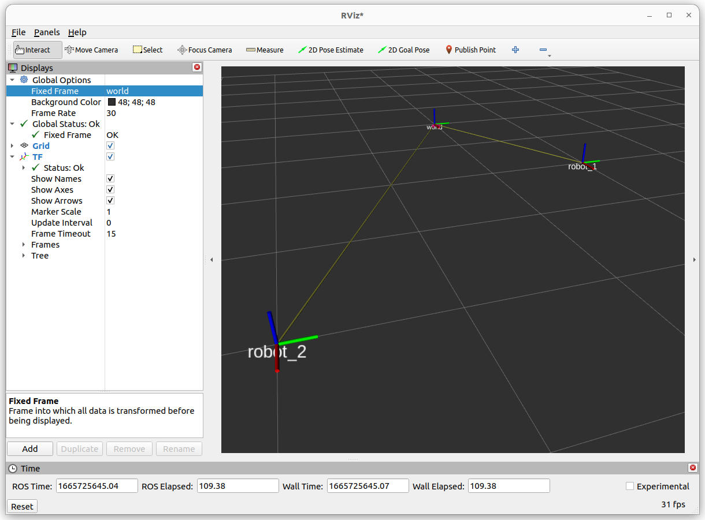

## static tf broadcast

```bash
ros2 run tf2_ros static_transform_publisher \
x y z \
yaw pitch roll \
parent_frame \
child_frame
```

## Demo
- Broadcast two robot tf frame relative to world frame


```bash
# world robot1
ros2 run tf2_ros static_transform_publisher 2 1 0 0 0 0 world robot_1

# world robot2
ros2 run tf2_ros static_transform_publisher 4 -2 0 0 0 0 world robot_2
```

### echo
- check the matrix between two frames
  
```
ros2 run tf2_ros tf2_echo robot_1 robot_2

At time 0.0
- Translation: [2.000, -3.000, 0.000]
- Rotation: in Quaternion [0.000, 0.000, 0.000, 1.000]
- Rotation: in RPY (radian) [0.000, -0.000, 0.000]
- Rotation: in RPY (degree) [0.000, -0.000, 0.000]
- Matrix:
  1.000  0.000  0.000  2.000
  0.000  1.000  0.000 -3.000
  0.000  0.000  1.000  0.000
  0.000  0.000  0.000  1.000

```

### tf tree

```bash 
ros2 run rqt_tf_tree rqt_tf_tree
```


### rviz
---





### topic

```bash
ros2 topic list
#
/parameter_events
/rosout
/tf_static
```

```bash
ros2 topic echo /tf_static
# publish one message because it's static tf
#ros2 topic info /tf_static
#Type: tf2_msgs/msg/TFMessage

transforms:
- header:
    stamp:
      sec: 1665725225
      nanosec: 204816367
    frame_id: world
  child_frame_id: robot_1
  transform:
    translation:
      x: 2.0
      y: 1.0
      z: 0.0
    rotation:
      x: 0.0
      y: 0.0
      z: 0.0
      w: 1.0
---
transforms:
- header:
    stamp:
      sec: 1665725576
      nanosec: 941586267
    frame_id: world
  child_frame_id: robot_2
  transform:
    translation:
      x: 4.0
      y: -2.0
      z: 0.0
    rotation:
      x: 0.0
      y: 0.0
      z: 0.0
      w: 1.0

```

---

# Reference
- [Getting Ready for ROS Part 6: The Transform System (TF)](https://articulatedrobotics.xyz/ready-for-ros-6-tf/)