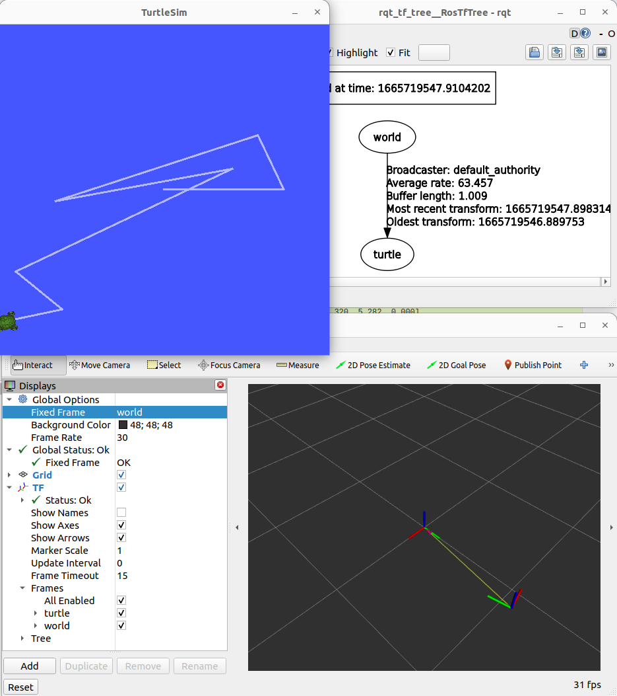

!!! example ""
    code from : https://docs.ros.org/en/humble/Tutorials/Intermediate/Tf2/Writing-A-Tf2-Broadcaster-Cpp.html
     
```bash terminal1
#turtlesim
ros2 run turtlesim turtlesim_node
```

```bash terminal2
# turtlesim teleop
ros2 run turtlesim turtle_teleop_key
```

```bash terminal3
# our node translate turtle pose to tf message
ros2 run learning_tf2 tf2_broadcaster
```

```bash terminal4
# tf echo tool
ros2 run tf2_ros tf2_echo world turtle
```

```bash terminal5
# tf tree using rqt
ros2 run rqt_tf_tree rqt_tf_tree --force-discover
```

```bash terminal6
# rviz
ros2 run rviz2 rviz2
```



---

# Reference
- [Learn TF2 – ROS2 Concepts in Practice](https://www.theconstructsim.com/learn-tf2-ros2-concepts-in-practice/)