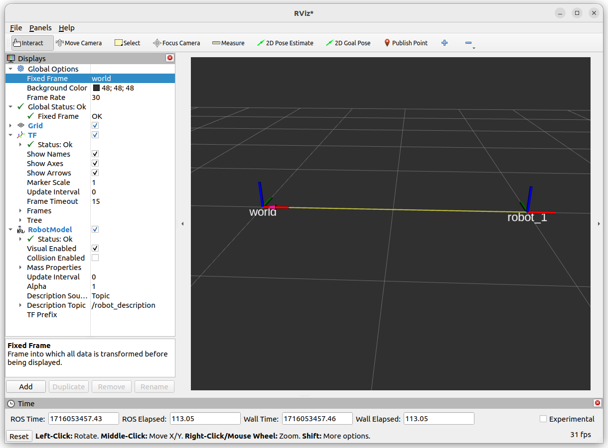
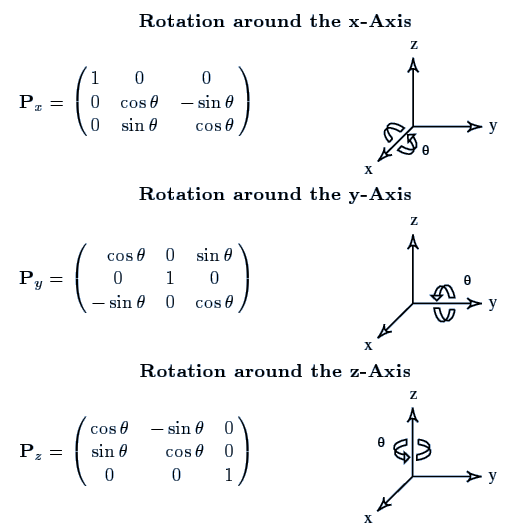
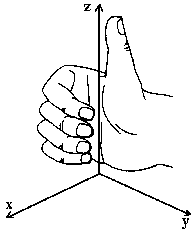

---
tags:
    - ros2
    - tf2
    - tutorial
---

# TF2


- [Static tf broadcaster]()
- [tf broadcaster]()
- [listener]()
- [frame](https://www.youtube.com/watch?v=F1BAm6Nf5Ec&list=PLSK7NtBWwmpTS_YVfjeN3ZzIxItI1P_Sr&index=41&pp=iAQB)
- [tf and time](https://www.youtube.com/watch?v=8fzl-45NIb0&list=PLSK7NtBWwmpTS_YVfjeN3ZzIxItI1P_Sr&index=42&pp=iAQB)


```bash
# ros2 run tf2_ros static_transform_publisher 2 0 0 0 0 0 parent child
ros2 run tf2_ros static_transform_publisher 2 0 0 0 0 0 world robot_1
```




### tf2_echo


```bash
# ros2 run tf2_ros tf2_echo [source_frame] [target_frame]
ros2 run tf2_ros tf2_echo robot_1 world

- Translation: [-2.000, 0.000, 0.000]
- Rotation: in Quaternion [0.000, 0.000, 0.000, 1.000]
- Rotation: in RPY (radian) [0.000, -0.000, 0.000]
- Rotation: in RPY (degree) [0.000, -0.000, 0.000]
- Matrix:
  1.000  0.000  0.000 -2.000
  0.000  1.000  0.000  0.000
  0.000  0.000  1.000  0.000
  0.000  0.000  0.000  1.000

```

The `robot_1` need to Translation -2 unit in the X axis to be align with the world coordinate frame


```bash
ros2 run tf2_ros static_transform_publisher \
--x 1 --y 0 --z 0 \
--roll 0 --pitch 0 --yaw 1.57079632679 \
--frame-id world --child-frame-id robot_1
```


!!! warning "static_transform_publisher rotation"

    [static_transform_publisher argument order](https://github.com/ros2/geometry2/issues/292)
    ```bash
    ros2 run tf2_ros static_transform_publisher 1 0 0 0 0 1.57079632679 world robot_1
    ```

    It's rotate on the **pitch** axis and not **yaw**

     
     


### calc 


```bash
ros2 run tf2_ros tf2_echo robot_1 world
#
- Translation: [-0.000, 1.000, 0.000]
- Rotation: in Quaternion [0.000, 0.000, -0.707, 0.707]
- Rotation: in RPY (radian) [0.000, 0.000, -1.571]
- Rotation: in RPY (degree) [0.000, 0.000, -90.000]
- Matrix:
  0.000  1.000  0.000 -0.000
 -1.000  0.000 -0.000  1.000
 -0.000  0.000  1.000  0.000
  0.000  0.000  0.000  1.000

```

Z Rotation matrix




$$
 Rz = \begin{bmatrix}
 cos(-90)&  -sin(-90)& 0 \\
 sin(-90)&  cos(-90)&  0\\
 0&  0& 1 \\
\end{bmatrix} 
$$



TODO: write reverse matrix