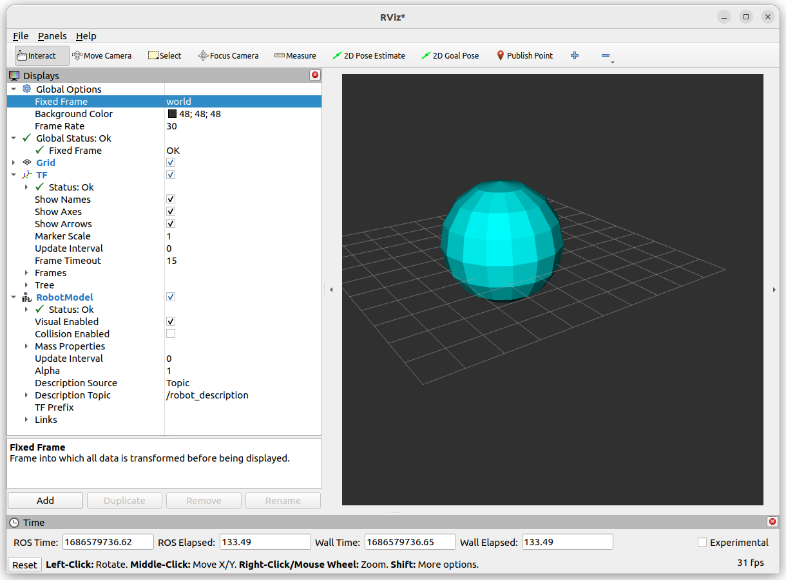
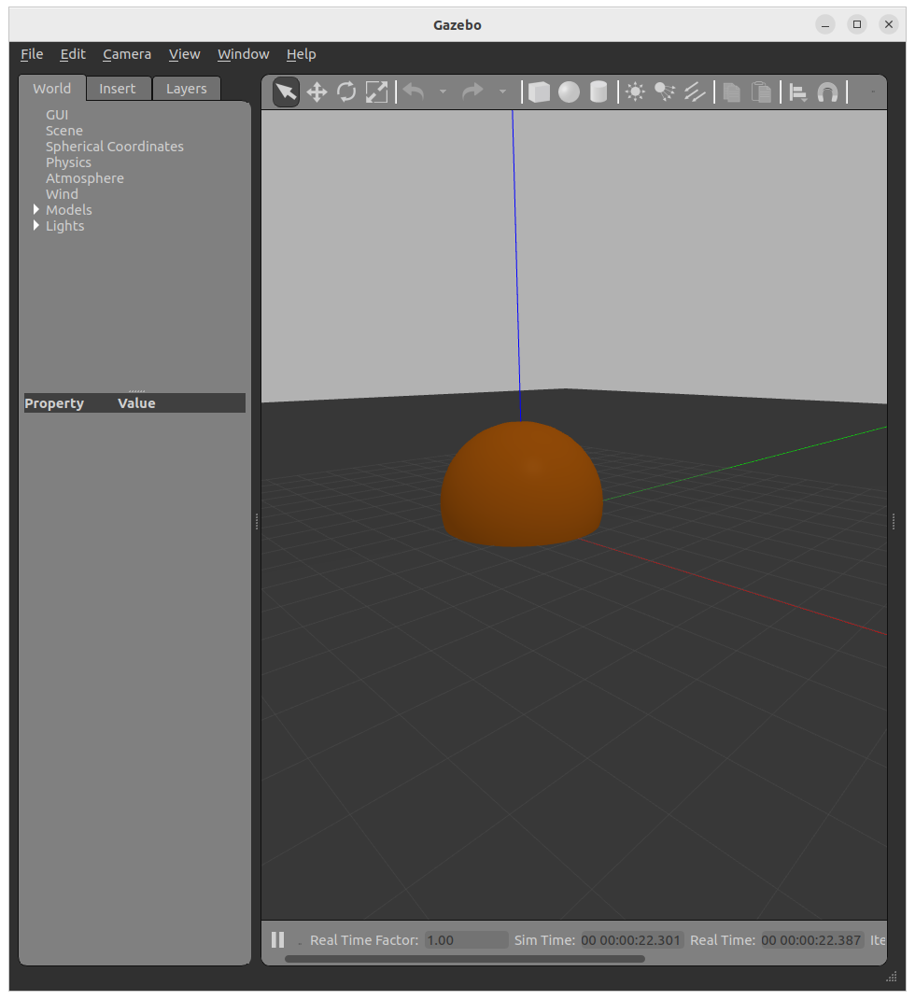

---
tags:
    - urdf
    - gazebo
---

# URDF gazebo element
The gazebo element is an extension to the URDF robot description format, used for simulation purposes in the Gazebo simulator.

## Demo
Add gazebo tag to urdf file to control color in gazebo simulator

### urdf

```xml title="basic_gazebo.urdf" linenums="1" hl_lines="23-25"
<?xml version='1.0' encoding='UTF-8'?>
<robot name='material_example'>
 <link name="world" />
    <joint name="world2link" type="fixed">
        <origin xyz="0.0 0.0 0.5" rpy="0.0 0.0 0.0"/>
        <parent link="world"/>
        <child link="base_link"/>
    </joint>
  <link name='base_link'>
    <inertial>
      <mass value='0.1' />
      <inertia ixx='0.01' ixy='0' ixz='0' iyy='0.01' iyz='0' izz='0.01' />
    </inertial>
    <visual>
      <geometry>
        <sphere radius="2"/>
      </geometry>
      <material name="Cyan">
        <color rgba="0 1.0 1.0 1.0" />
     </material>
    </visual>
  </link>
  <gazebo reference='base_link'>
    <material>Gazebo/Orange</material>
  </gazebo>
</robot>
```

### launch

```python title="urdf_gazebo.launch.py"
import os
from ament_index_python.packages import get_package_share_directory
from launch import LaunchDescription
from launch_ros.actions import Node

URDF = "basic_gazebo.urdf"
PACKAGE = "gazebo_tutorial_pkg"


def generate_launch_description():
    ld = LaunchDescription()

    pkg = get_package_share_directory(PACKAGE)
    urdf = os.path.join(pkg, "urdf", URDF)
    with open(urdf, "r", encoding="utf-8") as f:
        robot_description = f.read()

    robot_state_publisher = Node(
        package="robot_state_publisher",
        executable="robot_state_publisher",
        name="robot_state_publisher",
        output="screen",
        parameters=[{"robot_description": robot_description}]
    )

    ld.add_action(robot_state_publisher)
    return ld
```

### rviz



### launch include gazebo

```python title="urdf_gazebo_include.launch.py"
import os

from ament_index_python.packages import get_package_share_directory
from launch import LaunchDescription
from launch.actions import IncludeLaunchDescription
from launch.launch_description_sources import PythonLaunchDescriptionSource
import xacro
from launch_ros.actions import Node

PACKAGE = "gazebo_tutorial_pkg"
URDF = "basic_gazebo.urdf"


def generate_launch_description():
    ld = LaunchDescription()

    pkg = get_package_share_directory(PACKAGE)
    gazebo_pkg = get_package_share_directory("gazebo_ros")

    gazebo = IncludeLaunchDescription(
        PythonLaunchDescriptionSource(
            [os.path.join(gazebo_pkg, "launch", "gazebo.launch.py")]
        ),
        launch_arguments={"verbose": "true"}.items(),
    )

    robot_description_path = os.path.join(pkg, "urdf", URDF)
    doc = xacro.parse(inp=None, filename=robot_description_path)
    xacro.process_doc(doc)

    robot_state_publisher = Node(
        package="robot_state_publisher",
        executable="robot_state_publisher",
        parameters=[{"robot_description": doc.toxml()}],
    )

    spawn_entity = Node(
        package="gazebo_ros",
        executable="spawn_entity.py",
        arguments=["-entity", "demo", "-topic", "robot_description", "-z", "0.0"],
        output="screen",
    )

    ld.add_action(gazebo)
    ld.add_action(robot_state_publisher)
    ld.add_action(spawn_entity)

    return ld

```



