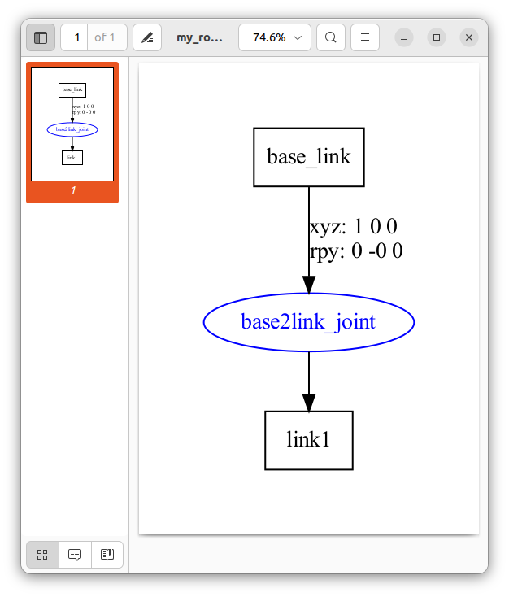
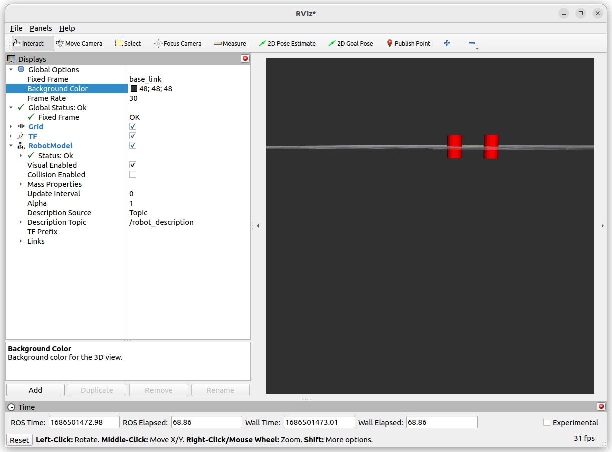

---
tags:
    - urdf
    - robot_state_publisher
    - urdf_to_graphiz
---

# URDF

Unified Robot Description Format
URDF is xml specification that describe robot physical as links and joints elements

- **robot**: The root element in a robot description file must be a robot
- **link**: The link element describes a rigid body with an inertia, visual features, and collision properties. 
- **joint**: The joint element describes the kinematics and dynamics of the joint between two links
- **gazebo**: The gazebo element is an extension to the URDF robot description format, used for simulation purposes in the Gazebo simulator. 

```xml title="minimal urdf"
<robot name="robot_name">
  <!--  robot links joints -->
</robot>
```

## elements
- [link](link.md)
- [joint](joint.md)
- [gazebo](gazebo.md)
- [more elements](https://wiki.ros.org/urdf/XML)

---

## Tools to view and debug urdf

- rviz
- gazebo
- online urdf preview
- verification and Visualization

### Install

```
sudo apt install ros-humble-urdf
```

### Demo

```xml title="demo.urdf"
<?xml version="1.0" encoding="UTF-8"?>
<robot name="my_robot">
    <link name="base_link">
        <visual>
            <geometry>
                <cylinder length="0.6" radius="0.2" />
            </geometry>
        </visual>
    </link>
    <link name="link1">
        <visual>
            <geometry>
                <cylinder length="0.6" radius="0.2" />
            </geometry>
        </visual>
    </link>
    <joint type="fixed" name="base2link_joint">
    <origin xyz="1 0 0" rpy="0 0 0"/>
        <parent link="base_link"/>
        <child link="link1"/>
    </joint>
</robot>
```

#### gazebo cli
check urdf validation with gazebo cli

```bash title="check using gazebo"
gz sdf --check <file>
```

#### urdf_to_graphiz
```bash
urdf_to_graphiz <file>

# check the pdf output
evince my_robot.pdf
```




#### online preview
[urdf](https://mymodelrobot.appspot.com)


#### rviz

```python linenums="1" hl_lines="32-38"
import os
from ament_index_python.packages import get_package_share_directory
from launch import LaunchDescription
from launch_ros.actions import Node

URDF = "basic_joint.urdf"
PACKAGE = "gazebo_tutorial_pkg"


def generate_launch_description():
    ld = LaunchDescription()

    pkg = get_package_share_directory(PACKAGE)
    urdf = os.path.join(pkg, "urdf", URDF)
    with open(urdf, "r", encoding="utf-8") as f:
        robot_description = f.read()

    robot_state_publisher = Node(
        package="robot_state_publisher",
        executable="robot_state_publisher",
        name="robot_state_publisher",
        output="screen",
        parameters=[{"robot_description": robot_description}]
    )

    joint_state_publisher_node = Node(
        package="joint_state_publisher_gui",
        executable="joint_state_publisher_gui",
        name="joint_state_publisher_gui",
    )

    rviz_node = Node(
            package='rviz2',
            namespace='',
            executable='rviz2',
            name='rviz2',
            arguments=['-d' + os.path.join(pkg, 'config', 'rviz.rviz')]
        )

    ld.add_action(robot_state_publisher)
    ld.add_action(joint_state_publisher_node)
    ld.add_action(rviz_node)
    return ld
```




---

## VSCode

Add urdf snippets with [urdf extension ](https://marketplace.visualstudio.com/items?itemName=smilerobotics.urdf)


---

## Reference
- [urdf](http://wiki.ros.org/urdf/XML)

