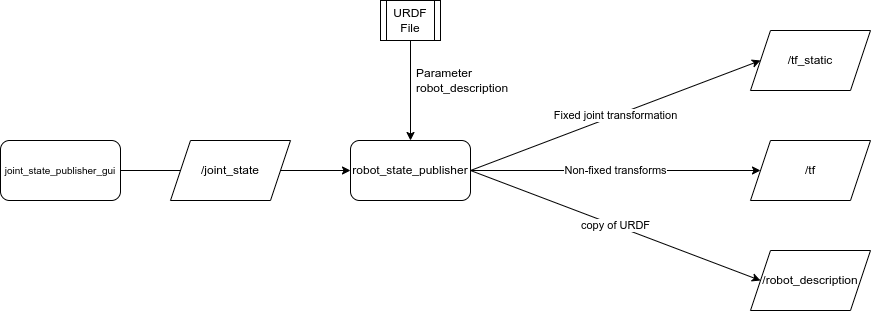

---
tags:
    - urdf
    - joint
---

# URDF joint element
[joint element](https://wiki.ros.org/urdf/XML/joint)


### Joint types
- **fixed**: All degrees of freedom are locked.
- **continuous**: a continuous hinge joint that rotates around the axis and has no upper and lower limits. 
- **revolute**: a hinge joint that rotates along the axis and has a limited range specified by the upper and lower limits. 
- **prismatic**: a sliding joint that slides along the axis, and has a limited range specified by the upper and lower limits. 
- **floating**: this joint allows motion for all 6 degrees of freedom. 
- **planar**: this joint allows motion in a plane perpendicular to the axis. 


## Demo
- Simulate `/joint_state` topic with `joint_state_publisher_gui`
- Launch and show it in `rviz`

  
  


### urdf

```xml title="basic_joint.urdf"
<?xml version="1.0" encoding="UTF-8"?>
<robot name="my_robot">
    <link name="world" />

    <joint name="fixed" type="fixed">
        <parent link="world" />
        <child link="link1" />
    </joint>

    <!-- Base Link -->
    <link name="link1">
        <visual>
            <origin xyz="0 0 0.5" rpy="0 0 0" />
            <geometry>
                <box size="0.1 0.1 1" />
            </geometry>
            <material name="Green">
                <color rgba="0 1.0 0 1.0" />
            </material>
        </visual>
    </link>

    <joint name="link12link2_joint" type="continuous">
        <parent link="link1" />
        <child link="link2" />
        <origin xyz="0 0.05 1" rpy="0 0 0" />
        <axis xyz="0 1 0" />
    </joint>

    <!-- Middle Link -->
    <link name="link2">
        <visual>
            <origin xyz="0 0.05 0.5" rpy="0 0 0" />
            <geometry>
                <box size="0.1 0.1 1" />
            </geometry>
            <material name="Red">
                <color rgba="1.0 0 0 1.0" />
            </material>
        </visual>
    </link>

</robot>
```


### launch 
- Run `robot_state_publisher`
- Run `joint_state_publisher_gui`

```python title="urdf_link.launch.py"
import os
from ament_index_python.packages import get_package_share_directory
from launch import LaunchDescription
from launch_ros.actions import Node

URDF = "basic_joint.urdf"
PACKAGE = "gazebo_tutorial_pkg"


def generate_launch_description():
    ld = LaunchDescription()

    pkg = get_package_share_directory(PACKAGE)
    urdf = os.path.join(pkg, "urdf", URDF)
    with open(urdf, "r", encoding="utf-8") as f:
        robot_description = f.read()

    robot_state_publisher = Node(
        package="robot_state_publisher",
        executable="robot_state_publisher",
        name="robot_state_publisher",
        output="screen",
        parameters=[{"robot_description": robot_description}]
    )

    joint_state_publisher_node = Node(
        package="joint_state_publisher_gui",
        executable="joint_state_publisher_gui",
        name="joint_state_publisher_gui",
    )

    ld.add_action(robot_state_publisher)
    ld.add_action(joint_state_publisher_node)
    return ld
```

### rviz

```bash title="run rviz"
rviz2
```

