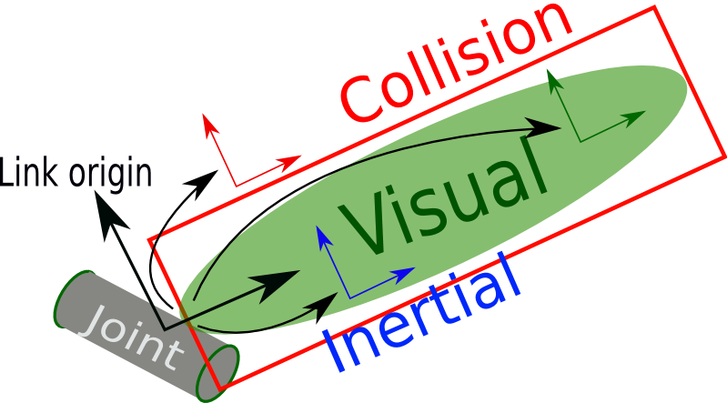
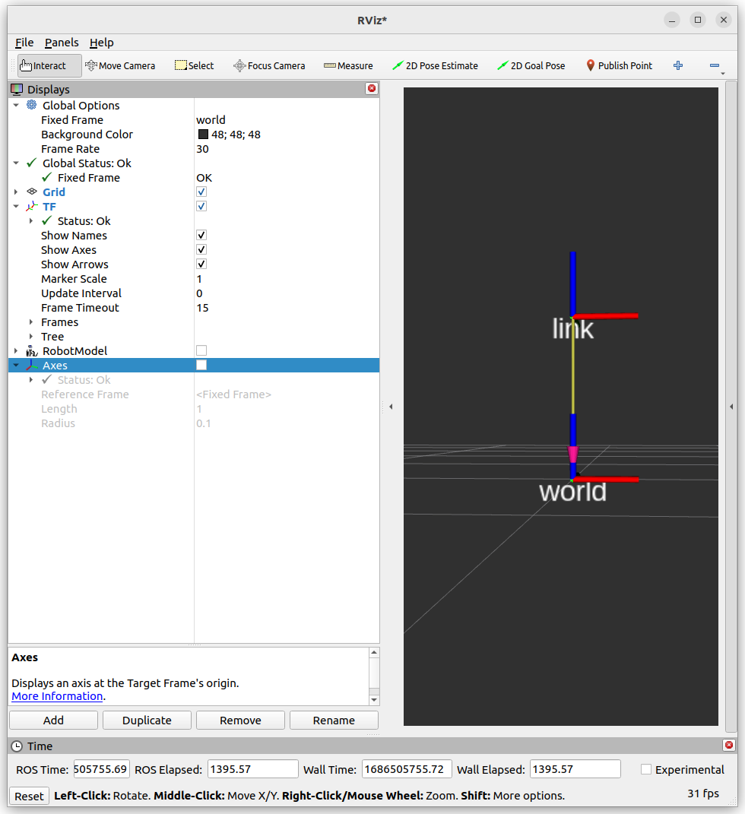

---
tags:
    - urdf
    - link
---

# URDF Link
[link element](https://wiki.ros.org/urdf/XML/link)





## Demo
### urdf
- box origin reference to world2link_joint
- Add link with
  - visual
  - collision
  - inertial
- Add material to visual part

!!! note material
    The material definition relative only to RVIZ

     

```xml title="basic_link.urdf" linenums="1" hl_lines="5 11 17 27"
<?xml version="1.0" encoding="UTF-8"?>
<robot name="my_robot">
    <link name="world" />
    <joint name="world2link" type="fixed">
        <origin xyz="0.0 0.0 0.0" rpy="0.0 0.0 0.0"/>
        <parent link="world"/>
        <child link="link"/>
    </joint>
    <link name="link">
        <inertial>
            <origin xyz="0 0 0.5" rpy="0 0 0" />
            <mass value="1" />
            <inertia ixx="100" ixy="0" ixz="0" iyy="100" iyz="0" izz="100" />
        </inertial>

        <visual>
            <origin xyz="0 0 0.5" rpy="0 0 0" />
            <geometry>
                <box size="1 1 1" />
            </geometry>
            <material name="Cyan">
                <color rgba="0 1.0 1.0 1.0" />
            </material>
        </visual>

        <collision>
            <origin xyz="0 0 0.5" rpy="0 0 0" />
            <geometry>
                <cylinder radius="1" length="0.5" />
            </geometry>
        </collision>
    </link>
</robot>
```

### launch

```python title="urdf_link.launch.py"
import os
from ament_index_python.packages import get_package_share_directory
from launch import LaunchDescription
from launch_ros.actions import Node

URDF = "basic_link.urdf"
PACKAGE = "gazebo_tutorial_pkg"


def generate_launch_description():
    ld = LaunchDescription()

    pkg = get_package_share_directory(PACKAGE)
    urdf = os.path.join(pkg, "urdf", URDF)
    with open(urdf, "r", encoding="utf-8") as f:
        robot_description = f.read()

    robot_state_publisher = Node(
        package="robot_state_publisher",
        executable="robot_state_publisher",
        name="robot_state_publisher",
        output="screen",
        parameters=[{"robot_description": robot_description}]
        # arguments=[urdf],
    )

    ld.add_action(robot_state_publisher)
    return ld

```

### Rviz

```bash title="run rviz"
rviz2
```


