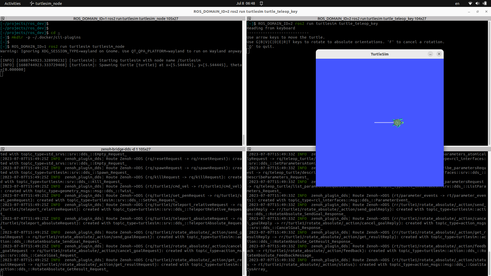

---
tags:
    - ros2
    - zenoh
---

# Zenoh

## DDS/ROS bridge
[github](https://github.com/eclipse-zenoh/zenoh-plugin-dds)

The DDS bridge can install as
- Zenoh router plugin
- Standalone executable
  
### install
```bash
echo "deb [trusted=yes] https://download.eclipse.org/zenoh/debian-repo/ /" | sudo tee -a /etc/apt/sources.list.d/zenoh.list
sudo apt update
```

```bash title="bridge"
sudo apt install zenoh-bridge-dds
```

## Demo
Run standalone bridge and connect two ROS node from different domains

[Zenoh bridge github page demo](https://github.com/eclipse-zenoh/zenoh-plugin-dds#for-a-quick-test-with-ros2-turtlesim)


!!! note zenoh bridges
    The 2 bridges will discover each other using UDP multicast.
     

```bash title="terminal1"
ROS_DOMAIN_ID=1 ros2 run turtlesim turtlesim_node
```

```bash title="terminal2"
ROS_DOMAIN_ID=2 ros2 run turtlesim turtle_teleop_key
```

```bash title="terminal1"
zenoh-bridge-dds -d 2
```

```bash title="terminal1"
zenoh-bridge-dds -d 1
```



!!! note "to read"
    [Architecture details](https://github.com/eclipse-zenoh/zenoh-plugin-dds#architecture-details)
     

## Demo2 - Add configuration to control topics between bridges
[default config example from github](https://github.com/eclipse-zenoh/zenoh-plugin-dds/blob/master/DEFAULT_CONFIG.json5)

```json
{
	plugins: {
		dds: {
			allow: ["cmd_vel"]
		}
	}
}
```

```bash title="terminal1"
ROS_DOMAIN_ID=1 ros2 run turtlesim turtlesim_node
```

```bash title="terminal2"
ROS_DOMAIN_ID=2 ros2 run turtlesim turtle_teleop_key
```

```bash title="terminal1"
zenoh-bridge-dds -d 2 -c zenoh_bridge.json
```

```bash title="terminal1"
zenoh-bridge-dds -d 1 -c zenoh_bridge.json
```


The bridge ignore all topic except the `cmd_vel`

```bash title="bridge log sample"
...
[2023-07-08T04:17:30Z INFO  zenoh_plugin_dds] Route DDS->Zenoh (rt/turtle1/cmd_vel -> rt/turtle1/cmd_vel): created with topic_type=geometry_msgs::msg::dds_::Twist_

[2023-07-08T04:17:30Z INFO  zenoh_plugin_dds] Ignoring Publication for resource rq/turtle1/rotate_absolute/_action/send_goalRequest as it is not allowed (see your 'allow' or 'deny' configuration)
...
```

---

## Resource
- [Improving the communications layer of robot applications with ROS 2 and Zenoh](https://youtu.be/1NE8cU72frk)
- [Minimizing Discovery Overhead in ROS2](https://zenoh.io/blog/2021-03-23-discovery/)
- [ROS2 Robot-to-Anything with Zenoh](https://www.youtube.com/watch?v=9h01_MSKPS0&list=PPSV&ab_channel=ZettaScaleTechnology)
- [zenoh plugin dds](https://github.com/eclipse-zenoh/zenoh-plugin-dds)
