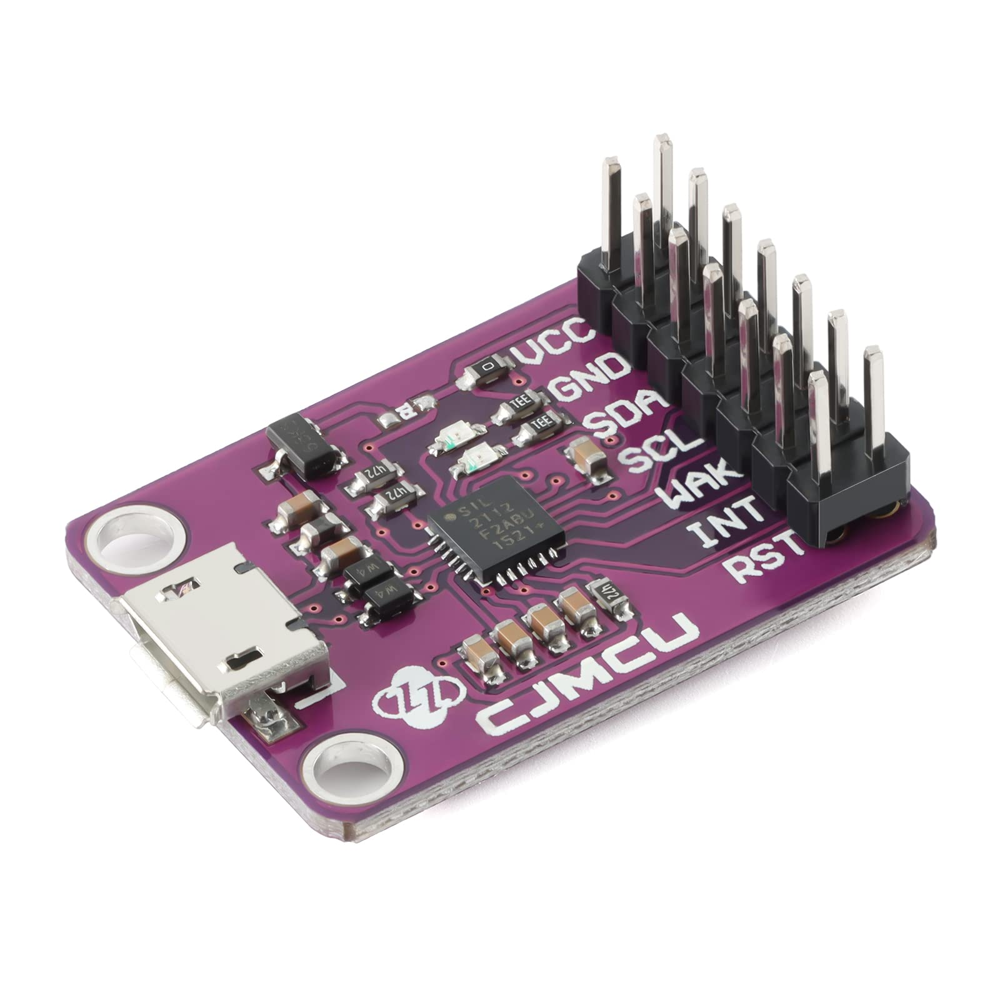

---
tags:
    - i2c
    - cp2112
    - usb 
---

The CP2112 USB-to-I2C Bridge is a device from Silicon Labs designed to facilitate communication between a USB host (like a PC) and I2C devices




## i2c-tools

```
sudo apt install i2c-tools
```

```bash
i2cdetect -l
#
...
i2c-16  unknown         CP2112 SMBus Bridge on hidraw5          N/A
```

### connect i2c sensor at address 0x18

```bash
sudo i2cdetect -y -r 16
[sudo] password for user: 
     0  1  2  3  4  5  6  7  8  9  a  b  c  d  e  f
00:                         -- -- -- -- -- -- -- -- 
10: -- -- -- -- -- -- -- -- 18 -- -- -- -- -- -- -- 
20: -- -- -- -- -- -- -- -- -- -- -- -- -- -- -- -- 
30: -- -- -- -- -- -- -- -- -- -- -- -- -- -- -- -- 
40: -- -- -- -- -- -- -- -- -- -- -- -- -- -- -- -- 
50: -- -- -- -- -- -- -- -- -- -- -- -- -- -- -- -- 
60: -- -- -- -- -- -- -- -- -- -- -- -- -- -- -- -- 
70: -- -- -- -- -- -- -- --                         
```

## udev rule
Add udev rule to add permission `rw` for all

```bash
ll /dev/i2c-16
#
crw-rw---- 1 root i2c 89, 16 Nov  1 07:10 /dev/i2c-16
```

```bash
udevadm info -a -p  $(udevadm info -q path -n /dev/i2c-16)
#

  looking at device '/devices/pci0000:00/0000:00:14.0/usb3/3-4/3-4.2/3-4.2.4/3-4.2.4:1.0/0003:10C4:EA90.0011/i2c-16/i2c-dev/i2c-16':
    KERNEL=="i2c-16"
    SUBSYSTEM=="i2c-dev"
    DRIVER==""
    ATTR{name}=="CP2112 SMBus Bridge on hidraw5"
    ATTR{power/async}=="disabled"
    ATTR{power/control}=="auto"
    ATTR{power/runtime_active_kids}=="0"
    ATTR{power/runtime_active_time}=="0"
    ATTR{power/runtime_enabled}=="disabled"
    ATTR{power/runtime_status}=="unsupported"
    ATTR{power/runtime_suspended_time}=="0"
    ATTR{power/runtime_usage}=="0"
```

```bash title="udev rule"
echo 'SUBSYSTEMS=="i2c-dev", ATTRS{name}=="CP2112 SMBus Bridge on hidraw5", MODE="0666"' | sudo tee /etc/udev/rules.d/90-i2c-usb.rules
```

```bash title="check rule"
sudo udevadm control --reload
# plug out/ in
# check device permission
ll /dev/i2c-16
crw-rw-rw- 1 root i2c 89, 16 Nov  1 08:05 /dev/i2c-16
#know we can run i2cdetect without sudo
i2cdetect -y -r 16
```