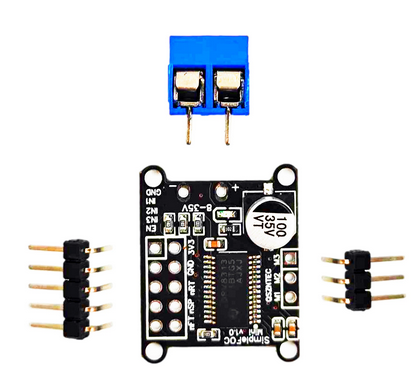
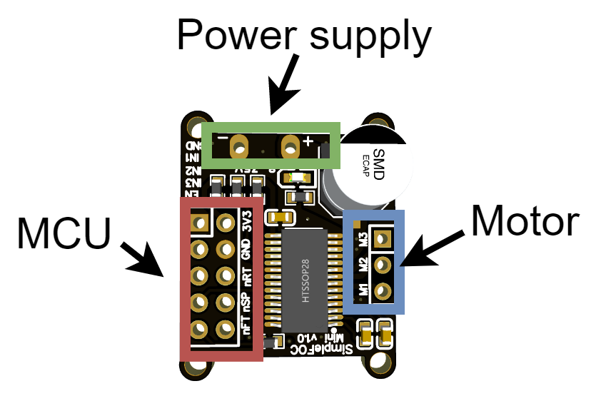

---
tags:
    - foc
    - bldc
    - arduino
    - drv8313
    - simple foc
---

# Simple FOC Mini Hello
Connect simpleFOCMini (v1.0) to arduino UNO
Use simplefoc library 








| PIN  | Arduino (uno) | Desc  |
|---|---|---|
| GND  | 12  |   |
| IN1  | 11  | PWM input phase 1  |
| IN2  | 10  | PWM input phase 2  |
| IN3  |  9 | PWM input phase 3  |
| EN  |  8 | Driver Enable  |

---

## Openloop velocity
[Velocity open-loop control](https://docs.simplefoc.com/velocity_openloop)


```cpp
#include <SimpleFOC.h>

// BLDC motor & driver instance
// BLDCMotor( pp number , phase resistance)
BLDCMotor motor = BLDCMotor(11 , 12.5, 100); 
BLDCDriver3PWM driver = BLDCDriver3PWM(11, 10, 9, 8);

// instantiate the commander
Commander command = Commander(Serial);
void doTarget(char* cmd) { command.scalar(&motor.target, cmd); }
void doLimitCurrent(char* cmd) { command.scalar(&motor.current_limit, cmd); }

void setup() {

  // driver config
  // power supply voltage [V]
  driver.voltage_power_supply = 20;
  driver.init();
  // link the motor and the driver
  motor.linkDriver(&driver);

  // limiting motor current (provided resistance)
  motor.current_limit = 0.5;   // [Amps]
 
  // open loop control config
  motor.controller = MotionControlType::velocity_openloop;

  // init motor hardware
  motor.init();
  motor.initFOC();

  // add target command T
  command.add('T', doTarget, "target velocity");
  command.add('C', doLimitCurrent, "current limit");

  Serial.begin(115200);
  Serial.println("Motor ready!");
  Serial.println("Set target velocity [rad/s]");
  _delay(1000);
}

void loop() {
  motor.loopFOC();
  // open loop velocity movement
  // using motor.current_limit and motor.velocity_limit
  motor.move();

  // user communication
  command.run();
}
```


```ini title="platformio.ini"
[env:uno]
platform = atmelavr
board = uno
framework = arduino
monitor_speed = 115200
lib_deps = askuric/Simple FOC@^2.3.3
```


#### usage
From terminal monitor
[Command interface](https://docs.simplefoc.com/commander_interface)


```bash
# Help
?
T:target velocity
C:current limit

# Send velocity command rad/s
# 1 rad/sec
T1
```
---

# Reference
- [https://docs.simplefoc.com/simplefocmini](https://docs.simplefoc.com/simplefocmini)
  - [Connecting the hardware](https://docs.simplefoc.com/mini_connect_hardware)
- [DRV8313 Simple FOC Mini v1.0](https://www.aliexpress.com/item/1005005824214884.html?spm=a2g0o.order_list.order_list_main.5.7d6b18029GAx85)