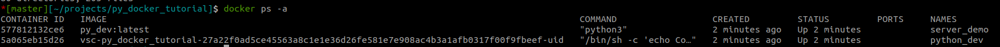

---
tags:
    - devcontainer
    - vscode
    - docker
    - docker compose
---

Using docker-compose with devcontainer  
**VSCode can only use one service as "the workspace" where the IDE runs.**

We can override some configs from the root/base docker-compose.yaml file to meet the dev environment settings

The .devcontainer `dockerComposeFile` tag can config with multiple `docker-compose.yaml` file that can override each other.

```json title="devcontainer attribute example"
"dockerComposeFile": [
        "../docker-compose.yaml",
        "./docker-compose.dev.yaml"
    ],
"service": "app",
"workspaceFolder": "/workspace",
```

| Property  | Type  | Description  |
|---|---|---|
| dockerComposeFile  | string, array  | Path or list of paths to Docker Compose files **relative** to the devcontainer.json file. |
| service | string | The name of service to connect once running |
| workspaceFolder | string | 	Sets the default path that devcontainer.json supporting services / tools should open when connecting to the container (which is often the path to a volume mount where the source code can be found in the container). |

[devcontainer json reference](https://containers.dev/implementors/json_reference/)


---

## Demo
using .devcontainer with docker-compose.yaml

### Setup

```bash title="project tree (partial)"
.
├── app
│   ├── __init__.py
│   ├── main.py
│   └── utils.py
├── .devcontainer
│   ├── devcontainer.json
│   ├── docker-compose.dev.yaml
│   ├── Dockerfile
│   └── postCreateCommand.sh
├── tests
│   ├── __init__.py
│   └── test_demo.py
└── .vscode
    ├── settings.json
    └── tasks.json
```

#### devcontainer override settings
```json title=".devcontainer/devcontainer.json"
{
    "name": "python-dev",
    "dockerComposeFile": [
        "../docker-compose.yaml",
        "./docker-compose.dev.yaml"
    ],
    "service": "app",
    "workspaceFolder": "/workspace",
    "postCreateCommand": "/usr/bin/bash -x ./.devcontainer/postCreateCommand.sh",
    "remoteUser": "user",
    "remoteEnv": {
        "PATH": "${containerEnv:PATH}:/home/user/.local/bin"
    },
    "containerUser": "user",
    "customizations": {}
}
```

- mount project root to container `/workspace` folder
  

```yaml title=".devcontainer/docker-compose.dev.yaml"
version: '3.7'

services:
  app:
    volumes:
      - ./:/workspace
```

#### root/prod docker-compose
```yaml title="docker-compose"
version: '3.7'

services:
  app:
    build:
      context: .
      dockerfile: .devcontainer/Dockerfile
      args:
        VERSION: 0.1
    user: user
    hostname: dev
    container_name: python_dev
    stdin_open: true 
    tty: true
  server:
    image: py_dev:latest
    hostname: server
    container_name: server_demo
    stdin_open: true 
    tty: true

```


### Test

#### view running containers



#### check network
!!! tip "install ping"
    ```bash
    sudo apt update
    sudo apt install iputils-ping
    ```

```bash
# ping <container_name>
ping server_demo
```
     