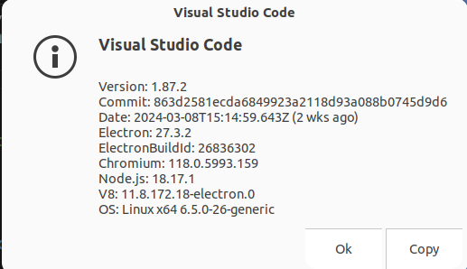

---
tags:
    - vscode
    - offline
    - extensions
    - devcontainer
    - docker
---

# Offline  devcontainer
Config VSCode devcontainer to work offline include vscode-server and remote extensions

## Download vscode server
Using script from [download-vs-code-server.sh ](https://gist.github.com/b01/0a16b6645ab7921b0910603dfb85e4fb)

!!! note "Add commit id"
    Add commit_id argument to script to support older vscode version


     

```bash title="usage"
#download-vs-code-server.sh platform arch commit
```

```bash title="download-vs-code-server.sh"
#!/bin/sh
# Auto-Get the latest commit sha via command line.
get_latest_release() {
    platform=${1}
    arch=${2}

    # Grab the first commit SHA since as this script assumes it will be the
    # latest.
    platform="win32"
    arch="x64"
    commit_id=$(curl --silent "https://update.code.visualstudio.com/api/commits/stable/${platform}-${arch}" | sed s'/^\["\([^"]*\).*$/\1/')

    printf "%s" "${commit_id}"
}

PLATFORM="${1}"
ARCH="${2}"
COMMIT="${3}"

if [ -z "${PLATFORM}" ]; then
    echo "please enter a platform, acceptable values are win32, linux, darwin, or alpine"
    exit 1
fi

if [ -z "${ARCH}" ]; then
    U_NAME=$(uname -m)

    if [ "${U_NAME}" = "aarch64" ]; then
        ARCH="arm64"
    elif [ "${U_NAME}" = "x86_64" ]; then
        ARCH="x64"
    elif [ "${U_NAME}" = "armv7l" ]; then
        ARCH="armhf"
    fi
fi


if [ -z "${COMMIT}" ]; then
    commit_sha=$(get_latest_release "${PLATFORM}" "${ARCH}")
else
    commit_sha=${COMMIT}
fi

if [ -n "${commit_sha}" ]; then
    echo "will attempt to download VS Code Server version = '${commit_sha}'"

    prefix="server-${PLATFORM}"
    if [ "${PLATFORM}" = "alpine" ]; then
        prefix="cli-${PLATFORM}"
    fi

    archive="vscode-${prefix}-${ARCH}.tar.gz"
    # Download VS Code Server tarball to tmp directory.
    curl -L "https://update.code.visualstudio.com/commit:${commit_sha}/${prefix}-${ARCH}/stable" -o "/tmp/${archive}"

    # Make the parent directory where the server should live.
    # NOTE: Ensure VS Code will have read/write access; namely the user running VScode or container user.
    mkdir -vp ~/.vscode-server/bin/"${commit_sha}"

    # Extract the tarball to the right location.
    tar --no-same-owner -xzv --strip-components=1 -C ~/.vscode-server/bin/"${commit_sha}" -f "/tmp/${archive}"
    # Add symlink
    cd ~/.vscode-server/bin && ln -s "${commit_sha}" default_version
else
    echo "could not pre install vscode server"
fi

```

---

# Demo
Create docker file that install python dependency and download vscode-server and extension

```title="project structure"
.
├── .devcontainer
│   └── devcontainer.json
├── Dockerfile
└── download-vs-code-server.sh
```

```Dockerfile
FROM ubuntu:22.04

ENV DEBIAN_FRONTEND=noninteractive

ARG USERNAME=user
ARG USER_UID=1000
ARG USER_GID=$USER_UID

# Create a non-root user
RUN groupadd --gid $USER_GID $USERNAME \
  && useradd -s /bin/bash --uid $USER_UID --gid $USER_GID -m $USERNAME \
  # Add sudo support for the non-root user
  && apt-get update \
  && apt-get install -y sudo \
  && echo $USERNAME ALL=\(root\) NOPASSWD:ALL > /etc/sudoers.d/$USERNAME\
  && chmod 0440 /etc/sudoers.d/$USERNAME \
  && rm -rf /var/lib/apt/lists/*

RUN apt-get update && \
    apt-get install -y \
        python3 \
        python3-pip \
        git \
        curl \
        && rm -rf /var/lib/apt/lists/*

COPY ./download-vs-code-server.sh /tmp
RUN chmod +x /tmp/download-vs-code-server.sh
USER user
RUN /tmp/download-vs-code-server.sh linux
ENV PATH=/home/user/.vscode-server/bin/default_version/bin:$PATH
RUN code-server --install-extension ms-python.python \
    && code-server --install-extension ms-python.black-formatter
```

```bash
docker build -t vscode:offline -f Dockerfile .
```

```json title="devcontainer.json"
{
    "name": "vscode_offline",
    "image": "vscode:offline",
    "remoteUser": "user",
    "runArgs": [
        "--hostname=dev"
    ]
}
```


---

## Download older vsix version

!!! note "Ubuntu 18.04"
    VSCode stop support ubuntu 18.04 from version 1.87, we need to downgrade VSCode version and install older extension version , for example remote-containers


### Demo: download devcontainer


!!! tip "name"
    `Container name: publisher.package`
    
    Example: ms-vscode-remote.remote-containers


```bash
# https://marketplace.visualstudio.com/_apis/public/gallery/publishers/<publisher>/vsextensions/<package>/<version>/vspackage

https://marketplace.visualstudio.com/_apis/public/gallery/publishers/ms-vscode-remote/vsextensions/remote-containers/0.352.0/vspackage
```


---

## Reference
- [VSCode Download Older version of an Extension](https://stackoverflow.com/questions/69398500/vscode-download-older-version-of-an-extension)