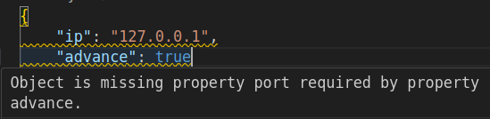

VSCode has the ability to display autocomplete suggestions for JSON and YAML format out of the box.  
It's use `JSON schema` to do it

## JSON Schema
[JSON Schema](https://json-schema.org/) is a specification that allows you to describe the structure of a JSON document and validate documents against that schema.


VSCode manage json schema by set `json.schemas` in settings.json

```json title="settings.json"
"json.schemas": [
      {
          "fileMatch": [
              "demo.json"
          ],
          "url": "file:<path>/demo.schema.json"
      }
]
```

```json title="demo.json"
{
    "ip": "127.0.0.1",
    "port": 2000
}
```

```json title="demo.schema.json"
{
    "type": "object",
    "properties": {
        "ip": {
            "type": "string"
        },
        "port": {
            "type": "integer",
            "maximum": 10000,
            "minimum": 1024
        }
    },
    "required": [
        "ip",
        "port"
    ]
}
```

!!! tip "online json schema creator"
     [json schema creator](https://www.liquid-technologies.com/online-json-to-schema-converter)

---

## Demos
- More schema options
  - array
  - enum
  - dependentRequired
  - anyOf
  - [If-Then-Else](https://json-schema.org/understanding-json-schema/reference/conditionals.html#if-then-else)


```json title="array"
"protocol": {
      "type":"array",
      "items": {
          "type": "string",
          "enum": ["tcp", "udp"]
      },
      "minItems": 2,
      "uniqueItems": true
  }
```

```json title="enum"
"protocol": {
    "type":"string",
    "enum": ["tcp", "udp"]
}

```

```json title="dependentRequired" linenums="1" hl_lines="7 12 22 23"
{
    "type": "object",
    "properties": {
        "ip": {
            "type": "string"
        },
        "port": {
            "type": "integer",
            "maximum": 10000,
            "minimum": 1024
        },
        "advance": {
            "type":"boolean"
        }


    },
    "required": [
        "ip"
        
    ],
    "dependentRequired": {
        "advance": ["port"]
    }
}
```



#### anyOf
[schema reference](https://json-schema.org/understanding-json-schema/reference/combining.html)
- data property can be:
  -  string with max two char
  -  positive numbers


```json title="anyOf"
{
    "type": "object",
    "properties": {
        "data": {
            "anyOf": [
                {
                    "type": "string",
                    "maxLength": 2
                },
                {
                    "type": "number",
                    "minimum": 0
                }
            ]
        }
    }
}
```

---

## YAML and json schema
Using [YAML red hat](https://marketplace.visualstudio.com/items?itemName=redhat.vscode-yaml)
we can config yaml file to validate against json schema


### settings

```json
"yaml.schemas": {
  "<shema file location>.json": "<file useage by schema>.yaml",
},
```

### Demo
- Simple schema withou

---

# References
- [How to create your own auto-completion for JSON and YAML files on VS Code with the help of JSON Schema](https://dev.to/brpaz/how-to-create-your-own-auto-completion-for-json-and-yaml-files-on-vs-code-with-the-help-of-json-schema-k1i)