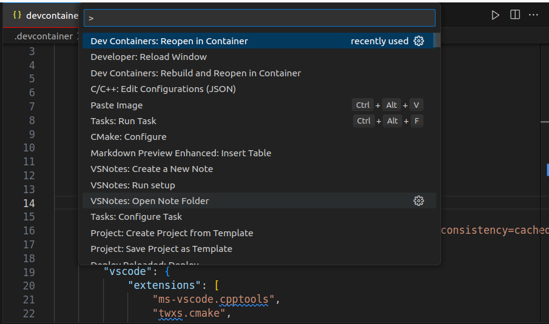

---
tags:
    - opencv
    - docker
    - python
    - vscode
    - devcontainer
---

# Build Docker for opencv application
Create python docker with opencv installed
Config docker to work as vscode devcontainer

## Docker
- Create Dockerfile
  - Add user UID=1000 to Docker
  - Install basic python dependencies
  - Install opencv runtime dependencies
  - Install opencv-python using pip
  - Add current user to `video` group for camera capture permission

### Dockerfile

```Dockerfile
FROM ubuntu:22.04 AS base

ENV DEBIAN_FRONTEND=noninteractive

ARG USERNAME=user
ARG USER_UID=1000
ARG USER_GID=$USER_UID

# Create a non-root user
RUN groupadd --gid $USER_GID $USERNAME \
  && useradd -s /bin/bash --uid $USER_UID --gid $USER_GID -m $USERNAME \
  # [Optional] Add sudo support for the non-root user
  && apt-get update \
  && apt-get install -y sudo \
  && echo $USERNAME ALL=\(root\) NOPASSWD:ALL > /etc/sudoers.d/$USERNAME\
  && chmod 0440 /etc/sudoers.d/$USERNAME \
  # Cleanup
  && rm -rf /var/lib/apt/lists/* \
  && echo 'export PS1="🐳 \u@\h: \w\a\ # "' > /home/$USERNAME/.bashrc

# python and some utils
RUN apt-get update && \
    apt-get install -y \
        python3 \
        python3-pip \
        python3-venv \
        net-tools \
        iputils-ping \
        && rm -rf /var/lib/apt/lists/*

# opencv runtime dependecies
RUN apt-get update && \
    apt-get install -y \
        libgl1-mesa-glx \
        qtbase5-dev \
        libxcb-cursor0 \
    && rm -rf /var/lib/apt/lists/*

# opencv using pip
RUN pip3 install --upgrade pip && \
    pip3 install opencv-python

# Add uid=1000 to video group for capture permission
RUN usermod -a -G video  $USERNAME
```

### Build
```bash
docker build -t ubuntu22:opencv .
```

### Usage

```bash
xhost + local:user
```

!!! tip "xhost"
     Don't forget to run 
     ```bash
     xhost + local:user
     ```

```bash
docker run -it --rm \
--privileged \
--user user \
--name opencv \
--hostname dev \
--device /dev/video0:/dev/video0 \
--net=host \
-e DISPLAY=$DISPLAY \
-v /tmp/.X11-unix:/tmp/.X11-unix \
-v `pwd`:/workspace \
ubuntu22:opencv \
/bin/bash
```

!!! warning "qt.qpa.plugin"
    ```bash
    qt.qpa.plugin: Could not find the Qt platform plugin "offscreen" in "/usr/local/lib/python3.10/dist-packages/cv2/qt/plugins"
This application failed to start because no Qt platform plugin could be initialized. Reinstalling the application may fix this problem.

Available platform plugins are: xcb.
    ```

    I success to resolve the issue by install
    ```bash
    apt install qtbase5-dev 
    apt install libxcb-cursor0 
    ```

    and run `xhost + local:user` before running docker container

---

#### Camera capture
- Add docker argument `--device /dev/video0:/dev/video0`
- When you run docker as none root add `--privileged` argument


```python
import cv2

cap = cv2.VideoCapture(0)

while True:
    status, photo = cap.read()
    cv2.imshow("Webcam Video Stream", photo)

    # Press Enter to exit
    if cv2.waitKey(10) == 13:
        break

cv2.destroyAllWindows()
```

---

### Dev using vscode devcontainer
- Use prebuild image

```json title="devcontainer.json"
{
    "name": "opencv",
    "image": "ubuntu22:opencv",
    "containerUser": "user",
    "runArgs": [
        "--privileged",
        "--network=host",
        "--name=opencv-dev",
        "--hostname=dev",
        "--device=/dev/video0:/dev/video0"
    ],
    "containerEnv": {
        "DISPLAY": "unix:0"
    },
    "mounts": [
        "source=/tmp/.X11-unix,target=/tmp/.X11-unix,type=bind,consistency=cached"
      ],
    "customizations": {
        "vscode": {
            "extensions": [
                "ms-vscode.cpptools",
                "twxs.cmake",
                "ms-python.python"
            ]
        }
    }   
}
```

#### Run

