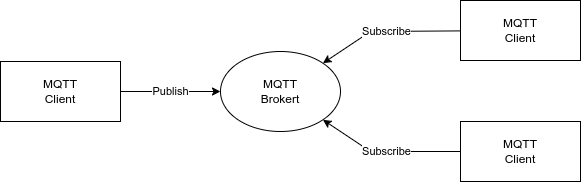

---
tags:
    - mqtt
---

# MQTT

MQTT is a Client Server publish/subscriber messaging transport protocol

Main Features
- Base on TCP
- Minimal overhead
- Simple
- Designed for reliable communication over unreliable channels


## Publish / Subscribe




## Broker

[mosquitto](https://mosquitto.org/download/)


## Demo
- install (pc)
- cli (pc)
- wifi

### install (pc)

```bash
sudo apt-add-repository ppa:mosquitto-dev/mosquitto-ppa
# client install
sudo apt install mosquitto-clients
```

### cli (pc)

```bash title="sub"
mosquitto_sub -h mqtt.eclipseprojects.io -t my_topic -d

```

```bash title="pub"
 mosquitto_pub -h mqtt.eclipseprojects.io -t my_topic -m "hello world" -d
Client null sending CONNECT
Client null received CONNACK (0)
Client null sending PUBLISH (d0, q0, r0, m1, 'my_topic', ... (11 bytes))
Client null sending DISCONNECT

```

### wifi
- Station mode
- Access point


---

## Reference
- [MQTT Essential](https://www.youtube.com/playlist?list=PLRkdoPznE1EMXLW6XoYLGd4uUaB6wB0wd)