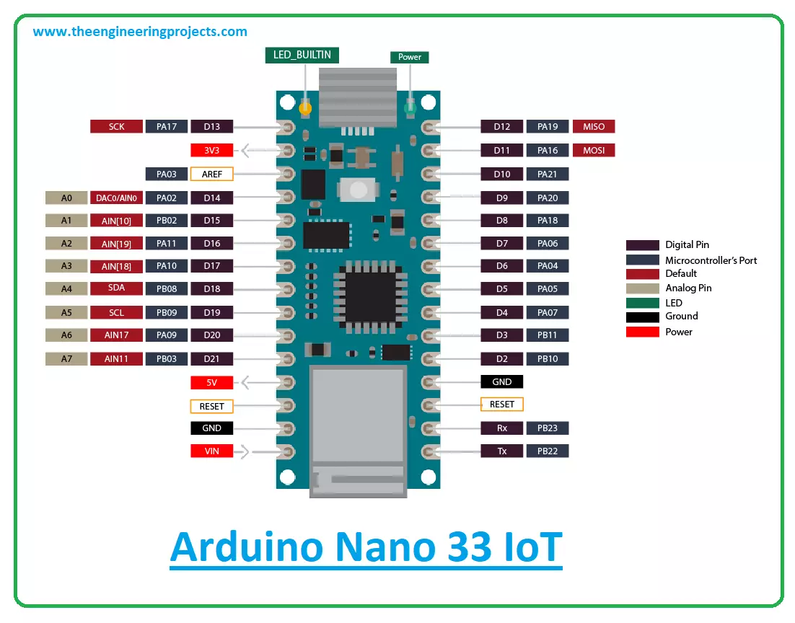

---
tags:
    - nano
    - terabee
    - sensors
    - i2c
    - arduino
---

## TeraRanger Evo pinout

| pin  | usage  |
|---|---|
| 1  | Tx  |
| 2  | Rx  |
| 3  | Gnd  |
| 4  | SDA  |
| 5  | SCL  |
| 6  |   |
| 7  | VCC  |
| 8  | GND  |
| 9  |   |
