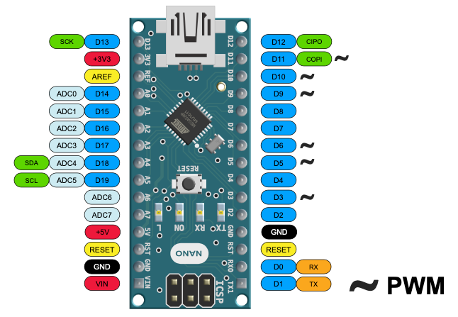
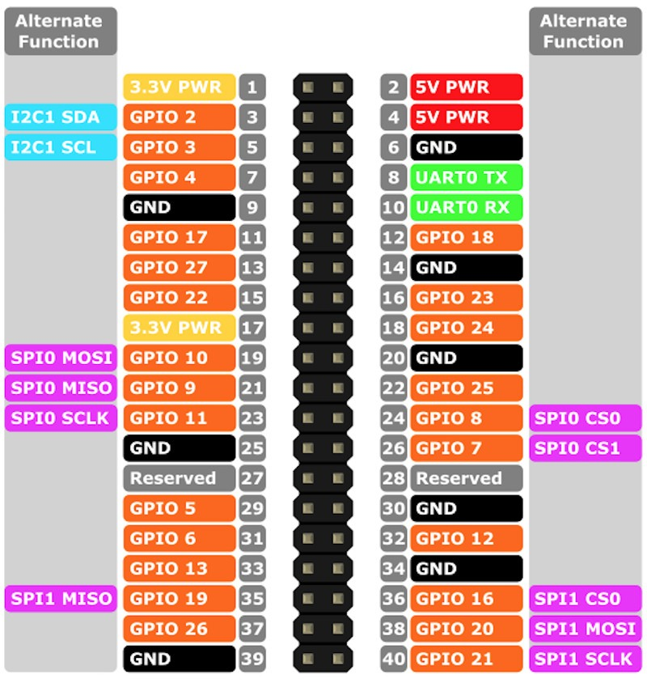

---
tags:
    - arduino
    - i2c
    - nano
    - rpi
---

# Arduino I2C as slave
Config arduino as i2c slave, control digital output from rpi using i2c

## pinout
#### Arduino nano


#### Rpi 4 


### Wiring

| rpi  | nano  |
|---|---|
| sda (3)  | sda(A4)  |
| scl (5)  | scl(A5)  |
| gnd (6)  | GND      |


## i2c

### Arduino code
Set arduino as **slave** listen in port `0x3a`

```c
#include <Arduino.h>
#include <Wire.h>

void receiveEvent(int howMany);

void setup() {
    Wire.begin(0x3a);
    Wire.onReceive(receiveEvent);
    Serial.begin(9600);
    Serial.println("Hello, World!");
    pinMode(DD2, OUTPUT);
    pinMode(DD3, OUTPUT);
    pinMode(DD4, OUTPUT);
}

void loop() {
    delay(100);
}

void toggle(int pin) {
    int current = digitalRead(pin);
        if (current == HIGH) {
            digitalWrite(pin, LOW);
        } else {
            digitalWrite(pin, HIGH);
        }
}
void receiveEvent(int howMany) {
    char c = Wire.read();
    Serial.println(c);
    if (c == 'a') {
        toggle(DD2);
    }
    if (c == 'b') {
        toggle(DD3);
    }
    if (c == 'c') {
        toggle(DD4);
    }
}
```

### usage / test

```bash
# 0x3a: 58 device address
# 0x61: a
# 0x62: b
# 0x63: c
i2cset -y 1 0x3a 0x61

# send block of data
# use mode i
i2cset -y 1 0x3a 0x61 0x62 0x63 i
```

---
## Demos

### Cpp

```cpp

#include <iostream>
#include <fcntl.h>      // For file control operations
#include <unistd.h>     // For system calls like open(), close(), etc.
#include <linux/i2c-dev.h>
#include <sys/ioctl.h>
#include <chrono>
#include <cstring>

int setI2CSlaveAddress(int file, int addr) {
    if (ioctl(file, I2C_SLAVE, addr) < 0) {
        std::cerr << "Failed to acquire bus access or talk to slave.\n";
        return -1;
    }
    return 0;
}


int openI2CBus(const char* bus) {
    int file;
    if ((file = open(bus, O_RDWR)) < 0) {
        std::cerr << "Failed to open the bus.\n";
        return -1;
    }
    return file;
}

int writeToArduino(int file, const char* data, int length) {
    if (write(file, data, length) != length) {
        std::cerr << "Failed to write to the i2c bus.\n";
        return -1;
    }
    return 0;
}

int readFromArduino(int file, char* buffer, int length) {
    if (read(file, buffer, length) != length) {
        std::cerr << "Failed to read from the i2c bus.\n";
        return -1;
    }
    return 0;
}

int main() {
    const char* i2cBus = "/dev/i2c-1";  // I2C bus device path
    int i2cAddr = 0x3a;                 // Arduino I2C address

    int file = openI2CBus(i2cBus);
    if (file < 0) return -1;

    if (setI2CSlaveAddress(file, i2cAddr) < 0) return -1;

    // Send a message to the Arduino
    const char* message = "a";
    if (writeToArduino(file, message, strlen(message)) < 0) return -1;

    // // Read response from Arduino
    // char buffer[16] = {0};  // Buffer to store the response
    // if (readFromArduino(file, buffer, 16) < 0) return -1;

    // std::cout << "Arduino says: " << buffer << std::endl;

    close(file);  // Close the I2C bus
    return 0;
}
```

## python

```python
import smbus


ADDRES = 0x3a

bus = smbus.SMBus(1)  # Use I2C bus 1 
bus.write_byte(ADDRES, 0x62)
```

---

## Get Data 

```cpp
#include <Arduino.h>
#include <Wire.h>

void requestEvent();

int data = 1024;
void setup() {
    Wire.begin(0x3a);
    Wire.onRequest(requestEvent);
    Serial.begin(9600);
}

void loop() {
    delay(100);
    Serial.println(data);
}

void requestEvent() {
  Wire.write((byte*)&data, sizeof(data)); // Send the data to the master
}
```

```bash
i2cget -y 1 0x3a 0 i 2
#
0x00 0x04

#0x0400 = 1024
```

```python
import smbus
import time

# Initialize the I2C bus
bus = smbus.SMBus(1)

# I2C address of the Arduino
address = 0x3a

def read_word():
    # Read 2 bytes (a word) from the Arduino
    data = bus.read_i2c_block_data(address, 0, 2)
    print(f"Received bytes: {hex(data[0])}, {hex(data[1])}")
    high_byte = data[1]
    low_byte = data[0]
    # Combine the two bytes into a single integer
    value = (high_byte << 8) + low_byte
    print(f"Received word: {value}")
    # return value

while True:
    read_word()
    time.sleep(1)
```