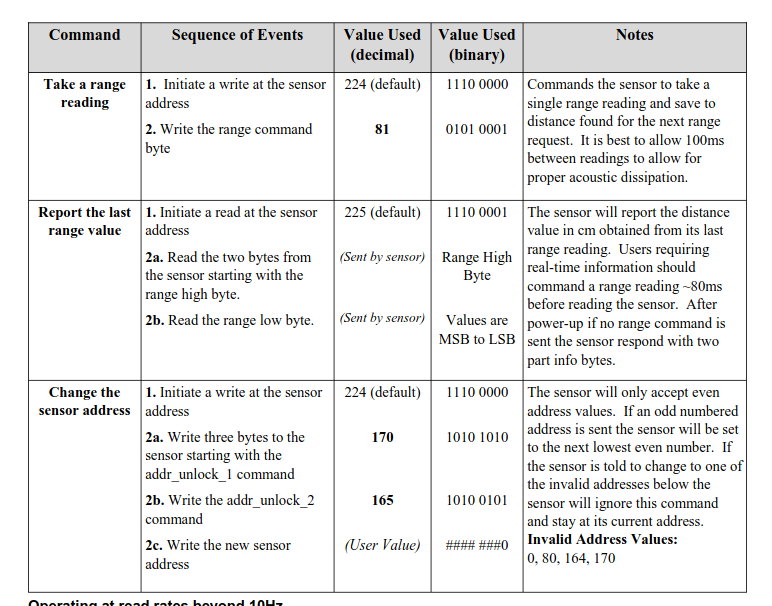

---
tags:
    - arduino
    - i2c
    - nano
    - vscode
    - platformio
---




## Wiring

## Code

```cpp
#include <Arduino.h>
#include <Wire.h>

void setup()
{
  Wire.begin();

  Serial.begin(9600);
  while (!Serial)
  Serial.println("\nI2C Scanner");
}

void loop()
{
  
    // Wire.beginTransmission(address);
    // error = Wire.endTransmission();

  Serial.println("Hello world");

  delay(1000);
}

```

---

## Reference 
- [I2CXL-MaxSonar-EZ DatasheetI2CXL-MaxSonar-EZ Datasheet](https://maxbotix.com/pages/i2cxl-maxsonar-ez-datasheet)