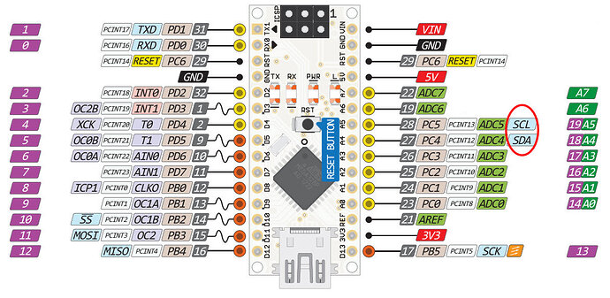

---
tags:
    - nano
    - tf_mini
    - sensors
    - serial
    - arduino
---
# Connect TF-Mini to Arduino nano




## Software serial

### Wiring

| Arduino  | TFMini  |
|---|---|
|   |   |
|   |   |
| PD2 (2)  | TX  |
| PD3 (3) | RX  |


## Code
[tf-mini manual](https://cdn-shop.adafruit.com/product-files/3978/3978_manual_SJ-PM-TFmini-T-01_A03ProductManual_EN.pdf)
[github tf mini](https://github.com/TFmini/TFmini-Arduino)

| byte 0  | byte 1  | byte 2  | byte 3  | byte 4  | byte 5  | byte 6  | byte 7  | byte 8  |
|---|---|---|---|---|---|---|---|---|
| 0x59  | 0x59  | Dist_L  | Dist_H  | Stre_L  | Stre_H  | Mode  | 0x00  | Checksum  |


```cpp
#include <Arduino.h>
#include <SoftwareSerial.h>   //header file of software serial port
#define RX PD2
#define TX PD3
SoftwareSerial Serial1(RX, TX); //define software serial port name as Serial1 and define pin2 as RX & pin3 as TX
 
int dist;                     //actual distance measurements of LiDAR
int strength;                 //signal strength of LiDAR
int check;                    //save check value
int i;
int uart[9];                   //save data measured by LiDAR
const int HEADER = 0x59;      //frame header of data package
 
 
void setup()
{
  Serial.begin(9600);         //set bit rate of serial port connecting 
  Serial1.begin(115200);      //set bit rate of serial port connecting LiDAR with
  Serial.println("init");
}
 
 
void loop() {
  if (Serial1.available())                //check if serial port has data input
  {
    if (Serial1.read() == HEADER)        //assess data package frame header 0x59
    {
      uart[0] = HEADER;
      if (Serial1.read() == HEADER)      //assess data package frame header 0x59
      {
        uart[1] = HEADER;
        for (i = 2; i < 9; i++)         //save data in array
        {
          uart[i] = Serial1.read();
        }
        check = uart[0] + uart[1] + uart[2] + uart[3] + uart[4] + uart[5] + uart[6] + uart[7];
        if (uart[8] == (check & 0xff))        //verify the received data as per protocol
        {
          dist = uart[2] + uart[3] * 256;     //calculate distance value
          strength = uart[4] + uart[5] * 256; //calculate signal strength value
          Serial.print("dist = ");
          Serial.print(dist);                 //output measure distance value of LiDAR
          Serial.print('\t');
          Serial.print("strength = ");
          Serial.print(strength);             //output signal strength value
          Serial.print('\n');
        }
      }
    }
  }
  
}
```