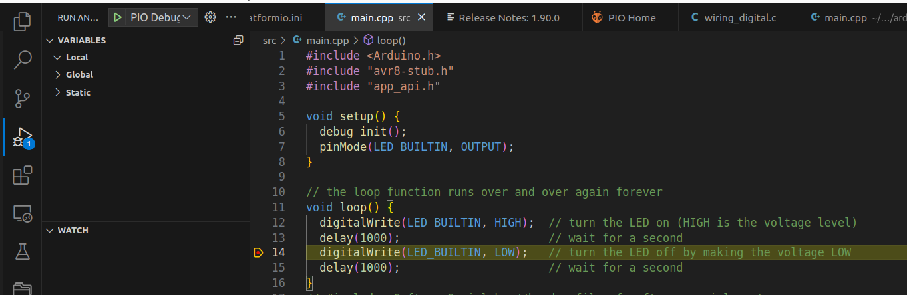

---
tags:
    - arduino
    - platformio
    - debug
    - vscode
---

# Debugging Arduino Uno and Nano
With VSCode and platformio

!!! Note
    The avr-debugger work with atmel 328 microcontrollers


```ini title="platformio.ini"
[env:nanoatmega328]
platform = atmelavr
board = nanoatmega328
framework = arduino

debug_tool = avr-stub
debug_port = /dev/ttyUSB0


lib_deps =
    jdolinay/avr-debugger @ ~1.4
```

!!! tip "mess libs"
    Remove / Clean project lib dependencies

    ```
    rm -rf $HOME//Documents/PlatformIO/Projects/<Project_name>/.pio/libdeps
    ```
     

---

### Demo 
Using blink

```cpp
#include <Arduino.h>
#include "avr8-stub.h"
#include "app_api.h"

void setup() {
  debug_init();
  pinMode(LED_BUILTIN, OUTPUT);
}

// the loop function runs over and over again forever
void loop() {
  digitalWrite(LED_BUILTIN, HIGH);  // turn the LED on (HIGH is the voltage level)
  delay(1000);                      // wait for a second
  digitalWrite(LED_BUILTIN, LOW);   // turn the LED off by making the voltage LOW
  delay(1000);                      // wait for a second
}
```

#### usage

Run with `f5`




## Reference
- [avr-stub](https://docs.platformio.org/en/stable/plus/debug-tools/avr-stub.html)
- [Debugging the Arduino Uno or Nano! (No extra hardware needed!)](https://youtu.be/7wx27FcluMg)