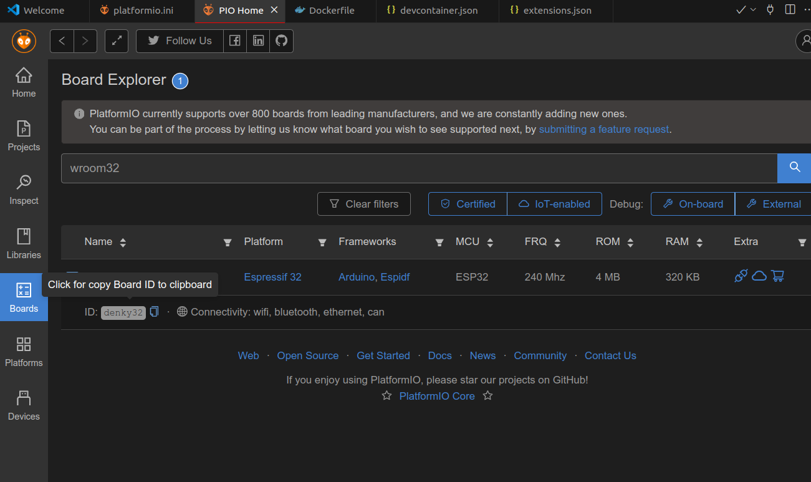
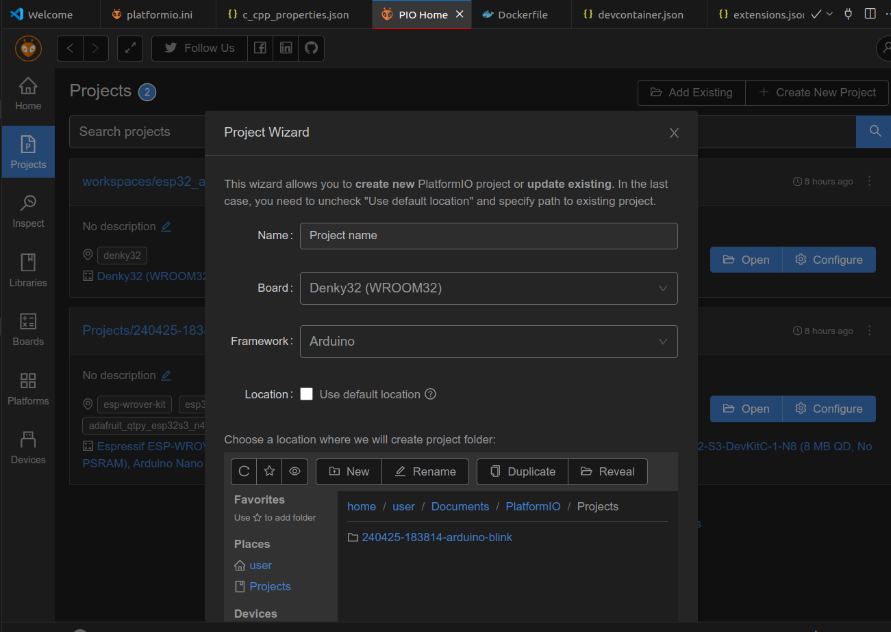

---
tags:
    - esp32
    - arduino
    - platformio
    - docker
    - vscode
    - devcontainer
---
Programming ESP32 with arduino framework using VSCODE and platformio all in devcontainer

## Setup
### Docker
- base on ubuntu 22.04
- Add user (none root user)
- Install python dependencies
- Add none root user to dialout group

```dockerfile
FROM ubuntu:22.04 AS base

ENV DEBIAN_FRONTEND=noninteractive

ARG USERNAME=user
ARG USER_UID=1000
ARG USER_GID=$USER_UID

# Create a non-root user
RUN groupadd --gid $USER_GID $USERNAME \
  && useradd -s /bin/bash --uid $USER_UID --gid $USER_GID -m $USERNAME \
  # Add sudo support for the non-root user
  && apt-get update \
  && apt-get install -y sudo \
  && echo $USERNAME ALL=\(root\) NOPASSWD:ALL > /etc/sudoers.d/$USERNAME\
  && chmod 0440 /etc/sudoers.d/$USERNAME \
  && rm -rf /var/lib/apt/lists/*

RUN apt-get update && apt-get install -y --no-install-recommends \
    python3 \
    python3-pip \
    python3-venv \
    python-is-python3 \
    wget \
  && rm -rf /var/lib/apt/lists/*

RUN usermod -aG dialout user
```

### devcontainer

- docker running settings
    - privileged
    - share usb with host
- Install platformio extension

```json
{
    "name": "esp32_arduino",
    "build": {
        "dockerfile": "Dockerfile",
        "context": ".."
    },
    "remoteUser": "user",
    "runArgs": [
        "--name=esp32_arduino",
        "--hostname=esp32",
        "--privileged",
        "--network=host"
    ],
    "mounts": ["type=bind,source=/dev/bus/usb,target=/dev/bus/usb"],
    "customizations": {
        "vscode": {
            "settings": {
              
                "search.exclude": {
                    "**/build": true,
                    "**/install": true,
                    "**/log": true
                }
            },
            "extensions": [
                "platformio.platformio-ide"
            ]
        }
    }
}
```

---

## Platformio setup
### Install framework


### Select board
- Search for support board
- Copy board id to ini file




---

## New project
Using project wizard to create new project



---

## Platformio ini file
Each platformio project has `platformio.ini` project configuration file
Set the:
- Build option
- Upload option
- Library options

[more](https://docs.platformio.org/page/projectconf.html)


```ini title="example with imu support library"
[env:denky32]
platform = espressif32
framework = arduino
board = denky32
monitor_speed = 115200


lib_deps =
  Wire
  electroniccats/MPU6050 @ ^1.3.1
```

---

## Reference
- [Using Touch Pins on a ESP32 (ESP32 + Arduino series)](https://www.youtube.com/playlist?list=PLzvRQMJ9HDiQ3OIuBWCEW6yE0S0LUWhGU)