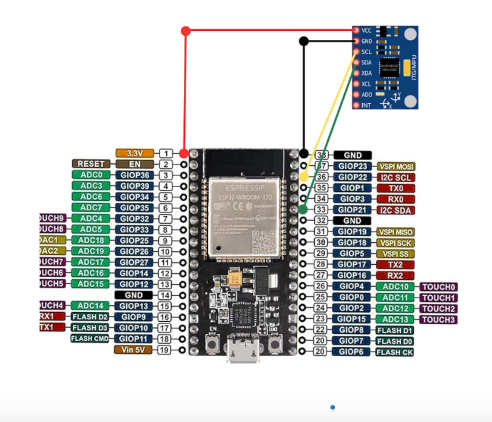
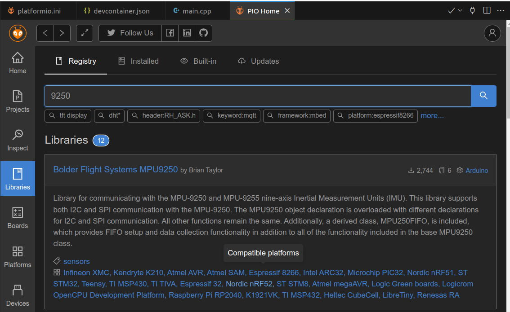

---
tags:
    - esp32
    - arduino
    - platformio
    - imu
    - mpu9250
---

# MPU-9250


Read imu data using `Bolder Flight Systems MPU9250` library

## Hardware



## Code




```ini title="platformio.ini"
[env:denky32]
platform = espressif32
framework = arduino
board = denky32
monitor_speed = 115200
upload_port = /dev/ttyUSB0

lib_deps =
  Wire
  bolderflight/Bolder Flight Systems MPU9250 @ ^1.0.2
```


```cpp title="read imu data"
#include "MPU9250.h"

// an MPU9250 object with the MPU-9250 sensor on I2C bus 0 with address 0x68
MPU9250 IMU(Wire,0x68);
int status;

void setup() {
  // serial to display data
  Serial.begin(115200);
  while(!Serial) {}

  // start communication with IMU 
  status = IMU.begin();
  if (status < 0) {
    Serial.println("IMU initialization unsuccessful");
    Serial.println("Check IMU wiring or try cycling power");
    Serial.print("Status: ");
    Serial.println(status);
    while(1) {}
  }
  // setting the accelerometer full scale range to +/-8G 
  IMU.setAccelRange(MPU9250::ACCEL_RANGE_8G);
  // setting the gyroscope full scale range to +/-500 deg/s
  IMU.setGyroRange(MPU9250::GYRO_RANGE_500DPS);
  // setting DLPF bandwidth to 20 Hz
  IMU.setDlpfBandwidth(MPU9250::DLPF_BANDWIDTH_20HZ);
  // setting SRD to 19 for a 50 Hz update rate
  IMU.setSrd(19);
}

void loop() {
  // read the sensor
  IMU.readSensor();

  // display the data
  Serial.print(IMU.getAccelX_mss(),6);
  Serial.print("\t");
  Serial.print(IMU.getAccelY_mss(),6);
  Serial.print("\t");
  Serial.print(IMU.getAccelZ_mss(),6);
  Serial.print("\t");
  Serial.print(IMU.getGyroX_rads(),6);
  Serial.print("\t");
  Serial.print(IMU.getGyroY_rads(),6);
  Serial.print("\t");
  Serial.print(IMU.getGyroZ_rads(),6);
  Serial.print("\t");
  Serial.print(IMU.getMagX_uT(),6);
  Serial.print("\t");
  Serial.print(IMU.getMagY_uT(),6);
  Serial.print("\t");
  Serial.print(IMU.getMagZ_uT(),6);
  Serial.print("\t");
  Serial.println(IMU.getTemperature_C(),6);
  delay(20);
}
```