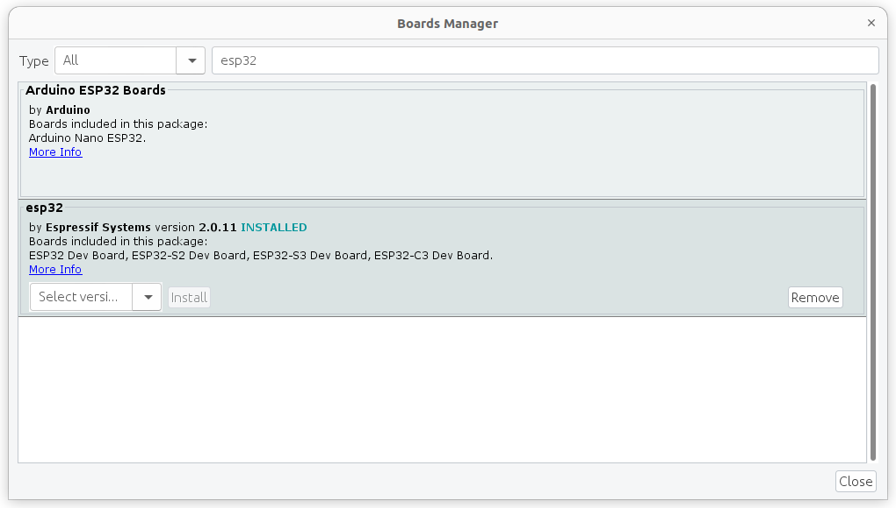

---
tags:
    - esp32
    - rtos
    - arduino
    - dev
---

# RTOS first step with ESP32 using arduino IDE
Simple blink LED

- ESP32-WOOD-32D (no internal LED)
- Arduino 1.8.19
- Ubuntu 22.04


## Arduino Config

```
https://dl.espressif.com/dl/package_esp32_index.json
```


### Boards Manager
- filter `esp32`




### Port
- set to `/dev/ttyUSB0`

---

## code

```cpp

static const BaseType_t app_cpu = 0;

//pins
static const int led_pin = 2;
static const int rate_1 = 1500;  // ms

void toggleLED_1(void *parameter) {
  while(1) {
    digitalWrite(led_pin, HIGH);
    vTaskDelay(rate_1 / portTICK_PERIOD_MS);
    digitalWrite(led_pin, LOW);
    vTaskDelay(rate_1 / portTICK_PERIOD_MS);
  }
}

void setup() {
  pinMode(led_pin, OUTPUT);
  // Task to run forever
  xTaskCreatePinnedToCore(  // Use xTaskCreate() in vanilla FreeRTOS
              toggleLED_1,  // Function to be called
              "Toggle 1",   // Name of task
              1024,         // Stack size (bytes in ESP32, words in FreeRTOS)
              NULL,         // Parameter to pass to function
              1,            // Task priority (0 to configMAX_PRIORITIES - 1)
              NULL,         // Task handle
              app_cpu);     // Run on one core for demo purposes (ESP32 only)
}

void loop() {
  // put your main code here, to run repeatedly:

}
```


```cpp
// portTICK_PERIOD_MS = 1ms
// The delay is number of ticks
vTaskDelay(rate_1 / portTICK_PERIOD_MS);
```

---

## Run
- Upload
- My Board has no Internal GPIO LED
- Connect led with resistor to GPIO2 and Test