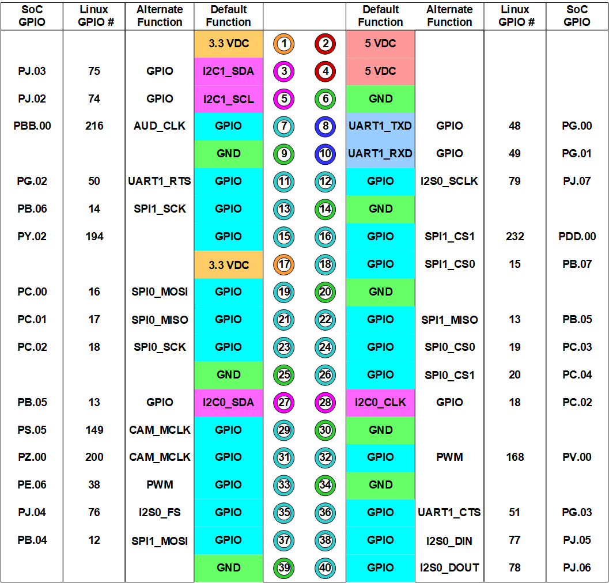
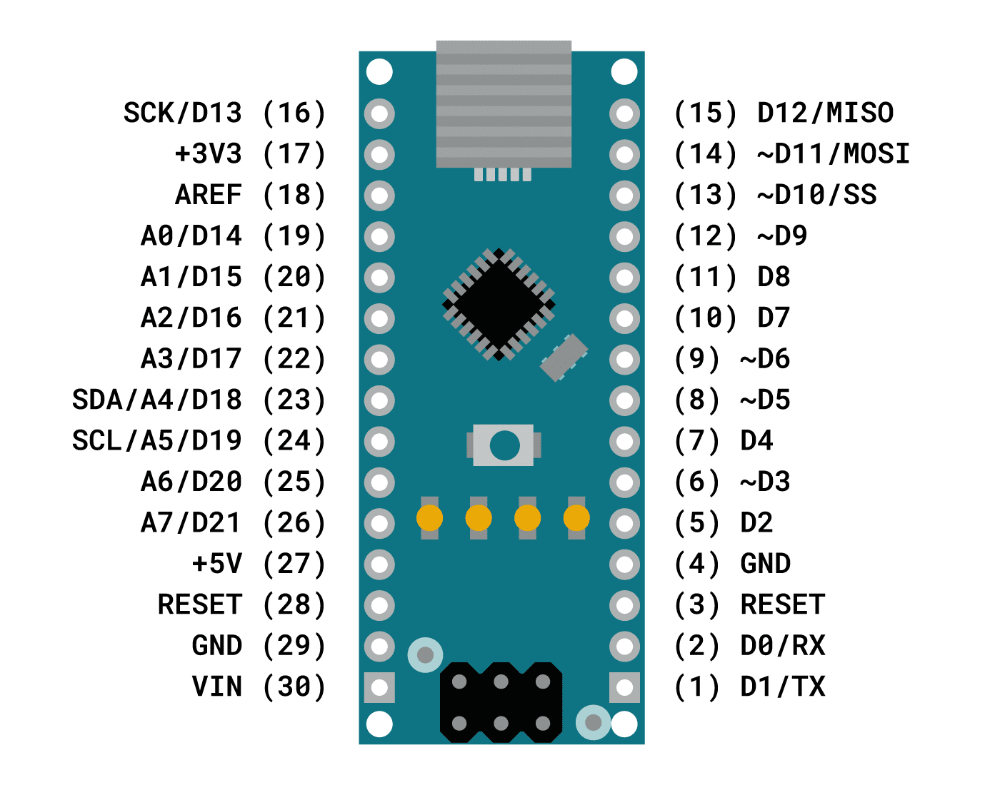

---
tags:
    - jetson
    - nano
    - arduino
    - i2c
---

# Connect Jetson nano to arduino nano over i2c communication
Connect jetson nano to arduino nano via i2c 
Install linux i2c tools and check communication with smbus python library

---

## wiring

| arduino      | jetson  |
| ------------ | ------- |
| GND          | GND     |
| A4(SDA) (23) | 27(SDA) |
| A5(SCL) (24) | 28(CLK) |

## Pinouts

### Jetson gpio pinout


### Arduino nano pinout


---

## Arduino nano

!!! tip "Nano usb disconnect from ttyUSB"

    ```bash title="dmesg output"
    [1182096.667353] usb 1-9: ch341-uart converter now attached to ttyUSB0
    [1182096.729868] audit: type=1130 audit(1637925474.011:3648): pid=1 uid=0 auid=4294967295 ses=4294967295 msg='unit=brltty-device@sys-devices-pci0000:00-0000:00:14.0-usb1-1\x2d9 comm="systemd" exe="/usr/lib/systemd/systemd" hostname=? addr=? terminal=? res=success'
    [1182096.800144] audit: type=1130 audit(1637925474.081:3649): pid=1 uid=0 auid=4294967295 ses=4294967295 msg='unit=brltty@-sys-devices-pci0000:00-0000:00:14.0-usb1-1\x2d9 comm="systemd" exe="/usr/lib/systemd/systemd" hostname=? addr=? terminal=? res=success'
    [1182096.803145] usb 1-9: usbfs: interface 0 claimed by ch341 while 'brltty' sets config #1
    [1182096.803731] ch341-uart ttyUSB0: ch341-uart converter now disconnected from ttyUSB0
    ```

    Remove ubuntu 22.04 support to braille e-reader
    ```bash
    sudo apt remove brltty
    ```

    [more info](https://stackoverflow.com/questions/70123431/why-would-ch341-uart-is-disconnected-from-ttyusb)


!!! tip "Nano avrdude: stk500_getsync() "

    Switch to old bootloader

    ```
    Tools > Board > ATmega328P (Old Bootloader)
    ```

    [more](https://forum.arduino.cc/t/avrdude-stk500_getsync-attempt-10-of-10-not-in-sync-resp-0x00/509854/9)
     

### Code example

```c
#include <Wire.h>

int i2cAddress = 0x40;
int servoState = 0;
int data = 0;

void setup()
{
  Wire.begin(i2cAddress);       // join i2c bus with address #0x40
  Wire.onReceive(receiveEvent); // register event
  Wire.onRequest(sendData);
  
  Serial.begin(9600);           // start serial for output
  Serial.println("hello i2c");
}


void loop()
{
  if(servoState > 0) {
      data = servoState;  
      servoState = 0;
      Serial.println(data);
    }
  
}


void receiveEvent(int bytes) {
  servoState = Wire.read();    // read one character from the I2C
}
void sendData(){
    Wire.write(data);
    
}
```

---

## jetson

```bash title="dependencies"
sudo apt-get install i2c-tools
sudo pip install smbus
```

### Check and test using CLI
```bash
sudo i2cdetect -y -r 0
     0  1  2  3  4  5  6  7  8  9  a  b  c  d  e  f
00:          -- -- -- -- -- -- -- -- -- -- -- -- -- 
10: -- -- -- -- -- -- -- -- -- -- -- -- -- -- -- -- 
20: -- -- -- -- -- -- -- -- -- -- -- -- -- -- -- -- 
30: -- -- -- -- -- -- -- -- -- -- -- -- -- -- -- -- 
40: 40 -- -- -- -- -- -- -- -- -- -- -- -- -- -- -- 
50: -- -- -- -- -- -- -- -- -- -- -- -- -- -- -- -- 
60: -- -- -- -- -- -- -- -- -- -- -- -- -- -- -- -- 
70: -- -- -- -- -- -- -- -- 
```

#### Test
- Upload application to Arduino

```bash
# sudo i2cset -y <bus number> <address> <data>
sudo i2cset -y 0 0x40 0x10
```

---

#### Python code

```python
import smbus
# Nvidia Jetson Nano i2c Bus 0
bus = smbus.SMBus(0)

# This is the address we setup in the Arduino Program
address = 0x40

def writeNumber(value):
    bus.write_byte(address, value)


def readNumber():
    number = bus.read_byte(address)
    return number

while True:
    var = input("")
    if not var:
        continue

    writeNumber(int(var))
    number = readNumber()
    print(f"--{number}--")
```

---

## Run i2c as non-root user


```bash title="check permission"
ll /dev/i2c*
crw-rw---- 1 root i2c 89,   0 Oct  4 09:30 /dev/i2c-0
crw-rw---- 1 root i2c 89,   1 Oct  4 09:30 /dev/i2c-1
```

```bash title="add user 2 i2c group
sudo usermod -aG i2c ${USER}
```


---

## Reference
- [Jetson Nano - Arduino i2c communication](https://forums.developer.nvidia.com/t/questions-on-jetson-nano-arduino-i2c-communication/111277/3)