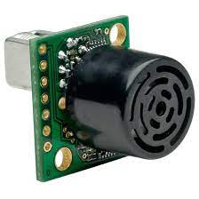

---
tags:
    - nano
    - jetson
    - nvidia
    - i2c
    - sensor
    - mb1202
    - ultrasonic
---

# Ultrasonic sensor - MaxBotix -I2CXL MaxSonar
Features of the MB1202, I2CXL-MaxSonar-EZ0, include centimeter resolution, the widest and most sensitive beam pattern of any unit from the I2CXL‑MaxSonar‑EZ sensor line, short to long distance detection, range information from 25cm to 765cm, up to a 40Hz read rate, and an I2C interface.




---

## Pinout

### MB1202


### Jetson nano


### Wiring

| mb1202 | jetson nano   |
| ------ | ------------- |
| GND    | GND (39)      |
| 3.3-5v | 3.3V (1)      |
| SCL    | I2C0_CLK (28) |
| SDA    | I2C0_SDA (27) |


---

## Check

```
i2cdetect -y -r 0
     0  1  2  3  4  5  6  7  8  9  a  b  c  d  e  f
00:          -- -- -- -- -- -- -- -- -- -- -- -- -- 
10: -- -- -- -- -- -- -- -- -- -- -- -- -- -- -- -- 
20: -- -- -- -- -- -- -- -- -- -- -- -- -- -- -- -- 
30: -- -- -- -- -- -- -- -- -- -- -- -- -- -- -- -- 
40: -- -- -- -- -- -- -- -- -- -- -- -- -- -- -- -- 
50: -- -- -- -- -- -- -- -- -- -- -- -- -- -- -- -- 
60: -- -- -- -- -- -- -- -- -- -- -- -- -- -- -- -- 
70: 70 -- -- -- -- -- -- --
```

---

## Programming
For distance reading, Send start the distance measurement, send byte “0x51” to the sensor. 
The I2C `write()` is used for this. 
The sensor then needs some time to be able to carry out the measurement. The measured values are available after approx. 0.12 seconds and can be read from register “0xe1”. The measured distance can be read out with the I2C command `read_word_data()`.


## Python test
Read sensor reading

```python
from smbus import SMBus
import time

# sensor I2C address
address1 = 0x70

# variables
LOOP = 20
intervall = 0.5
i2c_bus = SMBus(0)
for x in range(0, LOOP):
    try:
            # default write register address 0xE0 (224)
            i2c_bus.write_byte(0x70, 0x51)
            time.sleep(0.1)
            val = i2c_bus.read_word_data(0x70, 0xe1)
            print ((val >> 8) & 0xff, 'cm')
    except IOError as err:
            print (err)
    time.sleep(intervall)

```
**write_byte**  
write_byte(i2c_addr, value, force=None)
Write a single byte to a device.

**read_word_data**  
read_word_data(i2c_addr, register, force=None)
Read a single word (2 bytes) from a given register. and return int type

---

## Change sensor Address
If Multiple sensor wired to the bus, we need to control EEPROM sensor address,


Send block data `0xAA`(170) , `0xA5`(165), New Address to register Address `0xE0`


### Demo - Change from address 0x70 to 0x77

```python
from smbus import SMBus
import time

ADDRESS = 0x70
NEW_ADDRESS = 0x77
REGISTER_ADDRESS = 0xE0

i2c_bus = SMBus(0)
# new address LSB must be zero #### ###0
NEW_ADDRESS = NEW_ADDRESS << 1
i2c_bus.write_block_data(ADDRESS, REGISTER_ADDRESS, [0xAA, 0xA5, NEW_ADDRESS])
time.sleep(1)
```

```bash
i2cdetect -y -r 0
     0  1  2  3  4  5  6  7  8  9  a  b  c  d  e  f
00:          -- -- -- -- -- -- -- -- -- -- -- -- -- 
10: -- -- -- -- -- -- -- -- -- -- -- -- -- -- -- -- 
20: -- -- -- -- -- -- -- -- -- -- -- -- -- -- -- -- 
30: -- -- -- -- -- -- -- -- -- -- -- -- -- -- -- -- 
40: -- -- -- -- -- -- -- -- -- -- -- -- -- -- -- -- 
50: -- -- -- -- -- -- -- -- -- -- -- -- -- -- -- -- 
60: -- -- -- -- -- -- -- -- -- -- -- -- -- -- -- -- 
70: -- -- -- -- -- -- -- 77 
```

---

## Reference
- [Ultrasonic sensor - MaxBotix -I2CXL MaxSonar](https://github.com/custom-build-robots/ultrasonic-sensor-MaxBotix-I2CXL-MaxSonar)
- [maxbotix mb-1202 datasheet](https://maxbotix.com/pages/i2cxl-maxsonar-ez-datasheet)
- [smbus2 api](https://buildmedia.readthedocs.org/media/pdf/smbus2/latest/smbus2.pdf)