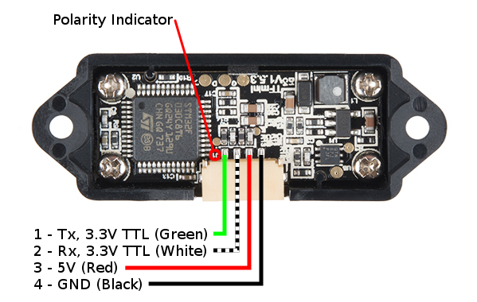

---
tags:
    - nano
    - jetson
    - nvidia
    - uart
    - serial
    - sensors
    - tfmini
---
# Connect TFMini LIDAR sensor to jetson nano

The TFMini is a ToF (Time of Flight) LiDAR sensor capable of measuring the distance to an object as close as 30 cm and as far as 12 meters


---

## Pinout



### Jetson nano


| TFMini      | Nano     |
| ----------- | -------- |
| GND (black) | GND(39)  |
| 5V (red)    | 5VDC (2) |
| RX (white)  | TX (8)   |
| TX (green)  | RX (9)   |

---

## Preparation
- Add user to tty group
- Disable console on uart
- Install python `pyserial` package

```bash title="Add user to tty grpup"
sudo useradd -aG tty ${USER}
```

```bash
systemctl stop nvgetty
systemctl disable nvgetty
udevadm trigger # or reboot instead
```

```
pip install pyserial
```

---

## Programming

|            | UART   |
| ---------- | ------ |
| Baud rate  | 115200 |
| Data bit   | 8      |
| Stop bit   | 1      |
| Parity bit | 0      |


### Data format

| 1    | 2    | 3      | 4      | 5          | 6          | 7        | 8        | 9        |
| ---- | ---- | ------ | ------ | ---------- | ---------- | -------- | -------- | -------- |
| 0x59 | 0x59 | Dist_L | Dist_H | Strength_L | Strength_H | Reversed | Raw.Qual | Checksum |

|                                                                        |                                                                                         |
| ---------------------------------------------------------------------- | --------------------------------------------------------------------------------------- |
| Byte1                                                                  | 0x59, frame header, all frames are the same                                             |
| Byte2                                                                  | 0x59, frame header, all frames are the same                                             |
| Byte3                                                                  | Dist_L distance value is a low 8-bit. Note: The distance value is a hexadecimal value,  |
| Byte4                                                                  | Dist_H distance value is a high 8-bit.                                                  |
| Byte5                                                                  | Strength_L is a low 8-bit.                                                              |
| Byte6                                                                  | Strength_H is a high 8-bit.                                                             |
| Byte7                                                                  | Reserved bytes.                                                                         |
| Byte8                                                                  | Original signal quality degree                                                          |
| Byte9                                                                  | Checksum parity bit is a low 8-bit, Checksum = Byte1 + Byte2 + ... + Byte8, Checksum is |
| the sum of the first 8 bytes of actual data; here is only a low 8-bit. |                                                                                         |

 
### Python simple distance reading

```python
import serial


ser = serial.Serial("/dev/ttyTHS1", 115200)

def getTFminiData():
    while True:
        count = ser.in_waiting
        if count > 8:
            recv = ser.read(9)
            ser.reset_input_buffer()
            if recv[0] == 0x59 and recv[1] == 0x59:
                low = int(recv[2])
                high = int(recv[3])
                distance = low + (high * 256)
                print(distance)


if __name__ == '__main__':
    try:
        if ser.is_open == False:
            ser.open()
        getTFminiData()
    except KeyboardInterrupt:   # Ctrl+C
        if ser != None:
            ser.close()
```
 
 

---

## Reference
- [TFMini datasheet](https://cdn.sparkfun.com/assets/5/e/4/7/b/benewake-tfmini-datasheet.pdf)