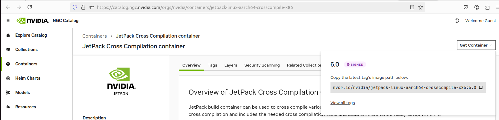
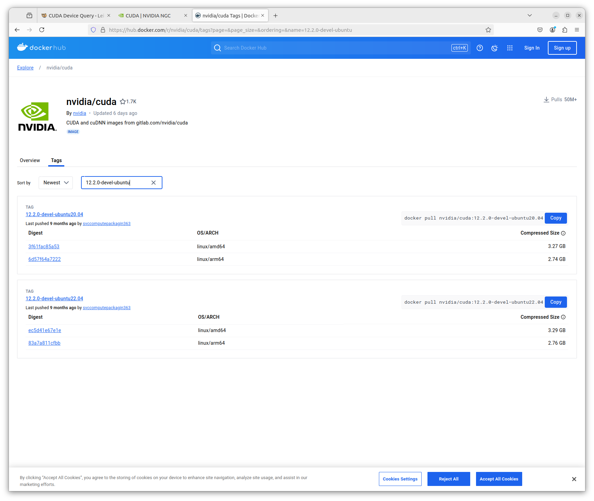

---
tags:
    - nvidia
    - cuda
    - docker
    - cross compiler
---

# Jetson Cross compiler
using docker

## JetPack Cross Compilation Container
JetPack build container can be used to cross compile various JetPack components on a x86 host machine. This container simplifies cross compilation and includes the needed cross compilation tools and build environment already setup within it.

[JetPack Cross Compilation container](https://catalog.ngc.nvidia.com/orgs/nvidia/containers/jetpack-linux-aarch64-crosscompile-x86)



```bash title="pull"
export JP_VERSION=6.0
docker pull nvcr.io/nvidia/jetpack-linux-aarch64-crosscompile-x86:${JP_VERSION}
```

```bash title="run"
docker run -it --privileged --net=host -v /dev/bus/usb:/dev/bus/usb -v ${pwd}:/workspace nvcr.io/nvidia/jetpack-linux-aarch64-crosscompile-x86:${JP_VERSION}
```

## demo
Build cuda `deviceQuery`

SOC_SMS
- orin 87
- xavier 75

```bash
git clone https://github.com/NVIDIA/cuda-samples.git
cd /l4t/cuda-samples/Samples/1_Utilities/deviceQuery
make TARGET_ARCH=aarch64 TARGET_OS=linux TARGET_FS=/l4t/targetfs/ SMS=${SOC_SMS}
```


---

## Docker 

!!! warning "not finish"
    need to understand buildx better
     

using nvidia cuda docker


[dockedr hub nvidia / cuda](https://hub.docker.com/r/nvidia/cuda/tags)



!!! warning ""
     Notice that using CUDA base or runtime Docker images as the base image will not work as they don’t come with the NVCC compiler.


```bash
$ sudo apt-get install -y binfmt-support qemu-user-static
```

```bash
docker buildx create --use --name cross-platform-build
docker buildx build -f device-query.Dockerfile --platform linux/amd64,linux/arm64 -t nvidia/device-query:12.2.0 .

docker buildx build --load -t nvidia/device-query:12.2.0 .
```

---


---

## Reference
- [CUDA Device Query](https://leimao.github.io/blog/CUDA-Device-Query/)
- [NVIDIA Container Toolkit](https://docs.nvidia.com/datacenter/cloud-native/container-toolkit/latest/install-guide.html)