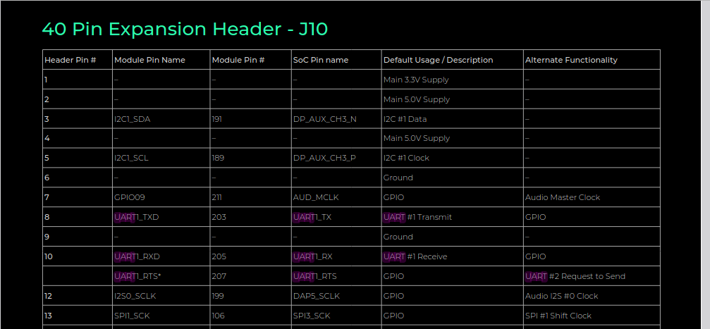
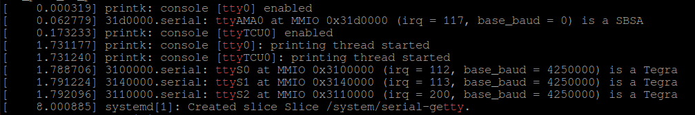

---
tags:
    - jetson
    - serial
    - console
---

# Jetson uarts 
Check uart over jetson 

Demo
- jetpack 6.0
- orin x
- seed studio 4012 board

```bash
sudo dmesg | grep tty

#seeed studio j4012 result orin nx

[    3.795370] 3100000.serial: ttyTHS1 at MMIO 0x3100000 (irq = 112, base_baud = 0) is a TEGRA_UART
[    3.796406] 3140000.serial: ttyTHS2 at MMIO 0x3140000 (irq = 113, base_baud = 0) is a TEGRA_UART
```

## Wiring and loopback check 
- Install `picocom` or other terminal application
- Connect j10 pin 8, 10
- run `picocom -b 115200 /dev/ttyTHS1`




!!! tip local echo
    ctrl-a ctrl-c enable/disable local echo
    
    ```
    *** local echo: no ***
    a
    *** local echo: yes ***
    aa

    ```

### Using socat to control uart over network
[Socat](https://www.redhat.com/sysadmin/getting-started-socat) allows for bidirectional data transfers from one location to another.


```bash
#jetson
socat -d -d TCP-LISTEN:8989 /dev/ttyTHS1,b115200,raw,echo=0
```

```bash
nc <jetson ip> 8989
```

---

## Connect tech hadron board

[Disable Serial Debug Console on Connect Tech TX2/TX1 Carriers](https://support.connecttech.com/hc/en-us/articles/4416438909083-Disable-Serial-Debug-Console-on-Connect-Tech-TX2-TX1-Carriers)

```
sudo dmesg | grep tty
```




```bash
cat /proc/cmdline 
root=PARTUUID=2f4ddaae-48d7-4edd-a6b8-311353cb339e rw rootwait rootfstype=ext4 mminit_loglevel=4 console=ttyTCU0,115200 firmware_class.path=/etc/firmware fbcon=map:0 net.ifnames=0 nospectre_bhb video=efifb:off console=tty0 bl_prof_dataptr=2031616@0x471E10000 bl_prof_ro_ptr=65536@0x471E00000 
```


```bash
sudo systemctl status getty@tty1
● getty@tty1.service - Getty on tty1
     Loaded: loaded (/lib/systemd/system/getty@.service; enabled; vendor preset: enabled)
     Active: active (running) since Thu 1970-01-01 00:00:28 UTC; 54 years 7 months ago
       Docs: man:agetty(8)
             man:systemd-getty-generator(8)
             http://0pointer.de/blog/projects/serial-console.html
   Main PID: 782 (agetty)

# stop getty
sudo systemctl stop getty@tty1
```

```bash
socat -d -d TCP-LISTEN:8989 /dev/ttyTCU0,b115200,raw,echo=0
```

```bash
nc <jetson ip> 8989
```