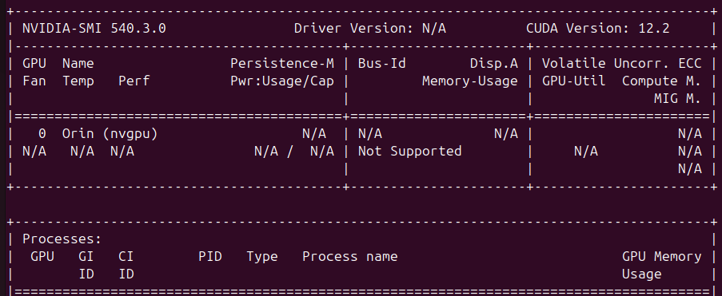

---
tags:
    - jetson
    - vscode
    - devcontainer
    - remote
    - nvidia
---

# Working on remote docker using vscode devcontainer

Connect to remote docker container that run on jetson orin nx with jetpack 6.0, using vscode remote ssh and devcontainer extension

## remote ssh
- download ext
- optional: create ssh key


```bash
ssh-copy-id
```

## config devcontainer

```dockerfile
FROM nvidia/cuda:12.2.0-runtime-ubuntu22.04
```

```json
{
    "name": "ros-jetpack",
    "build": {
        "dockerfile": "Dockerfile",
        "context": ".."
    },
    
    "workspaceFolder": "/workspaces/ros_ws",
    // "remoteUser": "ros",
    "runArgs": [
        "--hostname=dev",
        "--runtime=nvidia"
    ],
    "customizations": {
        "vscode": {
            "settings": {}
            },
            "extensions": []
        }
    }
}
```

## usage
```bash
nvidia-smi
```



---

