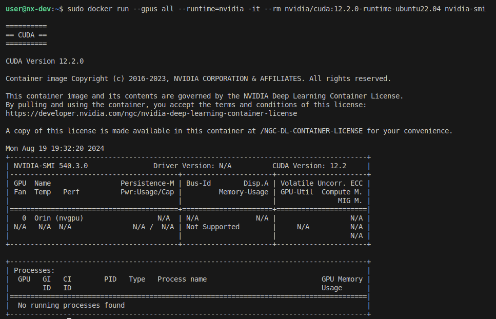

---
tags:
    - jetpack
    - nvidia
    - jetson
    - docker
---

# Jetpack 6.0 Docker install

## Docker install
```bash
sudo apt-get update
sudo apt-get install apt-transport-https ca-certificates curl gnupg lsb-release
```


```bash
curl -fsSL https://download.docker.com/linux/ubuntu/gpg | sudo gpg --dearmor -o /usr/share/keyrings/docker-archive-keyring.gpg
```

```bash

echo \
"deb [arch=$(dpkg --print-architecture) signed-by=/usr/share/keyrings/docker-archive-keyring.gpg] https://download.docker.com/linux/ubuntu \
$(lsb_release -cs) stable" | sudo tee /etc/apt/sources.list.d/docker.list > /dev/null
```

```bash
sudo apt-get update
sudo apt-get install docker-ce docker-ce-cli containerd.io
```

---

## Nvidia Container Toolkit

```bash
curl -fsSL https://nvidia.github.io/libnvidia-container/gpgkey | sudo gpg --dearmor -o /usr/share/keyrings/nvidia-container-toolkit-keyring.gpg 
curl -s -L https://nvidia.github.io/libnvidia-container/stable/deb/nvidia-container-toolkit.list | \
sed 's#deb https://#deb [signed-by=/usr/share/keyrings/nvidia-container-toolkit-keyring.gpg] https://#g' | \
sudo tee /etc/apt/sources.list.d/nvidia-container-toolkit.list
```

```bash
sudo apt update
sudo apt install nvidia-container-toolkit
```

## usage

```bash
sudo docker run --gpus all --runtime=nvidia -it --rm nvidia/cuda:12.2.0-runtime-ubuntu22.04 nvidia-smi
```





---

## Reference
- [installing the nvidia container toolkit](https://docs.nvidia.com/datacenter/cloud-native/container-toolkit/latest/install-guide.html)
- [Cloud-Native on Jetson](https://developer.nvidia.com/embedded/jetson-cloud-native)