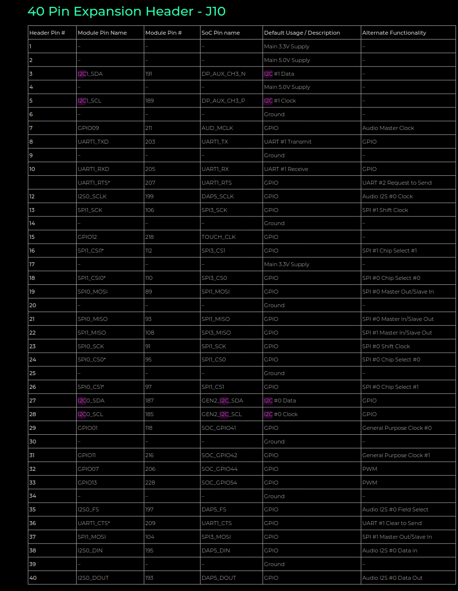
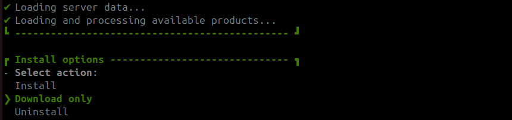

---
tags:
    - nvidia
    - jetson
    - i2c
    - mcp4725
---

# Connect MCP4725 to NVidia jetson over I2C
The MCP4725 is a 12-bit Digital-to-Analog Converter (DAC) with non-volatile memory (EEPROM) .
It can be work both in 3.3 and 5VDC, the input voltage set the max output voltage

## nvidia 



## Wiring

| nvidia 40pin  | mpc  |
|---|---|
| 5vdc (2) | VCC  |
| GND (6)  | GND  |
| SDA (27) | SDA  |
| SCL (28) | SCL  |


```bash
sudo apt-get install i2c-tools
```

```
i2cdetect -y -r 1
```


|   |   |
|---|---|
| -y  | disabled user interactive mode  |
| -r | 1: read prob method


### Change MPC Address
Check section 7.2 in data sheet


Connect pin A0 to VCC or GND(default)

- Default: 62
- VCC: 63


### Command
Check section 6.1 `Write commands` in data sheet

- **0x40**: write to RAM
- **0x60**: write to EEPROM The value will persist even after the device is powered off and on.

---

## Python 

```
pip install smbus
```

```python
# Change this to match the new address if A0 is connected to VCC
MCP4725_I2C_ADDRESS = 0x63  # Address when A0 is connected to VCC

# Initialize I2C (SMBus)
bus = smbus.SMBus(1)  # Use I2C bus 1 

CMD_RAM_WRITE = 0x40
CMD_EEPROM_WRITE = 0x60

# Function to set the MCP4725 DAC output
def set_dac_output(value):
    if 0 <= value <= 4095:  # MCP4725 is a 12-bit DAC, so value must be between 0 and 4095
        # Write two bytes to the MCP4725: one for the upper bits, one for the lower bits
        msb = (value >> 4) & 0xFF
        lsb = (value << 4) & 0xFF
        data = [msb, lsb]  # Send 12-bit data as two bytes
        # write_i2c_block_data(i2c_addr, command, data)
        bus.write_i2c_block_data(MCP4725_I2C_ADDRESS, CMD_RAM_WRITE, data)
    else:
        raise ValueError("Value must be between 0 and 4095.")

# Example usage:
if __name__ == "__main__":
    # Set DAC output to mid-range (approximately 2.5V if VCC is 5V)
    mid_value = 4095  # Midpoint of 0 to 4095 range
    set_dac_output(mid_value)
    print(f"DAC output set to {mid_value}/4095")
```

Write 12 bit data as two bytes 
- **MSB**: The first byte contains the most significant 8 bits of the 12-bit digital value.
- **LSB**: The second byte contains the least significant 4 bits of the digital value, shifted to fit into 8 bits.

The Output depend on VCC and the register value
VCC = 5v


| register  | output  |
|---|---|
| 0  | 0V  |
| 2048  | 2.5V  |
| 4095  | 5.0V  |


---

## Reference
- [mcp4725 data sheet](https://ww1.microchip.com/downloads/en/devicedoc/22039d.pdf)