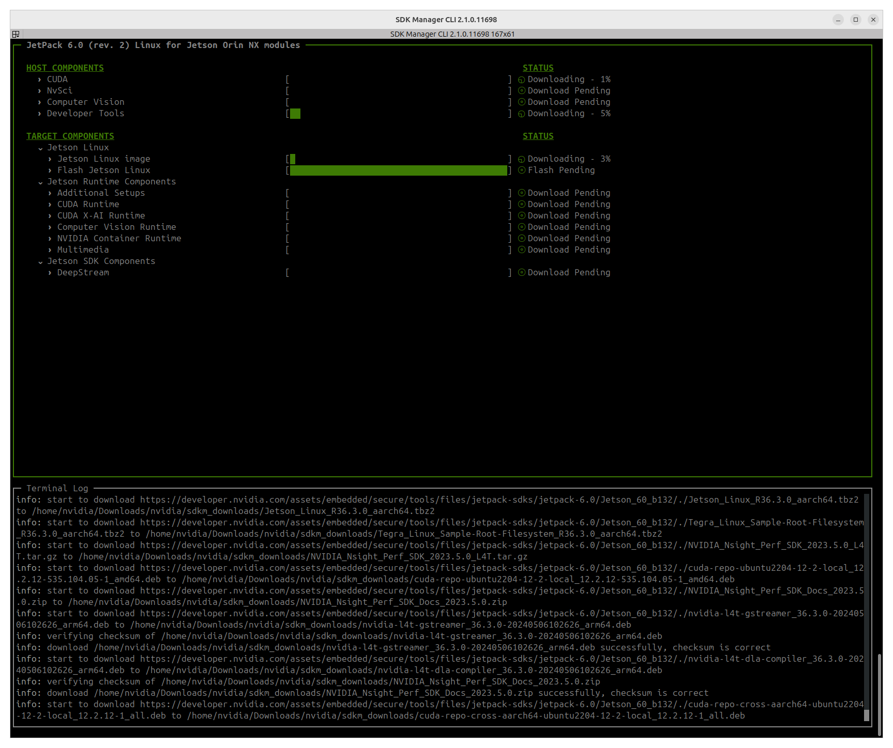
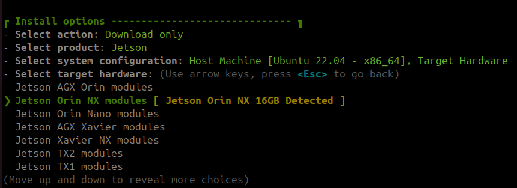
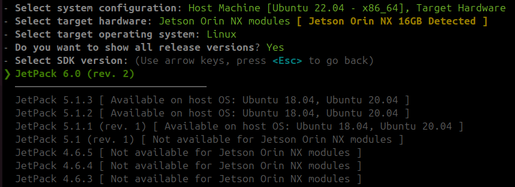
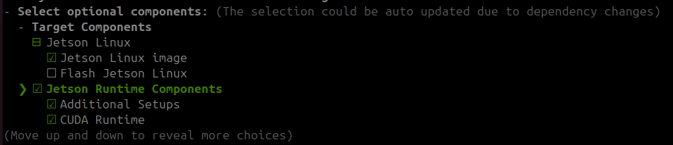

---
tags:
    - jetson
    - nvidia
    - orin
    - sdkmanager
    - connecttech
    - hadron
---

```bash
sudo apt install -y qemu-user-static binfmt-support
sudo update-binfmts --enable
```

Run SDKManager from docker

Query available SDKs

```bash
docker run -it --rm sdkmanager:2.1.0.11698-Ubuntu_22.04 --query
#
Available options are:

JetPack 6.0 (rev. 2)
sdkmanager --cli --action install --login-type devzone --product Jetson --version 6.0 --target-os Linux --host --target JETSON_AGX_ORIN_TARGETS --flash --additional-sdk 'DeepStream 7.0'
sdkmanager --cli --action install --login-type devzone --product Jetson --version 6.0 --target-os Linux --host --target JETSON_ORIN_NX_TARGETS --flash --additional-sdk 'DeepStream 7.0'
sdkmanager --cli --action install --login-type devzone --product Jetson --version 6.0 --target-os Linux --host --target JETSON_ORIN_NANO_TARGETS --flash --additional-sdk 'DeepStream 7.0'

JetPack 5.1.3
...

```

## Build docker command for Orin NX

```bash title="command for orin nx"
#jetpack 6.0
sdkmanager --cli --action install --login-type devzone --product Jetson --version 6.0 --target-os Linux --host --target JETSON_ORIN_NX_TARGETS --flash --additional-sdk 'DeepStream 7.0'
```

```bash
docker run -it --rm --privileged --network host \
  -v /dev/bus/usb:/dev/bus/usb/ \
  -v /dev:/dev \
  -v /home/user/nvidia/nvidia_sdk:/home/nvidia/nvidia/nvidia_sdk:rw \
  -v /home/user/nvidia/sdkm_downloads:/home/nvidia/Downloads/nvidia/sdkm_downloads:rw \
  sdkmanager:2.1.0.11698-Ubuntu_22.04 \
  --cli --action install \
  --login-type devzone \
  --product Jetson \
  --version 6.0 \
  --target-os Linux \
  --host \
  --license accept \
  --target JETSON_ORIN_NX_TARGETS \
  --flash \
  --download-folder /home/nvidia/Downloads/nvidia/sdkm_downloads \
  --stay-logged-in true \
  --collect-usage-data disable \
  --additional-sdk 'DeepStream 7.0'
```





---

### Run docker manual

```bash
docker run -it --rm --privileged --network host   -v /dev/bus/usb:/dev/bus/usb/   -v /dev:/dev   -v /home/user/nvidia/sdkm:/home/nvidia/sdkm   -v /home/user/nvidia/sdkm_downloads:/home/nvidia/sdkm_downloads   sdkmanager:2.1.0.11698-Ubuntu_22.04   --cli    --login-type devzone   --product Jetson \
  --version 6.0 \
  --target-os Linux \
  --host \
  --license accept \
  --target JETSON_ORIN_NX_TARGETS 
```








---

## Hadron
[CTI-L4T Board Support Package Installation for NVIDIA JetPack with Connect Tech Jetson™ Carriers](https://connecttech.com/ftp/Drivers/L4T-Release-Notes/Jetson-Orin-NX-Orin-Nano/ORIN-NX-NANO-36.3.0.pdf)
[kdb373: CTI-L4T Board Support Package Installation for NVIDIA JetPack with Connect Tech Jetson™ Carriers](https://connecttech.com/resource-center/kdb373/)

```bash
docker run -it --rm --privileged --network host \
-v /dev/bus/usb:/dev/bus/usb/ \
-v /dev:/dev \
-v /home/user/nvidia/nvidia_sdk:/home/nvidia/nvidia/nvidia_sdk:rw \
  -v /home/user/nvidia/sdkm_downloads:/home/nvidia/Downloads/nvidia/sdkm_downloads:rw \
--entrypoint /bin/bash \
sdkmanager:2.1.0.11698-Ubuntu_22.04
```


----

```
sudo ./tools/kernel_flash/l4t_initrd_flash.sh --external-only \
--network usb0 \
--external-device nvme0n1p1 \
-c tools/kernel_flash/flash_l4t_t234_nvme.xml \
-p "-c bootloader/generic/cfg/flash_t234_qspi.xml" \
--showlogs \
jetson-orin-nano-devkit internal
```


## Create a minimal rootfs
```
sudo docker run --privileged -it --rm -v <your_L4T_root>/Linux_for_Tegra:/l4t ubuntu:22.04

(inside of container) # apt-get update
(inside of container) # apt-get install -y qemu-user-static wget sudo
(inside of container) # cd /l4t/tools/samplefs
(inside of container) # sudo ./nv_build_samplefs.sh --abi aarch64 --distro ubuntu --flavor minimal --version jammy
```
from Linux_for_tegra folder

```bash
sudo ./tools/samplefs/nv_build_samplefs.sh --abi aarch64 --distro ubuntu --flavor minimal --version jammy
```

```
sudo ./apply_binaries.sh
```
```bash
#sudo ./tools/l4t_create_default_user.sh -u <username> -p <password> -n <machine name>
sudo ./tools/l4t_create_default_user.sh -u user -p user --accept-license
```


---

## Reference
- [Jetson DeveloperGuide QuickStart](https://docs.nvidia.com/jetson/archives/r36.3/DeveloperGuide/IN/QuickStart.html)
- [Preparing a Jetson to flash and boot an encrypted and non-encrypted image for an SSD](https://developer.ridgerun.com/wiki/index.php/Preparing_a_Jetson_to_flash_and_boot_an_encrypted_and_non-encrypted_image_for_an_SSD)