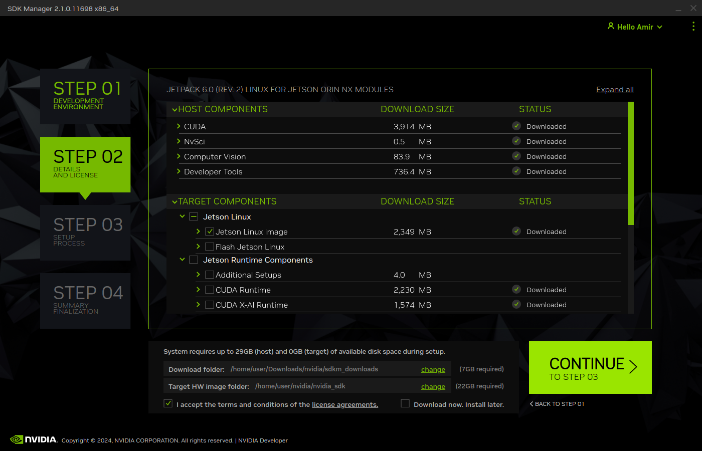
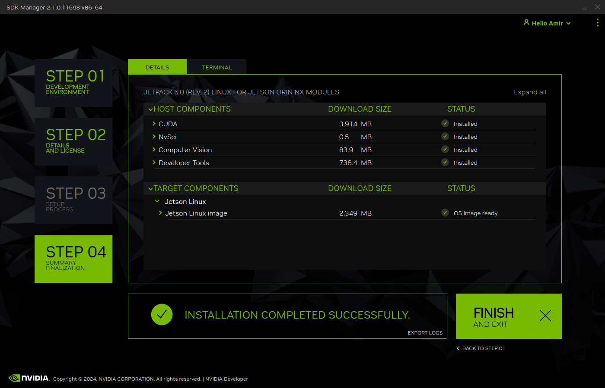
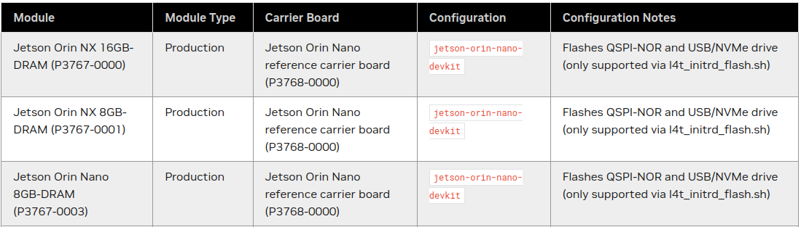
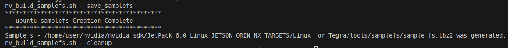
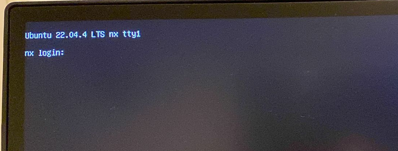

---
tags:
    - jetson
    - nvidia
    - sdkmanager
    - orin
---

# Jetpack on orin nx
Using SDKManager and minimal rootfs

---

## sdkmanager
using sdkmanager to download and extract





---

## flash from cli

!!! tip "Jetson modules"
    NX and Nano configure are same with name `jetson-orin-nano-devkit`
    [jetson-modules-and-configurations](https://docs.nvidia.com/jetson/archives/r36.3/DeveloperGuide/IN/QuickStart.html#jetson-modules-and-configurations)

    
     

Example flash command to nvme

```bash title="flash to nvme"
sudo ./tools/kernel_flash/l4t_initrd_flash.sh --external-device nvme0n1p1 \
  -c tools/kernel_flash/flash_l4t_t234_nvme.xml -p "-c bootloader/generic/cfg/flash_t234_qspi.xml" \
  --showlogs --network usb0 jetson-orin-nano-devkit internal
```

---

## rootfs
Create minimal rootfs, check [nvidia docs](https://docs.nvidia.com/jetson/archives/r36.3/DeveloperGuide/SD/RootFileSystem.html) for more info

### minimal flavor
nvidia preconfig three flavors
- minimal
- basic
- desktop

the flavor config by files locate `Linux_for_Tegra/tools/samplefs` that list all the packages to install

the `nv_build_samplefs.sh` 
#### build rootfs
```bash
sudo ./tools/samplefs/nv_build_samplefs.sh --abi aarch64 --distro ubuntu --flavor minimal --version jammy
```



#### remove current and extract new rootfs
- rename or remove current rootfs (from `Linux_for_Tegra` folder)
- extract new rootfs

```bash
mv rootfs/ rootfs_sdkmanager

#
mkdir rootfs && cd "$_"
#
sudo tar xpvf ../tools/samplefs/sample_fs.tbz2
#
cd ..
```

#### set user

```
sudo ./apply_binaries.sh
```

```bash
#sudo ./tools/l4t_create_default_user.sh -u <username> -p <password> -n <machine name> --accept-license
sudo ./tools/l4t_create_default_user.sh -u user -p user -n nx --accept-license
```

#### flash
```bash title="flash to nvme"
sudo ./tools/kernel_flash/l4t_initrd_flash.sh --external-device nvme0n1p1 \
  -c tools/kernel_flash/flash_l4t_t234_nvme.xml -p "-c bootloader/generic/cfg/flash_t234_qspi.xml" \
  --showlogs --network usb0 jetson-orin-nano-devkit internal
```

#### boot


---

## cuda dev

copy `cuda-tegra-repo-....` to jetson from sdk downloads

```bash
sudo dpkg -i cuda-tegra-repo-ubuntu2204-12-2-local_12.2.12-1_arm64.deb 
sudo cp /var/cuda-tegra-repo-ubuntu2204-12-2-local/cuda-tegra-9E6DEF43-keyring.gpg /usr/share/keyrings/
sudo apt update
sudo apt install cuda-toolkit-12-2

```

```bash title="cuda environment variablea"
export PATH=/usr/local/cuda/bin${PATH:+:${PATH}}
export LD_LIBRARY_PATH=/usr/local/cuda-12.2/lib64\
                         ${LD_LIBRARY_PATH:+:${LD_LIBRARY_PATH}}

```

----

## Reference
- [DeveloperGuide](https://docs.nvidia.com/jetson/archives/r36.3/DeveloperGuide/index.html)

