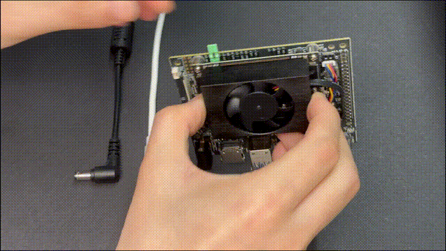
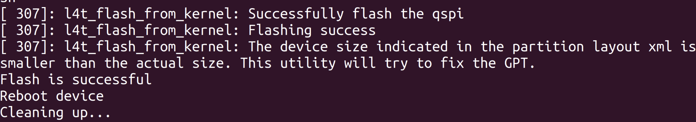
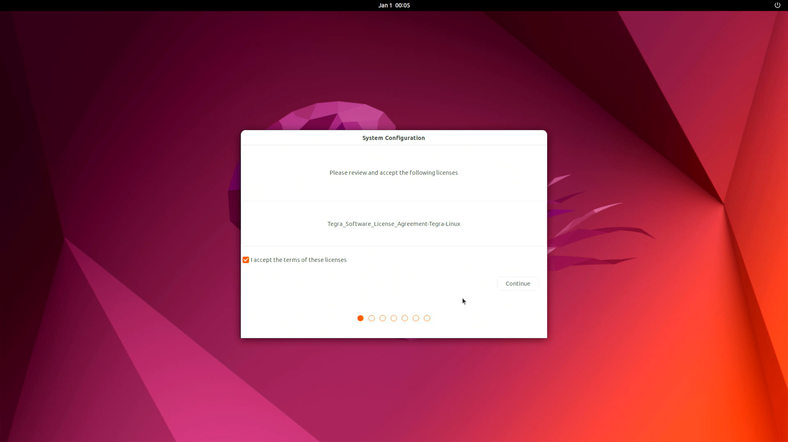

---
tags:
    - jetson
    - nx
    - orin
    - jetpack
---

# Install jetpack 6 on seed studio dev board 401 (v1)
Seed studio distributed their own image 

- [seed studio flash jetpack](https://wiki.seeedstudio.com/reComputer_J4012_Flash_Jetpack/)


## Recovery mode
Set board to recovery mode




```bash title="check board in recovery"
lsusb
#
Bus 003 Device 013: ID 0955:7323 NVIDIA Corp. APX
```

---

## Download and install JP6.0 for Orin NX

```bash title="install dependencies"
sudo apt install qemu-user-static sshpass abootimg nfs-kernel-server libxml2-utils binutils -y
```

### Download images 

[Download](http://recomputer-jetson.oss-us-west-1.aliyuncs.com/J401/mfi_recomputer-orin-nx-16g-j401-6.0-36.3.0-2024-07-04.tar.gz)

### Extract and Flash
```bash title="extract"
sudo tar xpf mfi_xxxx.tar.gz
# For example: sudo tar xpf mfi_recomputer-orin-nano-8g-j401-6.0-36.3.0-2024-06-07.tar.gz
```

```bash title="flash"
cd mfi_xxxx
# For example: cd mfi_recomputer-orin-j401
sudo ./tools/kernel_flash/l4t_initrd_flash.sh --flash-only --massflash 1 --network usb0  --showlogs
```



### connect to HDMI and finish installation

